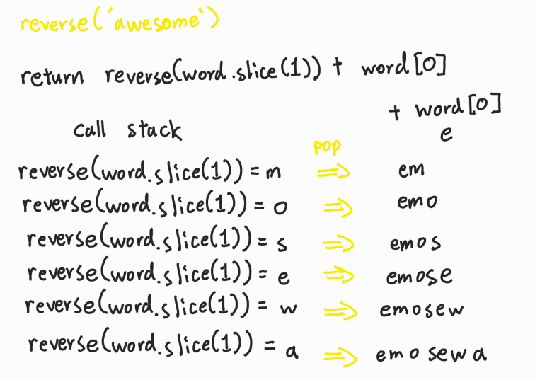

# Udemy - Javascript - 재귀 문제 풀이 2


## reverse()

> 단어 뒤집기

```javascript
function reverse(word) {
    if (word.length <= 1) return word
    return reverse(word.slice(1)) + word[0]
}
```



## isPalindrome()

> 단어와 단어를 뒤집었을때 같은지 참 또는 거짓으로 구하기

