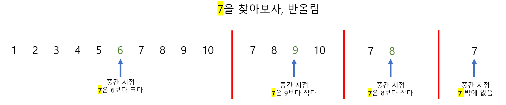

# Udemy - Javascript - 탐색


## 선형 탐색 (Linear Search)

> 배열이 있으면, 원소 하나하나를 비교해서 탐색하는것

#### 자바스크립트에서 선형 탐색을 하는 메서드들

- `indexOf`
- `includes`
- `find`
- `findIndex`


### indexOf 를 코드로 표현

```javascript
function linearSearch(array, number){

    for (let i = 0; i < array.length ; i ++) {
        if (array[i] === number) return i;
    }

    return -1
}
```


### Big O

- Best case : O(1)
  - 나오기 굉장히 어렵다
- Worst case : O(n)
- Average : O(n)


## 이진 탐색 (Binary Search)

> 선형 탐색보다 탐색이 훨씬 빠르다
>
> **하지만 이진 탐색은 데이터가 정렬이 되어 있을 때에만 가능하다**

1. 중간 지점을 찾는다
2. 탐색하는 원소가, 중간 지점보다 작거나 큰지 비교를 한다 (데이터 반이 없어지는 것)
3. 그리고 또 중간 지점을 찾는다 (이것을 숫자를 찾을 때까지 반복을 한다)

**즉, 중간 지점을 찾으면, 데이터 절반을 무시할 수 있다**



> 10개를 다 탐색하는 것이 아니라, 4번만 탐색을 하면, 찾고 싶은 값을 찾을 수 있다

```python
function binarySearch(array, number){
    let left = 0
    let right = array.length - 1

    while (left < right) {
        let mid = parseInt((right + left) / 2)
        console.log(mid)

        if (array[mid] === number | array[right] === number | array[left] === number) {
            if (array[mid] === number) {
                return mid
            } else if (array[right] === number){
                return right
            } else if (array[left] === number){
                return left
            }
            
        } else if (array[mid] > number) {
            right = mid - 1
        } else if (array[mid] < number) {
            left = mid + 1 
        }
    }

    return -1
}
```

- 투 포인터 처럼, `left` 와 `right` 포인트 들을 만들다
  - 배열의 맨 앞과, 맨 끝
- `mid`은 중간 포인트로서 `(right + left) / 2` 를 한다 


### Big O

Worst and Average Case : O(log n)

Best Case : O(1)

- 운 좋게, 한번에 값을 찾을 때


## Naive String Search

> #### 문자열 검색

#### 긴 문자열에서, 문자 찾기

- **long strings** : wowomgzomg
- **short strings** : omg
- **short strings**가 **long strings**에 몇 개가 있는지 찾는 것
  - 2개를 찾을 수 있다
  - loop을 2번 하기


```javascript
function naiveStringSearch (str_1, str_2) {
    let cnt = 0
    let answer = 0

    for (let i = 0 ; i < str_1.length; i ++) {
        if (str_1[i] === str_2[cnt]) {
            cnt ++
            if (cnt === str_2.length) {
                answer += 1
                cnt = 0
            }
        } else {
            cnt = 0
        }
    }

    return answer
}
```

- `str_1`을 순회한다
- `str_2`는 `str_1`과 비교를 하며, `cnt`를 통해서 인덱스를 정한다
  - letter가 같으면 `str_2`의 두번째 letter를 보기 위해 `cnt`를 1로 더한다
  - 연속으로 같으면 `cnt`를 `str_2`를 다 돌았을 때까지 비교를 한다
    - 다 돌면 `cnt`를 0으로 초기화 하고, `answer`에 1을 누적
- 비교를 했을 때, letter들이 다르면 `cnt`를 계속 0으로 초기화 시킨다
  - 비교했을때 연속으로 letter들이 같아야 한다

