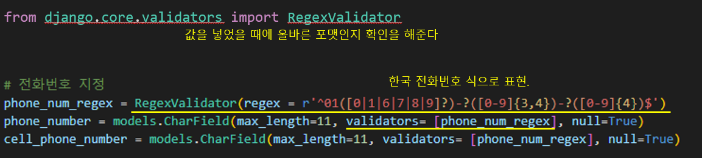
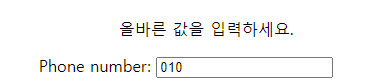

# Joontooling 프로젝트, Day 1

> 업무 : 회원가입 모델링


## Accounts 어플리케이션 만들기

#### project (settings.py)

```python
INSTALLED_APPS = [
    'accounts',
    'products',
    'django.contrib.admin',
    'django.contrib.auth',
    'django.contrib.contenttypes',
    'django.contrib.sessions',
    'django.contrib.messages',
    'django.contrib.staticfiles',
]

AUTH_USER_MODEL = 'accounts.User'
```

- 어플리케이션이 아닌 project의 `settings.py`에서 `INSTALLED_APPS`에다가 어플리케이션 이름을 넣는다
- `AUTH_USER_MODEL`을 설정한 것은, 유저 모델을 수정하기 위해서이다


#### project (urls.py)

```python
urlpatterns = [
    path('admin/', admin.site.urls),
    path('accounts/', include("accounts.urls")),
    path('products/', include("products.urls")),
]
```

- `urls.py`에서 `accounts` 어플리케이션을 사용할 경로를 만든다


#### accounts (models.py)

```python
from django.db import models
from django.contrib.auth.models import AbstractUser
from django.core.validators import RegexValidator

class User(AbstractUser):

    type_choice = (
        ("개인회원", "개인회원"),
        ("개인사업자", "개인사업자"),
        ("법인사업자", "법인사업자"),
    )

    address = models.CharField(max_length=100)

    # 전화번호 지정
    phone_num_regex = RegexValidator(regex = r'^01([0|1|6|7|8|9]?)-?([0-9]{3,4})-?([0-9]{4})$')
    phone_number = models.CharField(max_length=11, validators= [phone_num_regex], null=True)

    birth = models.DateTimeField(null=True)
    user_type = models.CharField(max_length=20, choices=type_choice)
    company = models.CharField(max_length=50)
    per_company_number = models.CharField(max_length=30, null=True)
    company_number = models.IntegerField(null=True)
    point = models.IntegerField(null=True)
```

- 장고에서 제공하는 AbstractUser를 사용한다
  - 기본적으로, `username`, `first_name`, `last_name`, `email`, `password`, `group`, `user_permission`, `is_staff`, `is_active`, `is_superuser`를 제공해준다



- `regex = r'^01([0|1|6|7|8|9]?)-?([0-9]{3,4})-?([0-9]{4})$'` 에 대한 설명
  - `01([0|1|6|7|8|9]?)`  : **01** 은 넣고 **0, 1, 6, 7, 8, 9** 중 하나를 꼭 넣어야 한다
  - `-?` : **-** 는 넣어도 되고 안 넣어도 된다
  - `[0-9]{3,4}` : 0부터 9까지 3~4개까지
  - `[0-9]{4}` : 0부터 9까지 4개를 넣어야 한다



- 올바른 입력 값들
  - 0101231234
  - 010-123-1234
  - 01012341234
  - 010-1234-1234
- 그 외에는 `올바른 값을 입력하세요`라고 에러 메세지가 뜬
