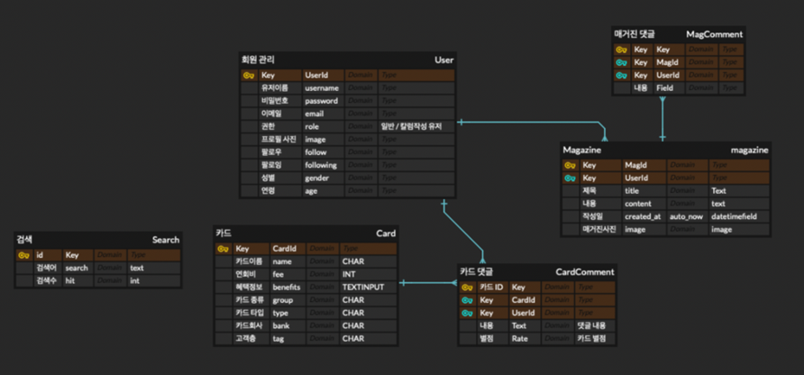
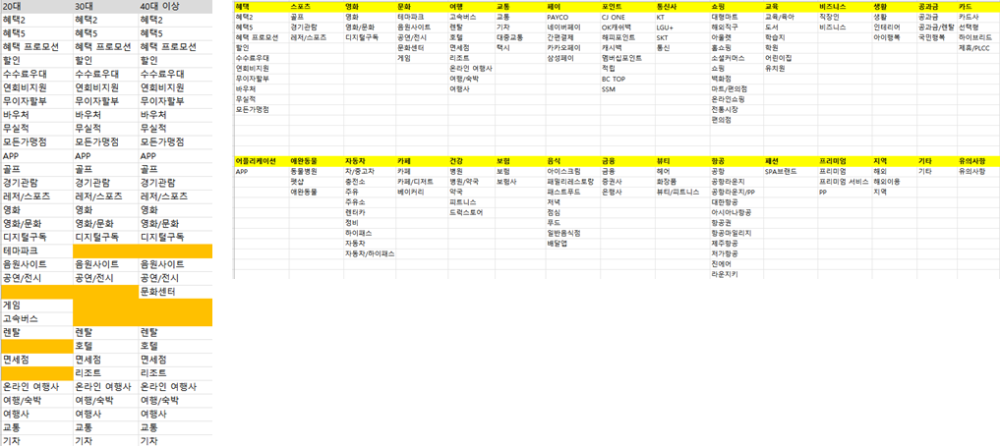
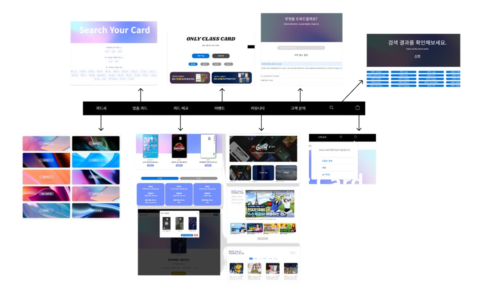

# 클래스 카드 소개

#### 프로젝트 기간 : 2022.11.23 ~ 2022.12.15

#### 팀원 : 김나현 (팀장), 이제준, 김지연, 김지영, 임수경

#### 맡은 역할 : 풀스택 개발, Readme 문서 정리

- 댓글, 대댓글 비동기 구현
- 카드 디테일 페이지 구현 (기능, UI)
- 카드 비교 기능 구현
- 맞춤 카드 추천 페이지 구현 (기능)

#### 사용 도구 : Python (Django), JavaScript | HTML, CSS | Github | AWS

#### 내용 : 사회 초년생을 위한 카드 혜택 정보를 제공하는 웹사이트 제작

- 크롤링을 통해 시중에 나와있는 카드 정보 수집 (FEAT. 카드 고릴라)
- 카드 정보, 카드 비교, 카드 추천, 그 외에도 카드 관련 커뮤니티 기능을 구현

 

#### 코드 링크 : https://github.com/ClassCardMLP/ClassCard

## DB 모델

- 모델링 뿐만 아니라, 혜택들을 분석하여, 각 카테고리에 넣었다
  - 카테고리에 넣은 이유는, 너무 많은 혜택들을 유저 입장에서 선택하면 불편하기 때문이다

## 페이지

### 카드 페이지

- 카드 정보를 볼 수 있는 페이지다
- 카드 정보 뿐만 아니라, 댓글을 달아, 카드에 대한 후기도 볼 수 있다

### 카드사 페이지

- 카드사 별로 카드를 찾을 수 있다
- 메이저한 카드사 위주로 카드사를 넣었다

### 맞춤 카드 페이지

- 나이 대, 신용/체크 카드, 그리고 원하는 혜택 별로 선택하면, 그에 맞는 카드들을 보여준다
- 여기서 또 한번, 카드사 별로 나눠서 볼 수 있다

### 카드 비교 페이지

- 먼저 `카드 비교`를 누르면, 카드 비교함이 뜬다
  - 이 비교함에, 카드들을 넣는다 (편의를 위해 모두 비동기 처리를 했다)
- 카드를 최대 3개까지 카드 비교함에 넣을 수 있고, 카드 정보와, 핵심 혜택 별로 정보를 보며, 카드들을 비교할 수 있다

### 이벤트 페이지

- 웹 서비스 내 이벤트를 보여주는 페이지다
- 특별한 기능 없이, 수작업으로 이벤트를 넣었다

### 커뮤니티 페이지

- 카드에 대한 더 섬세한 정보를 기록할 수 있는 페이지다
- 이 페이지는, 글을 쓸 수 있는 검증된 사람들만 쓸 수 있다

### 고객 문의 페이지

- 고객 문의를 직접 쓸 수 있거나, 자주 물어보는 질문들을 나열해서, 기록하였다
