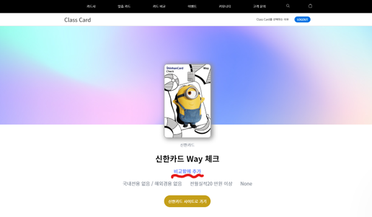
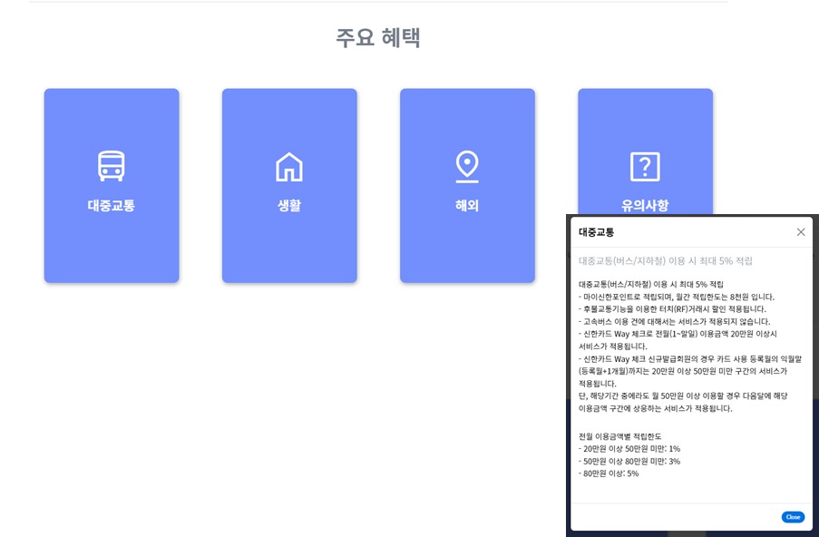

# 클래스 카드 - 카드 디테일 페이지

#### 카드 디테일 페이지는 카드 데이터부터, 시각화까지 모든 것을 구현했다

### 카드 데이터

- 크롤링을 통해 카드 데이터를 가지고 왔다
  - 카드 이름 / 카드사
  - 혜택 등

### 페이지 구현

- 제일 중요하게 생각한 것이, 어떻게 하면 유저들에게 간단한 UI를 제공하고 싶었다
- 그래서 정말 중요한 카드 내용들은 페이지에서 보여주었다
- 그리고 주요 혜택 같이, 내용이 많은 것들은, 모달을 이용했다
  - 주요 혜택의 제목 그리고 간단한 설명을 카드와 카드 호버 기능을 통해 구현을 했다
  - 해당 카드를 누르면, 모달창이 뜨고, 주요 혜택에 대한 자세한 정보를 볼 수 있다

> 위와 같이 페이지를 만들어, 유저들이 한 눈에 카드에 대한 내용을 볼 수 있다
>
> 만약 주요 혜택이 궁금하면, 카드를 클릭하면 된다
>
> - 주로 주요 혜택을 고려하더라도, 자세한 내용은 사람들이 잘 안 읽는다는 것을 생각했
