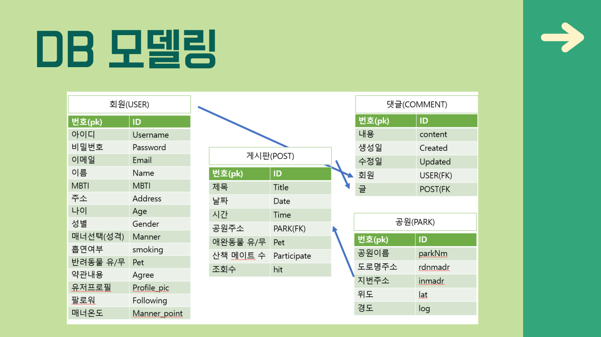
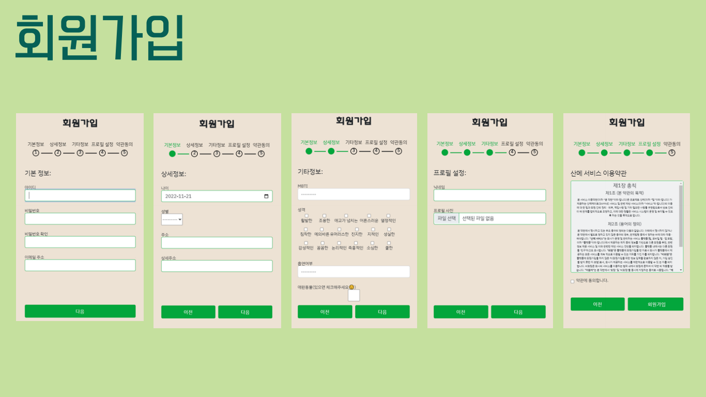
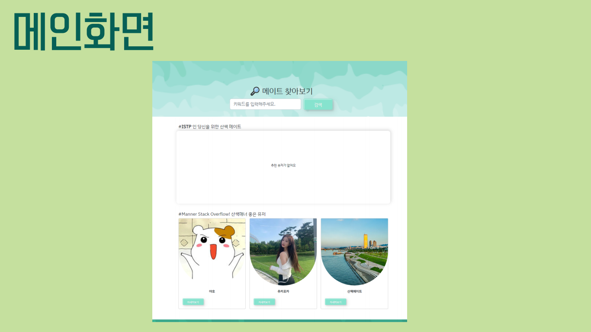
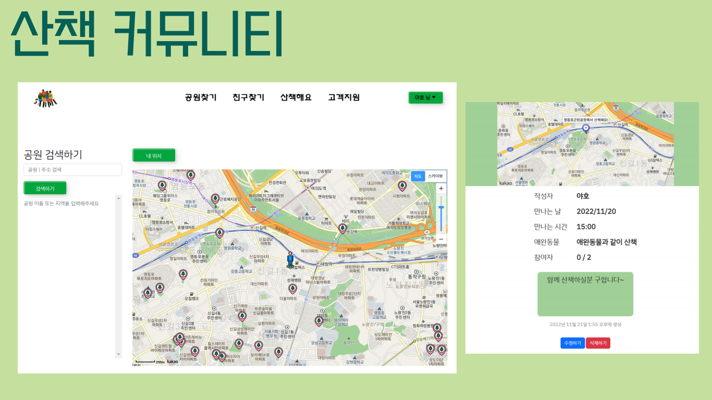
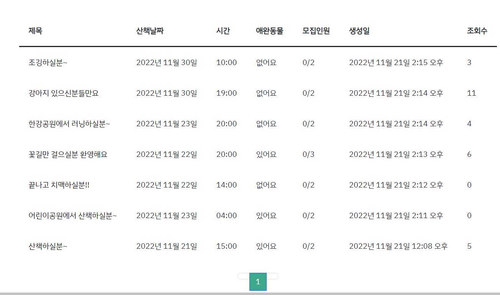
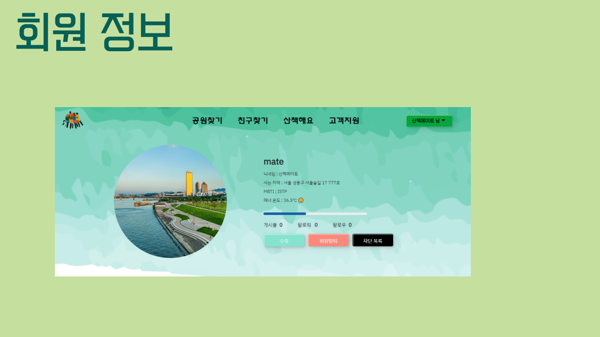
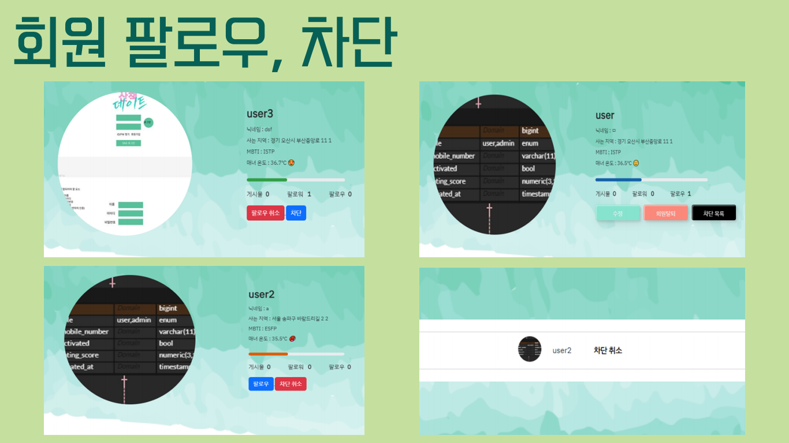

# 산메 (산책 메이트) 소개

#### 프로젝트 기간 : 2022.11.10 ~ 2022.11.21

#### 팀원 : 최준혁 (팀장), 이제준, 김다솔, 간정진, 신우철

#### 맡은 역할 : 풀스택 개발, Readme 문서 정리

- 지도 기능 구현
- 공원 검색 기능 구현
- 댓글 비동기 기능 구현

#### 사용 도구 : Python (Django), JavaScript | HTML, CSS | Github | AWS

#### 내용 : 가까운 공원을 찾아주고, 공원에서 같이 산책을 할 수 있도록 친구 모집을 할 수 있는 커뮤니티 웹서비스

 

#### 코드 링크 : https://github.com/jejoonlee/Sanme

## 주요 기능

### 전국 공원 정보

1. 전국 도시 공원 정보 표준 데이터 정보를 사용하여 전국의 공원을 조회할 수 있습니다.
2. 내 현재 위치 기반으로 공원 거리를 계산하여 가까운 공원 순으로 나열합니다.

### 산책 메이트 찾기

1. 글쓰기 버튼을 누르면 지도 페이지로 이동하여 근처의 원하는 공원을 선택할 수 있습니다.
2. 공원 선택 후 원하는 날짜와 시간, 인원 등의 정보를 포함한 글을 작성합니다.
3. 참여를 원하는 사용자는 댓글로 참여 의사를 표시합니다.
4. 작성자는 댓글을 작성한 사용자 중 원하는 사용자를 산책에 참여시킬 수 있습니다.

### 추천 유저

1. 가입 시 작성한 mbti를 반영한 추천 유저를 보여줍니다.
2. 산책 매너 점수가 높은 순으로 3명의 유저를 보여줍니다.

### 유저

1. 가입은 프로그래스바를 사용하여 가입 진행 정도를 알아볼 수 있습니다.
2. 원하는 유저를 팔로우, 차단 할 수 있습니다.
3. 유저 간 평가를 당근마켓 온도점수를 차용해 보여줍니다.

## DB 모델링

## 페이지 구성

### 시작 페이지

- 웹 서비스 특성 상, 유저들은 로그인을 해야지, 웹 서비스를 사용할 수 있도록 만들었

### 회원가입

- 회원가입을 하기 위해서는 성별, 주소, 나이, MBTI, 애완동물 등 많은 정보를 넣어야 하기 때문에, 페이지를 넘어가는 방식으로 처리를 했다

### 메인 페이지

- 검색 기능 / 추천 기능
  - MBTI 궁합 기준을 통해서 유저가 기입한 MBTI와 잘 맞는 MBTI인 유저들을 모아서, 랜덤으로 돌려서 추천을 해준다
  - 유저 온도가 높은 사람들 위주로 추천 리스트를 보여준다

### 공원 찾기 / 지도 기능 (코드 설)

- 공원 검색	
  - 공원 이름 또는 주소 위주로 검색을 할 수 있고, 유저 편의를 위해 비동기로 처리를 했다
  - 내 위치를 기준으로, 제일 가까운 공원 순서대로 검색 결과가 나온다
- 현재 위치 추전
  - 내 위치를 누르면, 지도에 현재 위치의 마커를 찍어준다
  - 반경 5km 내에 있는 공원들의 마커들도 찍어준다
- 공원 마커
  - 공원 마커를 누르면, 공원 이름, 주소, 그리고 내 위치로부터의 거리가 나온다
  - 산책하기 버튼을 클릭하면 산책할 메이트를 구하기 위한 글을 쓰는 페이지로 이동한다
    - 이때, 공원의 정보도 URL을 통해 가지고 간다
    - 추후, 산책 메이트 구하기 상세 페이지에서, 공원의 위치를 지도로 보여준다

### 게시글

- 게시글 작성
  - 지도에 만날 장소의 마커를 표시하고 장소, 날짜, 시간, 애완동물 유/무, 참여자의 수, 내용을 작성합니다.
- 게시글 목록
  - 작성된 게시글은 게시판에 리스트의 형태로 표시됩니다.

### 고객 지원

- 고객지원 페이지에서는 해당 사이트에서 자주 묻는 질문을 확인할 수 있습니다.

### 회원 정보

- 회원정보 페이지에서는 회원가입시 작성한 ID, 닉네임, 사는지역, MBTI 등을 확인할 수 있으며 수정 및 회원탈퇴가 가능합니다.

- 정보 수정페이지 이동
  - 작성한 개인정보를 수정하는 페이지로 이동합니다.
- 탈퇴하기
  - 회원을 탈퇴할 수 있습니다. 탈퇴 시 정보는 삭제되며, 산책 메이트의 기능을 사용할 수 없습니다.
- 차단목록
  - 내가 차단한 유저의 목록을 확인할 수 있습니다.

- 팔로우
  - 마음에 드는 유저를 팔로우할 수 있습니다. 팔로우된 유저는 매너온도가 상승합니다.
- 차단
  - 마음에 들지않는 유저를 차단할 수 있습니다. 차단된 유저는 매너온도가 하락합니다.
- 차단 취소
  - 차단을 취소합니다. 취소 시 매너온도는 다시 상승합니다.

