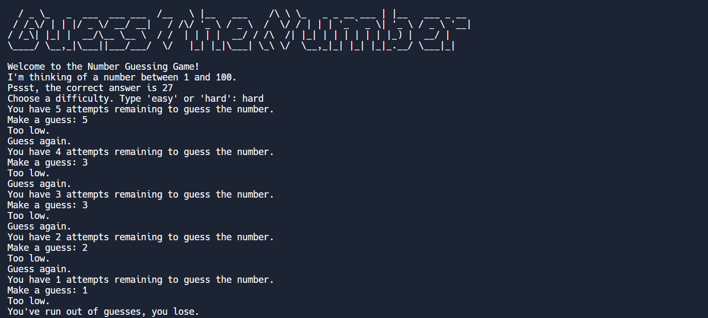

# Udemy : Python 유효 범위 (로컬 범위, 글로벌 범위)

#### 

## Scope

```python
enemies = 1

def increase_enemies():
    enemies = 2
    print(f"enemies inside function: {enemies}")
    
increase_enemies()
print(f"enemies inside function: {enemies}")

# output 1 : enemies inside function: 2
# output 2 : enemies inside function: 1
```

- output 1
  - 함수에서 가지고 온 `enemies`
- output 2
  -  함수 밖에 있는 `enemies=1`을 가지고 왔다


### Local Scope (로컬 범위)

- 로컬 범위는, 함수 안에 있는 것이다
- 변수를 함수 안에 넣게 되면, 함수 내에서만 변수를 사용할 수 없다
  - 즉 위에 `enemies = 1` 가 없고, `enemies`라는 변수를 따로 출력하려면 오류가 뜰 것이다

```python
def increase_enemies():
    enemies = 2
    print(f"enemies inside function: {enemies}")
    
print(enemies)
# error
```


### Global Scope (전역 범위)

- 함수 밖에 존재하는 것 들이다

```python
enemies = 1

def increase_enemies():
    enemies = 2
    print(f"enemies inside function: {enemies}")
    
increase_enemies()
print(f"enemies inside function: {enemies}")

# output 1 : enemies inside function: 2
# output 2 : enemies inside function: 1
```

- 즉 output 1은 Local Scope / output 2는 Global Scope


## 숫자 맞추는 게임



```python
def number_dif(count, num, num_choose):
  if num_choose > num:
    print("Too high.")
    print("Guess again.")
    print(f"You have {count} attempts remaining to guess the number")
    return False
  elif num_choose < num:
    print("Too low.")
    print("Guess again.")
    print(f"You have {count} attempts remaining to guess the number")
    return False
  elif num_choose == num:
    return True

import random

print("Welcome to the Number Guessing Game!")
print("I'm thinking of a number between 1 and 100.")
difficulty = input("Choose a difficulty. Type 'easy' or 'hard': ")

random_number = random.randint(1, 100)


if difficulty == 'easy':
  print("You have 10 attempts remaining to guess the number.")
  for i in range(9, 0, -1):
    guess = int(input("Make a guess: "))
    result = number_dif(i,random_number, guess)
    if result == True:
      print(f"You got it! The answer was {random_number}")
      break

  if result != True:
    print(f"You have failed to guess the number. The answer was {random_number}")

elif difficulty == 'hard':
  print("You have 5 attempts remaining to guess the number.")
  for i in range(4, 0, -1):
    guess = int(input("Make a guess: "))
    result = number_dif(i,random_number, guess)
    if result == True:
      print(f"You got it! The answer was {random_number}.")
      break

  if result != True:
    print(f"You've run out of guesses. The answer was {random_number}")

else:
  print("You did not choose the right difficulty, run the game again")
```

- `number_dif` 함수에 유저가 입력한 숫자와 맞춰야 하는 숫자를 비교한다
  - 못 맞추면, `False`를 return하고 맞추면 `True`를 return 한다
- 이 함수를 for문에 넣어서, **easy를 선택했을 땐 10번**을 반복하고, **hard를 선택했을 땐 5번**을 반복한다
- 그리고 함수에서 `True`를 반환했을 때, for문은 끝나고, 게임도 끝난다
