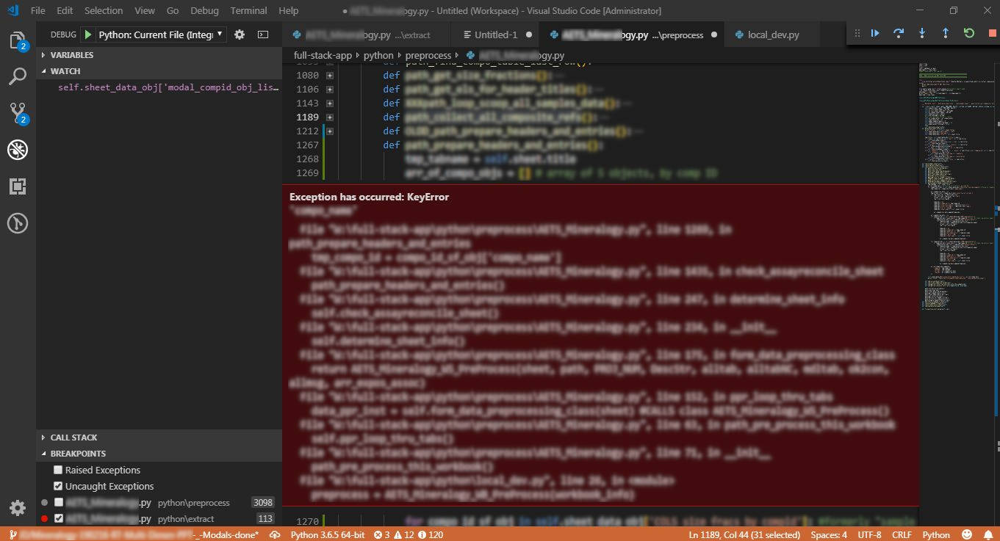
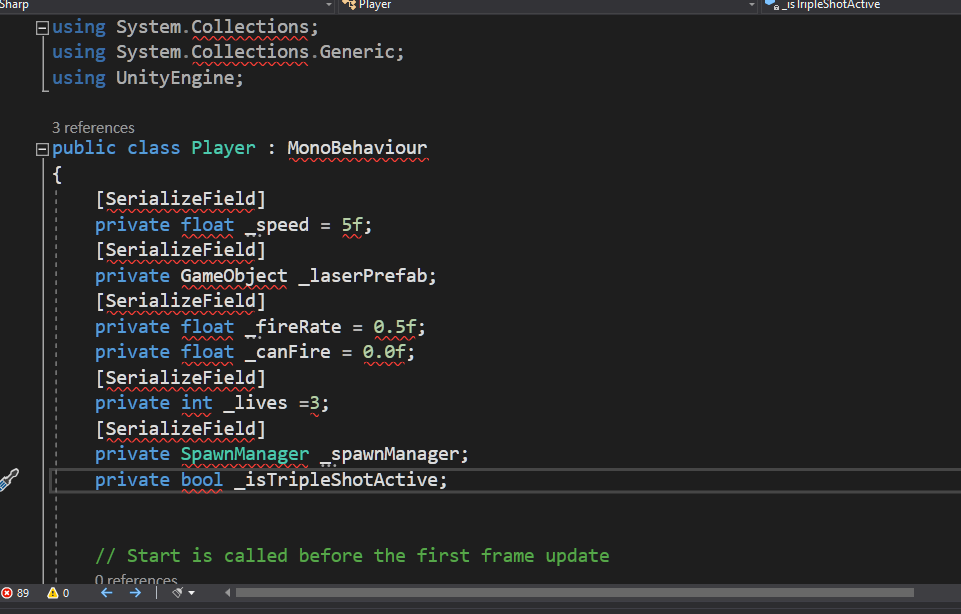

# Udemy : Python 디버깅


## 머리 속으로 문제 그려보기

```python
def my_function():
    for i in range(1, 20):
        if i == 20:
            print("You got it")

my_function()
```

- 위에 코드는 작동은 하지만 "You got it"을 출력을 안 한다
- 왜냐하면 `range(1, 20)` 특성상 1이상 20미만의 수들을 구한다
  - 즉 1부터 19까지만 구하는 것
- 따라서 "You got it"을 출력하기 위해서는 `range(1, 21)`로 바꿔야 한다


## 버그 재현하기

```python
from random import randint
dice_imgs = ["❶", "❷", "❸", "❹", "❺", "❻"]
dice_num = randint(1, 6)
print(dice_imgs[dice_num])

# 이 코드를 실행했을 경우, 어쩔때는 작동을 하지만 어쩔때는 작동이 안 된다
# 에러가 났을때 (list index out of range) 에러가 뜬다
```

- 어쩔 때는 작동이 되고, 어쩔 때는 작동이 안 될때에는 버그를 직접 다시 구현해보는 것도 좋다
  - `randint(1, 6)`이 1부터 6까지 랜덤으로 반환해주는 것을 안다
  - 그러면 `dice_num`에 숫자를 하나씩 넣어준다
  - 그렇게 되면 6을 넣게 되면 에러가 뜨게 된다 (즉, 6 때문에 에러가 발생한다는 것을 알 수 있다)
- 위에 같은 경우 `randint(1, 6)` 는 1부터 6을 랜덤으로 반환해 준다
  - 하지만 인덱스는 0부터 시작한다
  - `dice_imgs` 리스트 안에 있는 인덱스들은 0부터 5까지 있다
  - 즉 `randint(1, 6)` 에서 6을 반환할 때, 에러 메세지가 뜨는 것이다
- 해결을 하기 위해서는 `randint(0, 5)`로 바꿔야 한다


## 컴퓨터 입장으로 생각해보기

```python
year = int(input("What's your year of birth?"))
if year > 1980 and year < 1994:
  print("You are a millenial.")
elif year > 1994:
  print("You are a Gen Z.")
```

- 1994를 입력을 하면 아무것도 출력을 안 한다
  - 컴퓨터는 1994를 `year`에 입력을 받는다
  - 그리고 if문과 elif문을 차례대로 보게 된다
  - if 문에는 `1980 < year < 1994` 라서 1994년을 포함을 안 한다
  - elif문도 `1994 < year` 이라서 1994를 포함을 안 한다
  - 즉 if문 elif문 모두 1994를 포함하지 않기 때문에 아무것도 출력을 안 하는 것이다
- 즉 `if year > 1980 and year <= 1994` 또는 `year >= 1994`으로 만들어야 한다


## 오류 수정하기 

> #### 에디터를 사용할 때에 잘 볼 수 있다

- 콘솔 창에 뜨는 에러 메세지



- 코드를 작성할때 볼 수 있는 빨간 줄




## print() 구문으로 버그 사용하기

> #### 코드를 출력해보고, 어떤 것이 작동이 안 되는지 확인해보는 것이다

```python
pages = 0
word_per_page = 0
pages = int(input("Number of pages: "))
word_per_page == int(input("Number of words per page: "))
total_words = pages * word_per_page
print(total_words)

# output : 0
```

- 입력을 해도 0이 나온다
- 이 코드 같은 경우 `pages`와 `word_per_page`를 출력해본다
  - 그렇게 되면, `pages`는 입력값이 나오지만 `word_per_page`는 0이 나온다
  - 여기서 `word_per_page` 쪽에서 문제가 있는 것을 알 수 있다
  - 코드를 자세히 보면 `word_per_page ==` 이 있다


## 디버거 활용하기

> #### 파이썬 튜터: https://pythontutor.com/visualize.html#mode=edit
>
> #### vscode의 디버깅 툴이 있다


