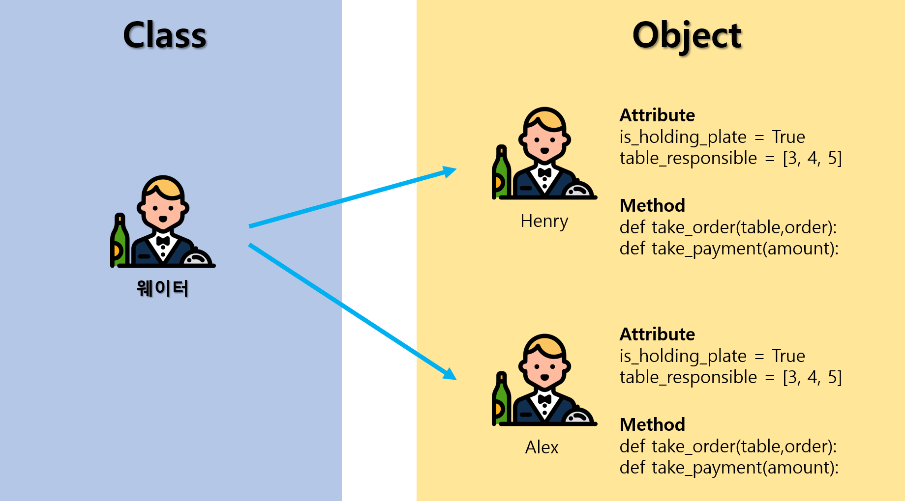
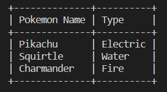

# Udemy : Python 객체 지향 프로그래밍 (OOP)

#### 


## 객체 지향 프로그래밍 (Object Oriented Programming)

> #### 현실 세계의 객체들 (Objects)을 프로그래밍으로 모델링 하는 것이다
>
> - ##### 객체들은 무언가를 가지고 있다 (attributes, 또는 속성) / 객체와 관련 있는 데이터
>
> - ##### 객체들은 무언가를 할 수 있다 (methods, 메소드)
>
> #### 즉 객체에는 data와 function이 존재한다

#### 예) 음식점

음식점은 혼자서 모든 것을 하는 것보다, **요리사, 웨이터, 청소하는 사람**을 고용하는 것이 편하다

- 요리사, 웨이터, 청소하는 사람들 모두 각각 **속성과 메소드**가 필요하다
  - **웨이터의 속성 (Attributes)**
    - 접시를 가지고 있는지? : `is_holding_plate = True`
    - 맡고 있는 테이블 : `table_responsible = [4, 5, 6]`
  - **웨이터의 메소드 (Methods)**
    - `def take_order(table, order):`
    - `def take_payment(amount):`
- 그리고 이 웨이터라는 속성과 메소드를 가지고, 다른 웨이터들에게 똑같은 속성와 메소드를 접목 시킬 수 있다
  - 예) `웨이터 = [Henry, Alex]`
  - 여기서 **웨이터는 Class 라고 하고 Henry 또는 Alex는 Object** 이다




### Class

- 클래스 안에 모든 속성과 메서드는 하나의 **블루 프린트**가 되어 현실을 모델링 한다

### Object

- 위에 클래스를 통해 만든 **블루 프린트**들을 가지고 많은 객체들을 만들 수 있는 것이다
- 그리고 프로그래밍을 할 때에 그 객체들을 사용한다


> #### 메서드를 불러올 때에는 `.method()`
>
> #### 속성을 불러올 때에는 `.attribute`


## 거북이 실습

```python
from turtle import Turtle, Screen
# turtle 모듈을 가지고 온다

timmy = Turtle() 	# Turtle() 클래스를 timmy라는 객체로 만든다
timmy.shape("turtle")		# function / method
timmy.color("red")			# function / method
timmy.pencolor("cyan")		# function / method
timmy.forward(100)		# 앞으로 100번을 가는 function (forward)
print(timmy)

my_screen = Screen()
print(my_screen.canvheight)		# my_screen의 속성
my_screen.exitonclick()
```


## Package

> #### PyPi : Python Package Index

- 파이썬 패키지를 검색할 수 있는 사이트
- 파이썬 패키지에서 가지고 올 패키지를 복사한다

```terminal
# 터미널에
pip install '패키지 이름'
```


### 예시

```python
# PrettyTable 다운로드 받기: pip install PrettyTable

from prettytable import PrettyTable

table = PrettyTable()

table.add_column("Pokemon Name", ["Pikachu", "Squirtle", "Charmander"])
table.add_column("Type", ["Electric", "Water", "Fire"])

table.align["Pokemon Name"] = 'l'
table.align["Type"] = 'l'
# 왼쪽으로 정렬
# 기본은 중앙 정렬
# .align은 속성이다

print(table)
```




## 커피 자판기 2

> #### 클래스를 사용해서 어제 만든 커피 자판기 코드를 다시 만들기
>
> #### menu, coffee_maker, money_machine 파일들은 주어진다
>
> ### Documentation을 읽으면서, 코드를 짜는 것!

```python
from menu import Menu, MenuItem
from coffee_maker import CoffeeMaker
from money_machine import MoneyMachine

coffee_info = CoffeeMaker()
coffee_menu = Menu()
menu_item = MenuItem
money_machine = MoneyMachine()

menu_choose = "on"

while menu_choose != "off":

    menu_choose = input(f"What would you like? ({coffee_menu.get_items()}): ").lower()

    if menu_choose == "report":
        coffee_info.report()
        money_machine.report()

    elif coffee_menu.find_drink(menu_choose).name:
        coffee_select = coffee_menu.find_drink(menu_choose)
        sufficiency = coffee_info.is_resource_sufficient(coffee_select)

        if sufficiency == True:
            money_check = money_machine.make_payment(coffee_select.cost)

            if money_check == True:
                coffee_info.make_coffee(coffee_select)
```

