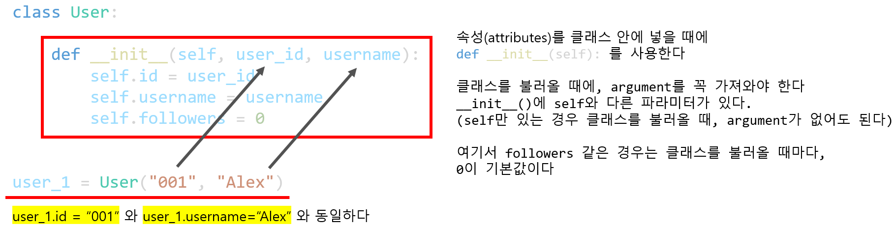

# Udemy : Python 퀴즈 프로젝트와 OOP의 장점


## 파이썬 클래스를 만드는 방법

> #### 클래스는 객체를 만들기 위한 블루프린트 (Blue Print)이다


```python
class User:
    pass

user_1 = User()
# 클래스를 불러올 때에는 클래스 이름 뒤에 ()를 붙인다
```

- `class User:`  -  class를 넣어주고, 뒤에 클래스의 이름을 쓰면된다
  - PascalCase - 클래스의 이름은 각 단어의 첫 번째 글자는 대문자로 써야 한다 (예) MyCar, UserInfo)
- `pass` - 클래스에 아무 정보를 넣고 싶지 않을 때


## 속성, 클래스 생성자, `__init__()` 함수 사용하기



```python
class User:
    
    def __init__(self, user_id, username):
        # initialise attributes / create starting value for attribute
        # called everytime class is called
        
        self.id = user_id
        self.username = username
        self.followers = 0

user_1 = User("001", "Alex")
# 밑의 코드와 같다
# user_1.id = "001"
# user_1.username = "Alex"
```

- `followers` 같이, `__init__(self)`에 파라미터가 없으면, 객체를 만들때 들어가는 기본 값인 것이다
- **`self` 는 객체를 가리키는 것**


## 메소드 (Method) 추가하기

```python
class User:
    
    def __init__(self, user_id, username):
        # initialise attributes / create starting value for attribute
        # called everytime class is called
        
        self.id = user_id
        self.username = username
        self.followers = 0
        self.following = 0

    def follow(self, user):
        user.followers += 1
        self.following += 1

user_1 = User("001", "Alex")
user_2 = User("002", "Yang")

user_1.follow(user_2)
```

- 클래스 안에 function을 넣으면 된다
- `follow` 예시


## 퀴즈 프로젝트

> True Or False 게임이고, 맟추면 점수를 얻는 것
