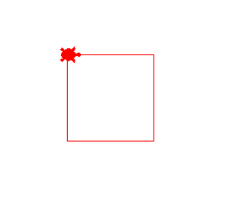
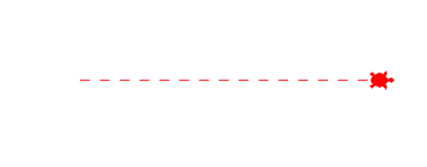
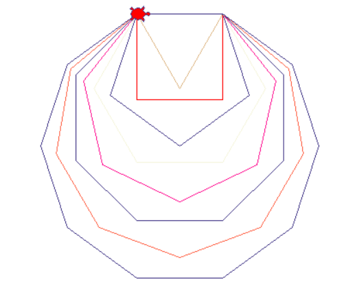
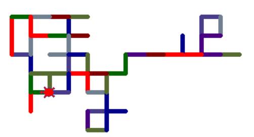
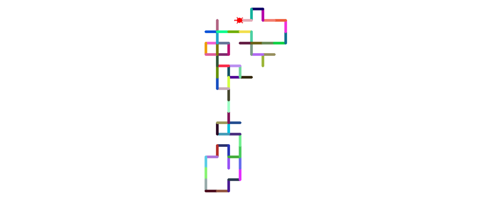
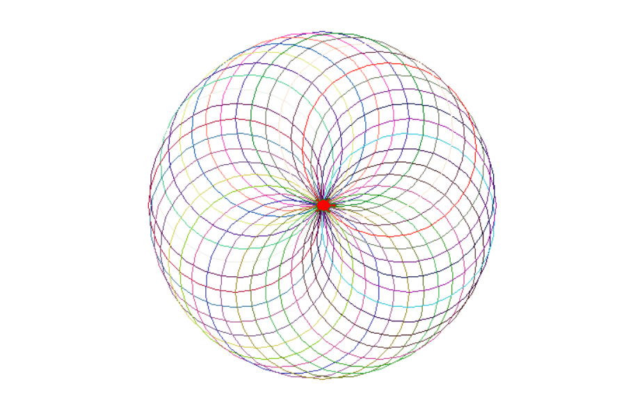
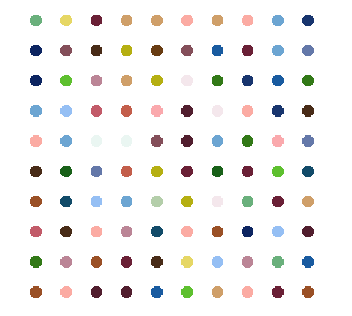

# Udemy : Python 터틀 & 그래픽 사용자 인터페이스 (GUI)

> turtle 파이썬, 문서를 보면서, 거북이를 조작하는 것


## GUI

> #### Graphical User Interface

- GUI가 만들기 전에는 TUI (Text User Interface)가 있었다.
  - TUI는 모두 글로 되어 있어서, 글로 명령을 하는 것이다
- GUI 같은 경우, 시각적으로 더 발전한 것이고, 마우스 같이, 스크린을 조작할 수 있다


## 모듈 Import , 패키지 설지 , 별칭 사용

#### import

```python
# keyword (import)	Module name (turtle)
import turtle

# 객체	모듈		클래스
# turtle  turtle.   Turtle()
turtle = turtle.Turtle()
```


#### from --- import

```python
# keyword	module name		keyword		thing in module
#	from	turtle			import		Turtle
from turtle import Turtle

# 객체		클래스
# trutle  	 Turtle()
turtle = Turtle()

from turtle import *
```

- `turtle.Turtle()`을 계속 안 사용하고, `Turtle()`로만 불러올 수 있다
- `*` 은 `turtle` 모듈 안에 있는 모든 클래스들을 사용 할 수 있다 
  - 하지만 어떤 클래스를 사용하는지 잘 모를 수 있다


#### Aliasing Module

> #### 모듈의 이름을 코드를 짜는 사람이 원하는 이름으로 바꾸는 것

```python
# keyword	Module name		keyword		alias name
# import	turtle			as			t

import turtle as t
```

- 원래 `turtle`이라는 모듈 이름을 `t`로 사용할 수 있다
- 모듈 이름이 길면, `as`로 이용하여 더 짧게 사용할 수 있다


#### Installing Module

> #### 다운을 받아야 하는 모듈이 있을 수 있다
>
> - 파이썬 기본 라이브러리에 있는 모듈이 있지만, 그렇지 않으면 모듈을 다운로드를 받아야 한다
> - 파이썬 기본 라이브러리에는 모듈이 많이 없다

```python
# 터미널에 pip install '모듈 이름'
# 다운로드를 받으면 import을 써서 가지고 오면 된다
```


## 네모 만들기

```python
from turtle import Turtle, Screen

turtle = Turtle()
turtle.shape("turtle")
turtle.color("red")

for _ in range(4):
    turtle.forward(100)
    turtle.right(90)


screen = Screen()
screen.exitonclick
```




## 거북이 점선 그리기

```python
from turtle import Turtle, Screen

turtle = Turtle()
turtle.shape("turtle")
turtle.color("red")

for _ in range(15):
    turtle.forward(10)
    turtle.penup()
    turtle.forward(10)
    turtle.pendown()


screen = Screen()
screen.exitonclick()
```




## 다양한 도형 그리기

> #### 도형마다 랜덤으로, 가지고 온 색깔을 고르기
>
> 그리고 도형 안의 각도를 나누면서 방향을 돌리면서 100씩 앞으로 가기

```python
from turtle import Turtle, Screen
import random

turtle = Turtle()
turtle.shape("turtle")
turtle.color("red")

colors = ["teal", "burlywood", "olive drab", "red", "dark salmon", "rebecca purple", "tomato", "violet", "dark slate blue", "pale goldenrod", "forest green", "beige", "peach puff", "pale violet red", "deep pink"]


for shape in range(3, 11):
    turtle.pencolor(random.choice(colors))

    for i in range(shape):
        turtle.forward(100)
        turtle.right(360/shape)

screen = Screen()
screen.exitonclick()
```





## 무작위 행보 구현하기

> #### 거북이가 무작위 방향으로 걷기
>
> #### 걷는 길이는 같음
>
> #### 색깔은 무작위로

```python
from turtle import Turtle, Screen
import random

turtle = Turtle()
turtle.shape("turtle")
turtle.color("red")
turtle.pensize(7)
turtle.speed(5)


colors = ["indigo", "dark slate blue", "red", "dark blue", "slate gray", "dark green", "maroon", "dark olive green"]
directions = [0, 90, 180, 270]

for _ in range(100):
    turtle.pencolor(random.choice(colors))
    turtle.setheading(random.choice(directions))
    turtle.forward(30)


screen = Screen()
screen.exitonclick()
```



- 팬의 색깔, 두깨, 랜덤 방향, 그리고 거북이 움직이는 속도를 따로 설정했다


## RGB를 랜덤으로

```python
import turtle as t
from turtle import Screen
import random

tim = t.Turtle()
tim.shape("turtle")
tim.color("red")
tim.pensize(7)
tim.speed(5)

t.colormode(255)


def random_color():
    r = random.randint(0,255)
    g = random.randint(0,255)
    b = random.randint(0,255)
    random_color = (r, g, b)
    return random_color

directions = [0, 90, 180, 270]

for _ in range(100):
    tim.pencolor(random_color())
    tim.setheading(random.choice(directions))
    tim.forward(30)


screen = Screen()
screen.exitonclick()
```



- `colormode` 를 설정한다
- rgb 색깔 : 0~255 까지를 랜덤으로 고르고 rgb색깔에 넣는다


## 스피로그래프 그리기

```python
import turtle as t
from turtle import Screen
import random

tim = t.Turtle()
tim.shape("turtle")
tim.color("red")
tim.pensize(1)
tim.speed("fastest")

t.colormode(255)


def random_color():
    r = random.randint(0,255)
    g = random.randint(0,255)
    b = random.randint(0,255)
    random_color = (r, g, b)
    return random_color

def draw_spirograph(size_of_gap):
    for _ in range(int(360 / size_of_gap)):
        tim.pencolor(random_color())
        tim.circle(100)
        tim.setheading(tim.heading() + size_of_gap)

draw_spirograph(10)

screen = Screen()
screen.exitonclick()
```



- ` tim.circle(100)` : radius를 넣으면 된다
- `tim.heading()` : 거북이가 어디를 바라보는지 값으로 알려준다
- `size_of_gap` : 방향을 얼마나 돌릴지 구한다
- 360도 를 size_of_gap 으로 나누면, 거북이가 동그라미를 몇개를 만들어야, 제자리로 돌아오는지 알 수 있다
  - `int(360 / size_of_gap)`


## 허스트 페인팅 프로젝트 

> #### 이미지에서 rgb 색깔 추출하기

```python
import colorgram

colors = colorgram.extract('SpotPainting04.jpg', 30)

color_rgb = []

for color in colors:
    color_rgb.append((color.rgb.r, color.rgb.g, color.rgb.b))
```

- colorgram을 설치하고 import 한다
- `colors = colorgram.extract('SpotPainting04.jpg', 30)` 
  - 30개의 색깔을 추출한다. RGB, HSL로 추출
- `(color.rgb.r, color.rgb.g, color.rgb.b)`
  - `color.rgb`는 튜플로 r, b, g 색깔을 가지고 오는데, 숫자만 있는 것이 아님
  - 그래서 뒤에 `.r`, `.g`, `.b`를 추가해서, 각각의 색깔 숫자를 가지고 온다


```python
import turtle as t
from turtle import Screen
import random

tim = t.Turtle()
tim.shape("turtle")
tim.pensize(1)
tim.speed("fastest")

t.colormode(255)

tim.hideturtle()
tim.penup()
tim.setheading(225)
tim.forward(300)
tim.setheading(0)
tim_xcor = tim.xcor()

for _ in range(10):

    for _ in range(10):
        tim.dot(20, random.choice(rgb_color))
        tim.penup()
        tim.forward(50)

    back_to_start = (tim_xcor, tim.ycor() + 50)

    # 위치를 계산해서 x는 뒤로 돌아가고 y는 50을 더해서 올라간다
    tim.goto(back_to_start)

screen = Screen()
screen.exitonclick()
```


