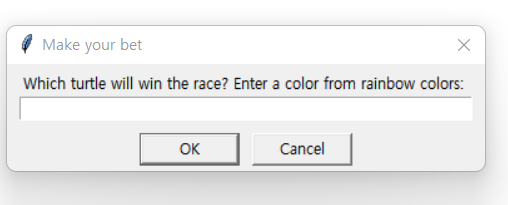
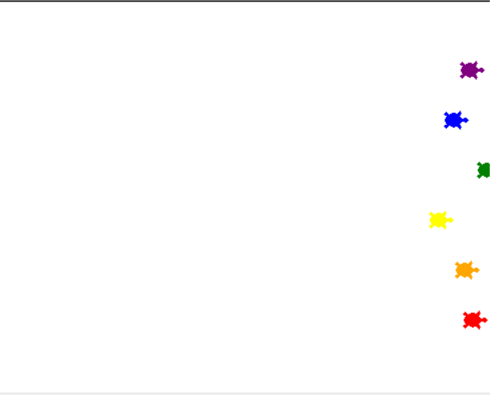

# Udemy : Python 인스턴스, 상태, 고차함수


## 객체 상태 및 인스턴스

```python
# object	class
# timmy		Turtle()
# tommy		Turtle()

timmy = Turtle()
tommy = Turtle()
```

- 위에 timmy와 tommy는 `Turtle()`이라는 클래스의 블루프린트를 가지고 있는 객체이다
- timmy와 tommy는 같은 블루 프린트를 가지고 있지만, 둘 다 각각 **독립적인 인스턴스** 이다
  - 각각 Turtle() 이라는 객체의 예시다
  - 즉 각각의 **인스턴스**는 다른 속성 그리고 다른 일을 할 수도 있다
    - 그리고 이렇게 다른 속성, 다른 일을 할 수 있는 것을 `state` 즉 상태라고 한다


## 고차 함수 & 이벤트 리스너

```python
import turtle as t
from turtle import Turtle, Screen

tim = Turtle()
screen = Screen()

def move_forward():
    tim.forward(10)

screen.listen()
screen.onkey(key="space", fun=move_forward)

screen.exitonclick()
```

- `screen.listen()` 스크린에서 어떤 동작을 하는지 기다리는 것
- `screen.onkey(key="space", fun=move_forward)` 
  - 키보드 `(key="space")`에서 스페이스바를 누르면, `fun=` 함수를 실행하는것
    - 그 함수는 `move_forward`
    - 여기서는 `()`가 필요 없다. 왜냐하면 스페이스 바를 누를 때 실행하는 함수라서
    - 즉 무언가를 할 때에, 실행하는 함수이다


### 고차 함수 예시

```python
def function_a(something):
    # Do this with something
    # Then do this
    # Finally do this
    
def function_b():
    # Do this
    
function_a(function_b)
# 함수 안에 함수를 실행하는 것

# -------- 예시 --------------
def add(n1, n2):
    return n1 + n2

def subtract(n1, n2):
    return n1 - n2

def multiply(n1, n2):
    return n1 * n2

def divide(n1, n2):
    return n1 / n2

# n1, n2 두 개의 숫자와 함수 이름을 가지고 온다
def calculator(n1, n2, func):
    return func(n1, n2)
# 반환 값은 불러온 함수를 통한 계산 값이다

print(calculator(2, 5, multiply))
# output : 10
# 2 * 5 는 10
```


## Etch-a-sketch App

> W = Forward
>
> S = Backwards
>
> A = Counter-Clockwise
>
> D = Clockwise
>
> C = Clear drawing
>
> 해당 키보드 키들의 기능들을 가지고 스케치를 하는 것

```python
import turtle as t
from turtle import Turtle, Screen

tim = Turtle()
screen = Screen()

def move_forward():
    tim.forward(20)

def move_backward():
    tim.backward(20)

def clockwise():
    tim.right(10)

def counter_clockwise():
    tim.left(10)

def clear():
    tim.reset()

screen.listen()
screen.onkey(key="w",fun=move_forward)
screen.onkey(key="s", fun=move_backward)
screen.onkey(key="d", fun=clockwise)
screen.onkey(key="a", fun=counter_clockwise)
screen.onkey(key="c", fun=clear)


screen.exitonclick()
```

- 키보드의 키를 누르면, 어떤 동작을 하는지 function을 통해서 만든다


## 거북이 레이스

> 6개 색깔의 거북이들이 달리기 시합을 하는 것이다
>
> 먼저 오른쪽 면에 도착하면 거북이가 이기는 것

```python
import turtle as t
from turtle import Turtle, Screen
import random

is_race_on = False
screen = Screen()
screen.setup(width=500, height=400)
user_bet = screen.textinput(title="Make your bet", prompt="Which turtle will win the race? Enter a color from rainbow colors: ")
colors = ["red", "orange", "yellow", "green", "blue", "purple"]

turtles = []
turtle_line = -170

for i in range(len(colors)):
    temp_turtle = Turtle(shape="turtle")
    temp_turtle.color(colors[i])

    turtle_line += 50

    temp_turtle.penup()
    temp_turtle.goto(-220, turtle_line)

    turtles.append(temp_turtle)

print(turtles)

if user_bet:
    is_race_on = True

while is_race_on:

    for turtle_race in turtles:
        move_forward = random.randint(0, 10)
        turtle_race.forward(move_forward)

        if turtle_race.xcor() > 230:
            winner = turtle_race.color()
            is_race_on = False
            break

if winner == user_bet:
    print(f"You've won! The {winner} turtle is the winner!")
else:
    print(f"You've lost! The {winner} turtle is the winner!")

screen.exitonclick()
```





