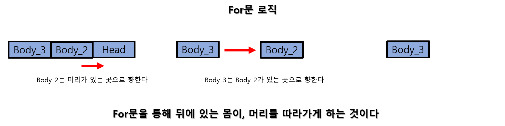
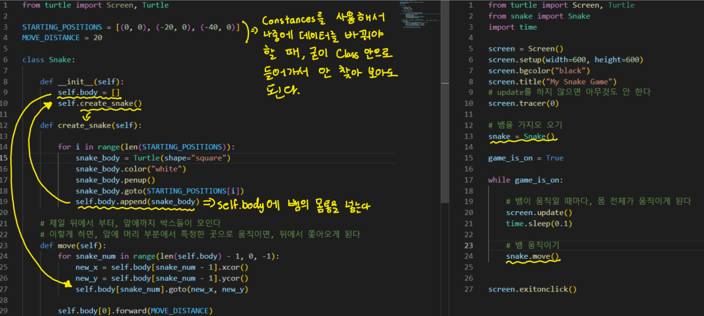

# Udemy : Python 에니메이션과 좌표


## 뱀 게임

#### 자연스럽게 에니메이션 설정하기

```python
screen.tracer(0)
screen.update()
```

- 원래는 블록 하나씩 움직이는 것이 다 보였다
  - 하지만 블록 전체가, 하나로 움직이는 것을 보여야 한다
- `screen.tracer(0)`를 하면 동작 전체를 안 하도록 한다
- `screen.update()`를 하면, 하나의 `for문` 또는 묶여있는 동작이 실행이 되면, 한번에 동작을 블록 전체가 하나로 실행하게 보이게 된다 


#### 뱀 움직이기



```python
for snake_num in range(len(snake) - 1, 0, -1):
    new_x = snake[snake_num - 1].xcor()
    new_y = snake[snake_num - 1].ycor()
    snake[snake_num].goto(new_x, new_y)
```


#### 클래스화 시키기




#### 클래스 상속

```python
from turtle import Turtle
import random

class Food(Turtle):

    def __init__(self):
        super().__init__()
        self.shape("circle")
        self.penup()
        # 10 * 10 circle
        self.shapesize(stretch_len=0.5, stretch_wid=0.5)
        self.color("blue")
        self.speed("fastest")
        self.refresh()

    def refresh(self):
        random_x = int(random.randrange(-280, 280, 20))
        random_y = int(random.randrange(-280, 280, 20))
        self.goto(random_x, random_y)
```

- Turtle() 클래스를 Food 클래스 안에 넣어서, 사용한다
- `super().__init__()` 을 통해 Turtle() 속성을 Food() 클래스에 가지고 온다


## Main.py

> #### 뱀 게임의 모든 기능들은 main.py에서 실행이 된다

```python
from turtle import Screen, Turtle
from snake import Snake
from food import Food
from scoreboard import ScoreBoard
import time

screen = Screen()
screen.setup(width=600, height=600)
screen.bgcolor("black")
screen.title("My Snake Game")
# update를 하지 않으면 아무것도 안 한다
screen.tracer(0)

# 뱀을 가지오 오기
snake = Snake()
food = Food()
scoreboard = ScoreBoard()


screen.listen()
screen.onkey(snake.up, "Up")
screen.onkey(snake.down, "Down")
screen.onkey(snake.left, "Left")
screen.onkey(snake.right, "Right")

game_is_on = True


while game_is_on:

    # 뱀이 움직일 때마다, 몸 전체가 움직이게 된다
    screen.update()
    time.sleep(0.1)

    # 뱀 움직이기
    snake.move()

    if snake.head.distance(food) < 10:
        scoreboard.score_point()
        food.refresh()
        snake.extend()

    if snake.head.xcor() >= 300 or snake.head.xcor() <= -300 or snake.head.ycor() >= 300 or snake.head.ycor() <= -300:
        game_is_on = False
        scoreboard.game_over()

    for body in snake.body[1:]:
        if snake.head.position() == body.position():
            game_is_on = False
            scoreboard.game_over()

screen.exitonclick()
```


## snake.py

> #### 뱀의 형태, 그리고 움직임을 작동시키는 class를 만든 파일

```python
from turtle import Screen, Turtle

STARTING_POSITIONS = [(0, 0), (-20, 0), (-40, 0)]
MOVE_DISTANCE = 20
UP, DOWN, RIGHT, LEFT = 90, 270, 0, 180


class Snake:
    def __init__(self):
        self.body = []
        self.create_snake()
        self.head = self.body[0]

    def add_snake(self, position):
        snake_body = Turtle(shape="square")
        snake_body.color("white")
        snake_body.penup()
        snake_body.goto(position)
        self.body.append(snake_body)

    def create_snake(self):
        for position in STARTING_POSITIONS:
            self.add_snake(position)

    def extend(self):
        position = (self.body[-1].xcor(), self.body[-1].ycor())
        self.add_snake(position)

    # 제일 뒤에서 부터, 앞에까지 박스들이 모인다
    # 이렇게 하면, 앞에 머리 부분에서 특정한 곳으로 움직이면, 뒤에서 쫓아오게 된다
    def move(self):
        for snake_num in range(len(self.body) - 1, 0, -1):
            new_x = self.body[snake_num - 1].xcor()
            new_y = self.body[snake_num - 1].ycor()
            self.body[snake_num].goto(new_x, new_y)

        self.head.forward(MOVE_DISTANCE)

    # 다시 방향을 돌아갈 수 없도록 if문으로 만든다
    # 예) 위를 보고 있으면 DOWN 방향을 못 가게 만든다
    def up(self):
        if self.head.heading() != DOWN:
            self.head.setheading(UP)

    def down(self):
        if self.head.heading() != UP:
            self.head.setheading(DOWN)

    def right(self):
        if self.head.heading() != LEFT:
            self.head.setheading(RIGHT)

    def left(self):
        if self.head.heading() != RIGHT:
            self.head.setheading(LEFT)
```


## food.py

> #### 뱀의 먹이, 먹을 때 마다, 뱀의 몸의 길이가 늘어난다

```python
from turtle import Turtle
import random

class Food(Turtle):

    def __init__(self):
        super().__init__()
        self.shape("circle")
        self.penup()
        # 10 * 10 circle
        self.shapesize(stretch_len=0.5, stretch_wid=0.5)
        self.color("blue")
        self.speed("fastest")
        self.refresh()

    def refresh(self):
        random_x = int(random.randrange(-280, 280, 20))
        random_y = int(random.randrange(-280, 280, 20))
        self.goto(random_x, random_y)
```


## scoreboard.py

> #### 현재 점수를 보여주는 파일

```python
from turtle import Turtle

class ScoreBoard(Turtle):
    
    def __init__(self):
        super().__init__()
        self.color("white")
        self.score = -1
        self.penup()
        self.hideturtle()
        self.score_point()


    def score_point(self):
        self.score += 1
        self.clear()
        self.setposition(0, 280)
        self.write(f"Score : {self.score}", True, align="center", font=('Arial', 12, 'normal'))

    def game_over(self):
        self.setposition(0, 0)
        self.write("GAME OVER", True, align="center", font=('Arial', 24, 'normal'))
```

