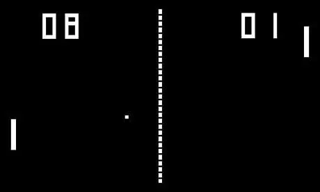

# Udemy : 퐁 게임



### main.py

> while문을 보면, 게임에 대한 주요 동작들을 볼 수 있다

```python
from turtle import Turtle, Screen
from paddle import Paddle
from ball import Ball
from scoreboard import Scoreboard
import time

screen = Screen()
screen.bgcolor("black")
screen.setup(800, 600)
screen.title("Pong Game")
screen.tracer(0)

r_paddle = Paddle((350, 0))
l_paddle = Paddle((-350, 0))
ball = Ball()
score = Scoreboard()

screen.listen()
screen.onkey(r_paddle.up, "Up")
screen.onkey(r_paddle.down, "Down")
screen.onkey(l_paddle.up, "w")
screen.onkey(l_paddle.down, "s")

game_is_on = True
cnt = 0

while game_is_on:
    time.sleep(ball.ball_speed)
    screen.update()
    ball.move()
    
    if ball.ycor() > 280 or ball.ycor() < -280:
        ball.bounce()

    if ball.distance(r_paddle) < 50 and ball.xcor() > 320 or ball.distance(l_paddle) < 50 and ball.xcor() < -320:
        ball.paddle_bounce()

    # 공을 놓쳤을 때
    if ball.xcor() > 380:
        score.l_score_point()
        ball.reset_position()

    if ball.xcor() < -380:
        score.r_score_point()
        ball.reset_position()

screen.exitonclick()
```

- if문 차례대로
  - 맨 위와, 맨 아래를 부딛힐 때에, 공은 튕겨서 안쪽으로 들어와야 하는 것
  - 공이 벽돌에 부딛혔을때, 반대쪽으로 튕긴다
  - 공을 놓쳤을 때에, 공의 위치를 초기화시키고, 상대방에게 점수를 준다


### Brick movement

> left and right bricks with different key
>
> (left, WASD / right, arrows)

```python
from turtle import Turtle

MOVE_DISTANCE = 20

class Paddle(Turtle):

    def __init__(self, s_position):
        super().__init__()
        self.shape("square")
        self.color("white")
        self.shapesize(stretch_wid=5, stretch_len=1)
        self.starting_position(s_position)

    def starting_position(self, s_position):
        self.penup()
        self.setposition(s_position)

    def up(self):
        new_ycor = self.ycor() + MOVE_DISTANCE
        
        if new_ycor <= 255:
            self.goto(self.xcor(), new_ycor)


    def down(self):
        new_ycor = self.ycor() - MOVE_DISTANCE

        if new_ycor >= -250:
            self.goto(self.xcor(), new_ycor)
```

- 벽돌의 위치 그리고, 동작들을 여기서 작동을 시킨다
- 벽돌은 위 아래만 움직이기 때문에 `ycor()`만 사용하여, 벽돌을 움직이면 된다


### Ball movement

> automatic, starts from center

```python
from turtle import Turtle

MOVE_DISTANCE = 20

class Ball(Turtle):

    def __init__(self):
        super().__init__()
        self.shape("circle")
        self.color("white")
        self.penup()
        self.x_move = 10
        self.y_move = 10
        self.ball_speed = 0.1

    def move(self):
        x_cor = self.xcor() + self.x_move
        y_cor = self.ycor() + self.y_move
        self.goto(x_cor, y_cor)

    # x 좌표같은 경우 계속 한 쪽으로 움직인다
    # 하지만 위 아래 벽에 부딛힐 경우, 위로 가던 공은 아래로 향해야 하고
    # 아래고 가던 공은 위로 향해야 해서 -1을 곱해준다
    def bounce(self):
        self.y_move *= -1
        self.ball_speed *= 0.9

    def paddle_bounce(self):
        self.x_move *= -1
        self.ball_speed *= 0.9

    def reset_position(self):
        self.goto(0,0)
        self.x_move *= -1
        self.ball_speed = 0.1
```

- 제일 중요한 것은 공이 벽에 부딛히겨나, 벽돌에 부딛히면 반대로 튕겨 나가야 한다
  - 위 아래 벽을 부딛힐 때에는, `y` 좌표의 반대 방향으로 튕겨 나와야 해서 `-1`을 곱해준다
  - 반대로 벽돌에 부딛힐 때에는 `x`좌표의 반대 방향으로 튕겨 나와야 해서 `-1`을 `x` 좌표에 곱해준다
- 공의 속도도, 조금씩 빨라지게 `self.ball_speed`를 `0.9`씩 곱해준다
  - 여기서 `self.ball_speed`는 `main.py`의 `time.sleep`에 들어가게 된다
- 벽돌이 공을 맞추지 못 할 경우, 공은 중앙으로 돌아간다. 여기서 반대 방향으로 시작을 하기 위해 `x`좌표에 -1을 곱해준다


### Scoreboard

```python
from turtle import Turtle

class Scoreboard(Turtle):
    def __init__(self):
        super().__init__()
        self.color("white")
        self.penup()
        self.hideturtle()
        self.r_score = 0
        self.l_score = 0
        self.update_scoreboard()

    def update_scoreboard(self):
        self.setposition(250, 200)
        self.write(self.r_score, font=('Arial', 48, 'normal'))
        self.setposition(-250, 200)
        self.write(self.l_score, font=('Arial', 48, 'normal'))
    

    def r_score_point(self):
        self.r_score += 1
        self.clear()
        self.update_scoreboard()

    def l_score_point(self):
        self.l_score += 1
        self.clear()
        self.update_scoreboard()

```

- 내가 만약에 공을 놓치게 되면, 상대방이 점수를 얻는 방식이다


