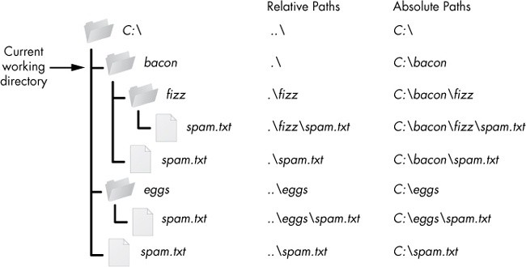
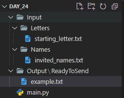
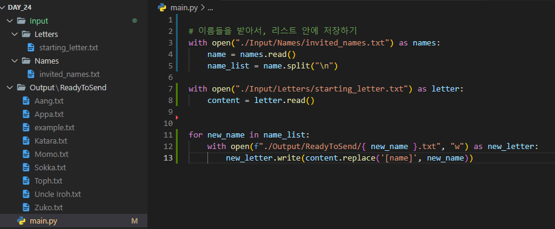
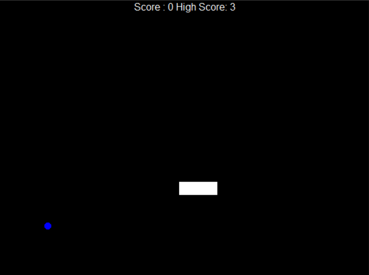

# Udemy : Python 파일과 디렉토리(경로)


## 파일 (Files)

> 파이썬을 이용해서 파일을 열고, 읽고, 쓰고, 닫는 것

```python
# 파일을 열기
file = open("my_file.txt")

# 파일을 읽기
contents = file.read()
print(contents)

# 파일을 닫기
contents.close()
```

- `open()`  |  `read()`  |  `close()`
- 파일을 열었을 때, 기본 모드는 `read`이다
- 즉 파일에 데이터를 추가하고 싶을 때에 `open("my_file.txt", mode="w")` 를 해준다
  - 모드 부분에 쓰기까지 사용할 수 있도록 했다
  - 단, `read()`가 안 된다
- 하나 씩 사용할 때에는, 꼭 파일을 닫아야 한다


#### `open()` 모드

- `mode = "r"`  :  파일을 읽는 것 (데이터를 추가할 수 없음)
  - `write()`를 할 수 없음

- `mode = "a"`  :  파일에 데이터를 추가하는 것 
  - `read()` 를 할 수 없음
- `mode = "w"`  :  파일에 새로운 데이터를 넣지만, 기존 데이터들은 다 없어짐
  - `read()` 를 할 수 없음
  - **파일의 이름이, 폴더에 없을 때에는, 새로운 파일을 생성해 준다!**

```python
with open('new_file.txt', mode="w") as file:

    file.write("Hello, my name is Je Joon")

# new_file.txt 라는 파일이 생성되고, 안에 write의 내용이 들어간다
```


#### with 사용하기

```python
with open('my_file.txt') as file:

    content = file.read()
    print(content)
```

- `with`를 사용할 때에는, 알아서 파일을 닫아 준다


## 파일 경로에 대한 이해

> #### 상대 및 절대 파일 경로
>
> #### 컴퓨터는 파일과 폴더가 있다
>
> #### 주로 맥은 `/` 를 사용하고 윈도우는 `\` 사용한다
>
> - 하지만, 파이썬 같은 경우 윈도우에서 `/`를 사용해야 제대로 작동한다




### 절대 파일 경로

> 최상위 폴더부터 내가 원하는 폴더/파일 찾는 것

- ` \ ` root  :  최상위 폴더를 의미한다 
  - C드라이브, or  Macintosh 폴더
- 항상 루트 (최상위 폴더) 즉 `\`으로 시작한다
  - 위에 이미지 같은 경우 `C:\`로 시작을 한다


### 상대 경로

> 나의 현재 위치에서부터, 폴더/파일 찾는 것

- 이미 어느 폴더에 있으면 (Working Directory), 상대 경로를 사용할 수 있다
  - 위에 이미지 같은 경우 현재 `working directory`는  **bacon** 폴더이다
- `..\`  : working directory의 상위 폴더에 가는 것
  - 이미지 예시) `..\`  -  **bacon**폴더 위에 있는 **C드라이브**로 들어간다
- `.\`  :  working directory 현재 위치
  - 이미지 예시) `.\fizz`  -  **bacon** 폴더의 하위 폴더인 **fizz** 폴더로 들어간다
- working directory에 있는 파일을 들어가려면, `.\`을 꼭 사용하지 않고, 파일 이름만 써도 그 파일에 들어간다

```python
# new_file.txt는 지금 working directory에 새로 파일을 만드는 것이기 때문에
# 파일 이름만 넣어도 된다
with open('new_file.txt', mode="w") as file:

    file.write("Hello, my name is Je Joon")
```


## 메일 머지



> `starting_letter.txt` 의 내용에 있는 비어있는 이름들을  `invited_names.txt`의 이름들로 바꿔서, 이름 별로 `Output` 폴더에 파일을 만드는 것이다



- 이름들을 리스트로, 그리고 편지 내용을 `content` 변수로 저장을 했다
- for문으로 이름들의 리스트를 순회했다
  - 순회하는 이름을 f-string을 통해 파일 이름으로 설정
  - `content` 안에 있는 내용 중, `'[name]'`을 순회하는 이름으로 바꾼다
  - `.write()`을 통해, 편지에 이름들의 내용을 넣어서, 하나의 txt 파일로 저장을 한다


## 뱀 게임에 최고 점수 추가하기

[그 전 코드 보기](https://jejoonlee.tistory.com/72)




### scoreboard.py

```python
 class ScoreBoard(Turtle):
    
    def __init__(self):
        super().__init__()
        self.color("white")

        file = open("score.txt")
        last_high_score = file.read()

        self.high_score = int(last_high_score)
        self.score = -1
        self.penup()
        self.setposition(0, 280)
        self.hideturtle()
        self.update_scoreboard()
        self.score_point()   
    
        # 최고 점수 추가하기
        def reset(self):
            if self.score > self.high_score:
                self.high_score = self.score
            
                with open("score.txt", mode="w") as file:
                    file.write(str(self.high_score))
        
            self.score = 0
            self.update_scoreboard()

        # def game_over(self):
        #     self.setposition(0, 0)
        #     self.write("GAME OVER", True, align="center", font=('Arial', 24, 'normal'))
```

- `__init__(self)` 부분에서 파일을 열어서, 파일 안에 있는 데이터를 읽는다
  - 그 데이터는 그 전에 저장했던 최고 점수이다
- `reset(self)` 부분을 통해 최고 점수를 받았을 때에, `score.txt` 안에 최고 점수를 저장해준다
  - 리셋은 추가된 부분이고, 만약 게임을 실패할 때에는 점수를 새로 시작한다
  - 그 전에는 멈추고, 게임 종료였지만, 이제부터는 아예 초기화 시키는 것


### snake.py

```python
    def reset(self):
        # 실패하면, 원래 있던 뱀은 스크린 밖으로 나간다
        for body in self.body:
            body.goto(1000, 1000)

        self.body.clear()
        self.create_snake()
        self.head = self.body[0]
```

- 실패하면, 뱀을 새로 만든다

