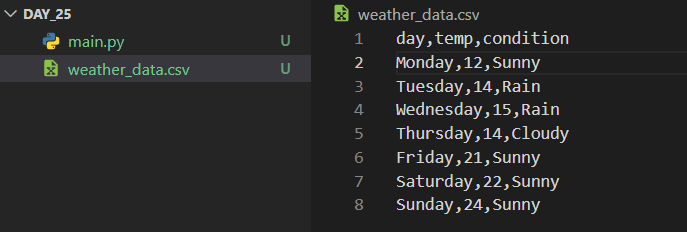
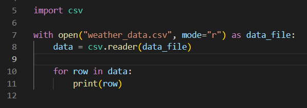
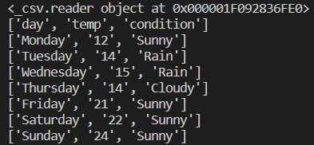
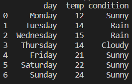
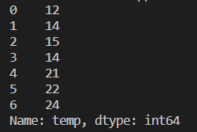
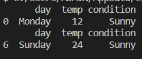
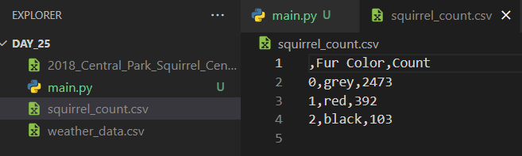

# Udemy : Python CSV 데이터와 Pandas


## CSV (Comma Separated Values)

> #### 표로 나타낼 수 있는 데이터들을 뜻한다
>
> - 엑셀 같이



- 각 열은 데이터를 뜻 하는데, `,` 를 통해서 데이터를 나눈다


### CSV 데이터 읽기

> ` csv` 라이브러리를 import 한다
>
> `csv.reader()`를 사용해서, 각 열의 데이터를 가지고 온다
>
> for문으로 순회를 하며, 각 열의 데이터를 볼 수 있다





- `<_csv.reader object at 0x000001F092836FE0>` , `csv.reader()`를 사용해서 데이터를 끌어왔을 때
- 그 밑에는 for문으로 `<_csv.reader object at 0x000001F092836FE0>` 을 순회하며, 각 열의 데이터를 출력한 것이다


## Pandas

https://pandas.pydata.org/docs/reference/index.html

> 파이썬 데이터 분석 라이브러리다
>
> 표로 나타난 데이터들을 분석하는데 매우 유용하다

#### 패키지를 따로 설치해야 한다


#### CSV파일을 불러오는 방법

```python
import pandas

data = pandas.read_csv("weather_data.csv")
print(data)
```




#### 특정 데이터를 불러오기 (여기서는 temp)

> `pandas` 는 첫 열은 데이터의 이름인 것으로 판단 한다
>
> 즉 `temp`라는 행의 정보를 알고 싶으면, 데이터에 `temp`를 찾으면, `temp`에 대한 정보를 가지고 온다

```python
import pandas

data = pandas.read_csv("weather_data.csv")
print(data["temp"])
```




#### DataFrame / Series

```python
import pandas

data = pandas.read_csv("weather_data.csv")
print(type(data))
# output : <class 'pandas.core.frame.DataFrame'>

print(type(data["temp"]))
# output : <class 'pandas.core.series.Series'>
```

- `DataFrame`  :  하나의 테이블 / 즉 표 안에 있는 모든 데이터들
- `Series`  :  표 안에 있는 행의 데이터들

> weather_data.csv 의 표는 `DataFrame`이다
>
> weather_data.csv에 있는 `temp`는 `Series` 이다


#### 행의 데이터를 이용하기

> 행의 이름이 꼭 맞아야 한다

```python
import pandas

data = pandas.read_csv("weather_data.csv")

# ------- 행의 데이터 가지고 오기 ----------
data["temp"]
data.temp

# ---------- temp 데이터를 리스트로 반환하기 --------------
temp_list = data["temp"].to_list()

# ------------- 평균 값 구하기 --------------
print(data["temp"].mean())

# ------------- 제일 큰 값 값 구하기 --------------
print(data["temp"].max())
```

- `weather_data.csv`의 데이터 중에 `temp` 데이터들을  `.mean()`을 통해서 평균 값을 구한다
- `weather_data.csv`의 데이터 중에 `temp` 데이터들을  `.max()`을 통해서 제일 큰 값을 구한다


#### 열의 데이터 가지고 오기

```python
import pandas

data = pandas.read_csv("weather_data.csv")

# ---- day가 Monday인 데이터들을 가지고 오기 -----
# 둘 중에 하나를 써도 된다
data[data["day"] == "Monday"]
print(data[data.day == "Monday"])

# --- 기온이 최대였던 날의 데이터 가지고 오기 ---
print(data[data.temp == data["temp"].max()])
```




#### 월요일의 기온을 Celsius에서 Fahrenheit로 바꾸기

```python
import pandas

data = pandas.read_csv("weather_data.csv")

# 월요일의 데이터들을 가지고 온다
monday = data[data.day == "Monday"]

# monday.temp를 통해, 월요일의 기온을 가지고 온다
fahrenheit = (int(monday.temp) * 9/5) + 32

# output : 53.6
```


#### 파이썬을 통해 새로운 데이터 프레임 만들기

```python
import pandas

data_dict = {
    "students" : ["Amy", "James", "Angela"],
    "scores" : [76, 56, 65]
}

pandas.DataFrame(data_dict)
```

- 딕셔너리, 또는 표로 만들 수 있는 자료 구조가 있다
- `pandas.DataFrame(변수명)` 을 해주면, 알아서 표로 만들어 준다


```python
import pandas

data_dict = {
    "students" : ["Amy", "James", "Angela"],
    "scores" : [76, 56, 65]
}

data = pandas.DataFrame(data_dict)
data.to_csv("new_data.csv")
```

- 거기에 `.to_csv(파일 이름.csv)`를 해주면 csv 파일로 만들어준다


## 다람쥐 색깔 분석

```python
import pandas

squirrel = pandas.read_csv("2018_Central_Park_Squirrel_Census_-_Squirrel_Data.csv")

#---- 다람쥐 색깔별로, 갯수를 구했다-----
grey = len(squirrel[squirrel["Primary Fur Color"] == 'Gray'])
red = len(squirrel[squirrel["Primary Fur Color"] == 'Cinnamon'])
black = len(squirrel[squirrel["Primary Fur Color"] == 'Black'])

#---- 딕셔너리를 따로 만들기 ----
data_dict = {
    "Fur Color" : ["grey", "red", "black"],
    "Count" : [grey, red, black]
}


#--- 딕셔너리를 데이터 프레임을 통해 표로 만들기----
data_csv = pandas.DataFrame(data_dict)

#--- 표로 만든 것을 csv 파일로 저장하기 ----
data_csv.to_csv("squirrel_count.csv")
```




