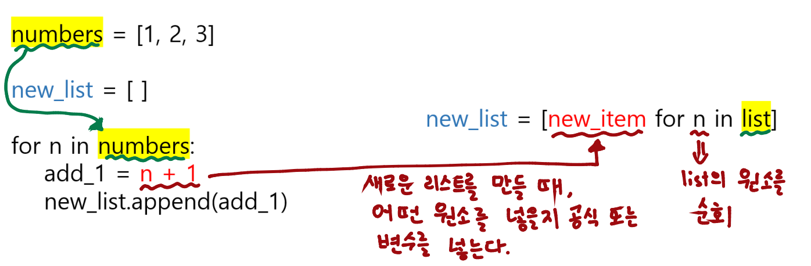
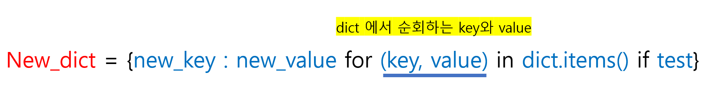

# Udemy : Python 리스트와 딕셔너리 컴프리헨션


## 리스트 컴프리헨션 (List Comprehension)

#### 원래 사용했던 코드

```python
numbers = [1,2,3]
new_list = []
for n in numbers:
    add_1 = n + 1
    new_list.append(add_1)
print(new_list)
# output :  [2,3,4]
```




#### 리스트 컴프리헨션

> #### `new_list = [new_item for item in list]`

```python
numbers = [1,2,3]
new_list = [n + 1 for n in numbers]
print(new_list)
# output : [2,3,4]
```


#### if문 추가하기

> #### new_list = [new_item for item in list if test]
>
> - 뒤에다가 if문을 붙이면 된다

```python
number = [1,2,3,4,5,6]
even_number = [n for n in number if n % 2 == 0 ]
print(even_number)

# output : [2,4,6]
```

- `number`를 순회한다.
- 순회하는 숫자가 2로 나누어 떨어지면, 그 숫자를 리스트에 넣는 것


```python
#--- 레터가 5개 이상인 이름의 레터들을 다 대문자로 리스트에 저장하기 ---
names = ['Alex', 'Beth', 'Caroline', 'Eleanor', 'Freddie']
long_names = [n.upper() for n in names if len(n) >= 5]
print(long_names)

# output : ['CAROLINE', 'ELEANOR', 'FREDDIE']
```


#### 코딩 연습

```python
#--- 제곱수 ---
numbers = [1,2,3,4,5,6]
squared_numbers = [n ** 2 for n in numbers]

#---짝수 필터링---
number = [1,2,3,4,5,6]
even_number = [n for n in number if n % 2 == 0 ]


#--- 겹치는 데이터 ---
with open("file1.txt") as file1:
    one = list(file1.read().split('\n'))
    # readlines() 를 사용할 수 있음

with open("file2.txt") as file2:
    two = list(file2.read().split('\n'))
    # readlines() 를 사용할 수 있음

result = [int(n) for n in one if n.isnumeric() == True and n in two]


print(result)
```

- 겹치는 데이터
  - file1.txt 와 file2.txt에서 리스트로 데이터들을 가지고 온다
  - file1.txt를 기반으로 숫자들을 순회하면서, file2.txt에 있으면, 그 숫자를 integar로 만들고 리스트에 넣는다
    - 여기서 `''` 가 있어서, `isnumeric()`을 통해, 숫자인지 아닌지를 판단해야 한다


## 딕셔너리 컴프리헨션 (Dictionary Comprehension)

> #### `new_dict = {new_key : new_value for item in list}`
>
> - 딕셔너리 만들기
>
> #### `new_dict = {new_key : new_value} for key, value in dict.items()}`




예시)

```python
#--- key를 이름으로 value를 랜덤 점수 ---
import random
names = ['Alex', 'Beth', 'Caroline', 'Eleanor', 'Freddie']

random_score = {name : random.randint(1,100) for name in names}

#--- random_score에서 60점을 넘는 학생의 이름과 점수를 딕셔너리로 가지고 온다 ---
passed_student = {key : value for key, value in random_score.items() if value >= 60}
```


#### 실습 1

```python
sentence = "What is the Airspeed Velocity of an Unladen Swallow?"

result = {word : len(word) for word in sentence.split(' ')}

print(result)
```

- 문장의 단어를 key로 그리고 단어의 letter 수를 value로 딕셔너리에 저장한다


#### 실습 2

```python
weather_c = {
    "Monday": 12,
    "Tuesday": 14,
    "Wednesday": 15,
    "Thursday": 14,
    "Friday": 21,
    "Saturday": 22,
    "Sunday": 24,
}

weather_f = {key : (value * 9/5) + 32 for key, value in weather_c.items()}

print(weather_f)
```

- key로는 날을, value는 celsius를 fahrenheit로 바꿔서 `weather_f로 저장한다`


## NATO 알파벳 음성기호

```python
import pandas

data = pandas.read_csv("nato_phonetic_alphabet.csv")

nato_dict = {items.letter : items.code for index, items in data.iterrows()}

user_word = input("Enter a word: ").upper()

result = [nato_dict[letter] for letter in user_word if nato_dict[letter]]

print(result)

# input : Alex
# output : ["Alpha", "Lima", "Echo", "X-ray"]
```

- `data` : pandas를 통해 **nato_phonetic_alphabet.csv**에서 표로 데이터를 가지고 온다
- `nato_dict` : `data.iterrows()`를 통해서 위에서 가지고온 표에서 각 열들을 for문을 통해 순회한다
  - 그 중 **letter** 데이터를 key로, **code** 데이터를 value로 넣는다
- `result` : 유저의 입력값을 받아서, 그 입력값의 letter들을 순회하면서 딕셔너리를 통해 코드로 반환해서 리스트로 저장한다
