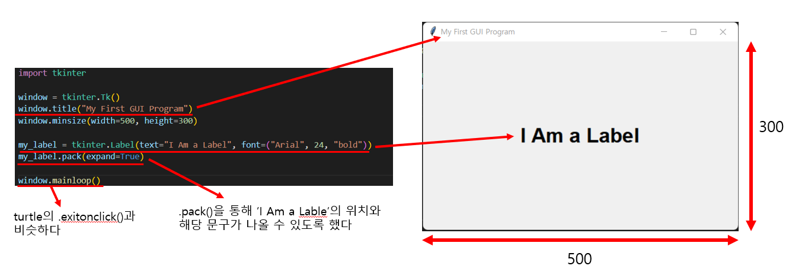
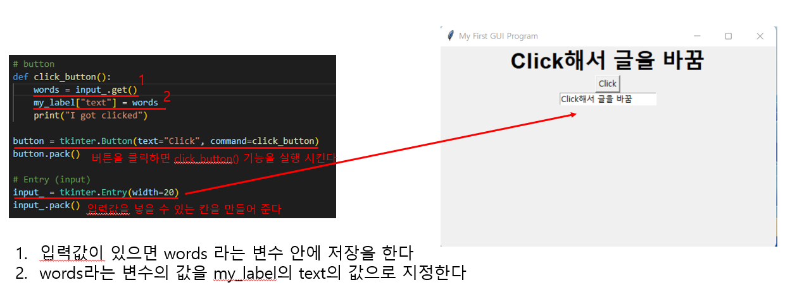
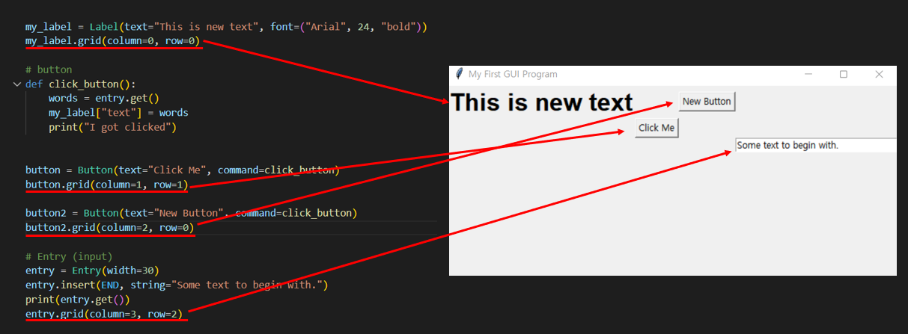
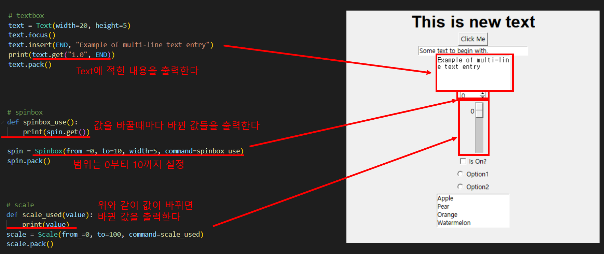
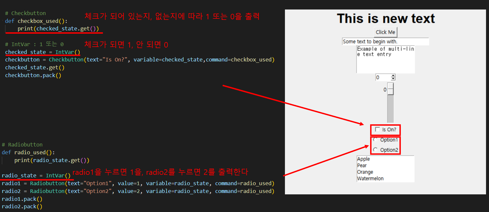
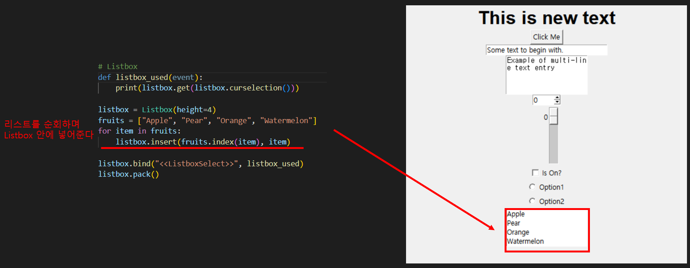

# Udemy : Tkinter, *args, **kwargs 및 GUI


## Argument with Default Values

```python
def my_function(a, b, c):
    # Do this with a
    # Then do this with b
    # Finally do this with c
    
my_function(c=3, a=1, b=2)
```

- `my_function()` 안에, `a`, `b`, `c`의 값들을 넣어서 함수를 실행했다
- 하지만 함수를 만들 때에, 미리 기본 값을 설정해서, 함수를 바로 실행할 수 있다


```python
def my_function(a=1, b=2, c=3):
    # Do this with a
    # Then do this with b
    # Finally do this with c

#--- 기본 값을 가지고 함수 작동 ---
my_function()

#--- 기본 값의 b만 바꿔서 함수 작동 ---
my_function(b=4)
```

- 함수를 보면 `a=1`, `b=2`, `c=3` 으로 기본적인 값을 argument에 넣었다
- 이렇게 하면 `my_function()`만 가지고 함수를 실행할 수 있다
- 즉 `my_function()`에 argument를 넣는 것은 여기서는 필수가 아니다


## *args

> #### Unlimited Positional Arguments
>
> 함수로 받는 모든 값들을 튜블로 만든다
>
> 여러 인수를 갖는 함수 만들기

```python
def add(*args):
    for n in args:
        print(N)
```

- `args`는 바껴도 되지만 `*`은 꼭 있어야 한다
- `*`  :  argument의 개수가 제한되지 않는다


#### 연습

```python
def add(*args):
    answer = 0
    for n in args:
        answer += n
    return answer

print(add(12, 3, 4, 6, 7, 23, 45))
```

- 제한 없이 함수 안에 숫자들을 넣고, 그 숫자들의 덧셈을 결과로 출력하는 것
- `args`는 받은 값들을 **튜플**로 만든다


## **kwargs

> Unlimited Keyword Arguments
>
> 딕셔너리로 만든다

```python
def calculate(**kwargs):
    print(kwargs)

calculate(add=3, multiply=5)

# Output : {'add': 3, 'multiply': 5}
```

- `.get()`을 사용하면, 딕셔너리에 key가 없을 때에, 에러가 아닌 none을 반환한다


## GUI

> Graphical User Interface

- GUI 전에는, 코드를 이용해서 컴퓨터를 작동시켰다
- GUI가 소개되고, 마우스를 사용하면서, 유저들은 컴퓨터를 작동시킬 수 있었다


## Tkinter




#### 글씨 바꾸기




### Pack / Place / Grid

> 셋 중 하나라도 없으면, 해당 요소를 창에 넣을 수 없다

#### `.pack()`

- 기본은 중앙 상단이다. 거기서 밑으로 요소들을 추가한다
- 그 외에도 left, right, bottom이 있다
- 정확한 위치에 요소를 넣는 것이 조금 어렵다


#### `.place()`

- x와 y 값을 가지고 요소를 창에 넣을 수 있다
- 너무 정확하게 써어 넣어야 해서, 요소의 양이 많아지면, 요소를 배치하기 어렵다


#### `.grid()`

> 상대적이다
>
> 하지만 grid와 pack을 같이 사용할 수 없다

- 그리드를 이용하는 것이다
- row와 column을 사용하여, 요소들을 배치할 수 있다




## 그 외 Widget들








## Miles에서 Km로 바꾸기


```python
from tkinter import *

window = Tk()
window.title("Mile to Km Converter")
window.config(padx=40, pady=20)

def calculate():
    num = int(mile.get())
    km["text"] = round(num * 1.6, 2)
    print(km["text"])

mile = Entry(width=10)
mile.grid(column=1, row=0)

mile_measure = Label(text="Miles")
mile_measure.config(padx=10, pady=10)
mile_measure.grid(column=2, row=0)

word = Label(text="is equal to")
word.config(padx=10, pady=10)
word.grid(column=0, row=1)

km = Label(text="")
km.config(padx=10, pady=10)
km.grid(column=1, row=1)

km_measure = Label(text="Km")
km_measure.config(padx=10, pady=10)
km_measure.grid(column=2, row=1)

button = Button(text="Calculate", command=calculate)
button.grid(column=1, row=2)

window.mainloop()
```

- 각 요소들을 `grid`를 통해서 배치했다
- `grid`를 배치하고, `calculate()` 함수를 만드는게 제일 중요
  - `calculate()`함수는 버튼을 누를 때 작동한다
  - `button = Button(text="Calculate", command=calculate)`
