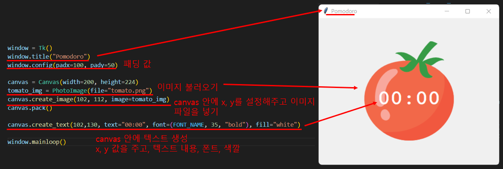

# Udemy : Tkinter, 동적 프로그램


## Canvas Widget

> #### 이미지 위에 이미지/ 글 넣기



- `canvas`의 x, y 기준은, `canvas` 변수명을 주었을 때 설정했던 **width**와 **height** 기준이다
- 추가로, `window.config()`와 `Canvas()` 에 `bg=` 를 넣어서 배경 색깔을 바꿀 수 있다
  - `Canvas(highlightthickness=0)`으로 만들어야, border가 안 나온다


## 동적 타이핑

> 예) 숫자를 문자열로 바꿔서 사용

- 위에 토마토를 보면, 10 아래로 떨어지면 한 자리 수만 보여준다
  - 원래 시간은 00, 01, 02 이런 식으로 보이는 것이 익숙하다

```python
# ---------------------------- TIMER MECHANISM ------------------------------- #
def starttimer():
    countdown(1 * 60)

# ---------------------------- COUNTDOWN MECHANISM ------------------------------- #
def countdown(count):

    min = count // 60
    sec = "{:02d}".format(count % 60)
    # if sec < 10:
    #   sec = f"0{sec}"
    # 위와 같다

    canvas.itemconfig(timer_text, text=f"{min}:{sec}")
    if count > 0:
        # .after을 사용해서, 1초 마다 countdown 함수 실행하기
        window.after(1000, countdown, count - 1)
```

- `starttimer()`을 누르면 `countdown()`이 시작한다
- `countdown()`은 `.itemconfig()`를 통해 토마토 중앙에 있는 글을 바꾼다
  - 바꿀 때에는 분과 초를 바꾸는 것


#### 동적 타이핑

` sec = "{:02d}".format(count % 60)` 

- 초를 문자열로 바꿨다.
- count를 60으로 나눈 나머지를 가지고 오고 10 아래로 내려가도 앞에 0을 추가해서 2개 자리 수가 보이도록 만들었다

```python
if sec < 10:
    sec = f"0{sec}"
```

- 해당 식과 같다
- 10 아래로 내려가면 f-string을 사용해서 0을 앞에 붙이는 것


## 실습

```python
from tkinter import *
import math

# ---------------------------- CONSTANTS ------------------------------- #
PINK = "#e2979c"
RED = "#e7305b"
GREEN = "#9bdeac"
YELLOW = "#f7f5dd"
FONT_NAME = "Courier"
WORK_MIN = 25
SHORT_BREAK_MIN = 5
LONG_BREAK_MIN = 20
REPS = 0
my_timer = None

# ---------------------------- TIMER RESET ------------------------------- #
def reset_timer():
    window.after_cancel(my_timer)

    global REPS
    REPS = 0

    canvas.itemconfig(timer_text, text="00:00")
    timer_name.config(text="Timer", fg=GREEN)
    check.config(text="")


# ---------------------------- TIMER MECHANISM ------------------------------- #
def starttimer():
    global REPS
    REPS += 1

    work_count = WORK_MIN * 60
    short_count = SHORT_BREAK_MIN * 60
    long_count = LONG_BREAK_MIN * 60

    if REPS % 8 == 0:
        timer_name.config(text="Break", fg=RED)
        countdown(short_count)

    elif REPS % 2 == 0:
        timer_name.config(text="Break", fg=PINK)
        countdown(long_count)

    else:
        timer_name.config(text="Work", fg=GREEN)
        countdown(work_count)

# ---------------------------- COUNTDOWN MECHANISM ------------------------------- #
def countdown(count):
    global my_timer

    min = count // 60
    sec = "{:02d}".format(count % 60)

    canvas.itemconfig(timer_text, text=f"{min}:{sec}")
    if count > 0:
        my_timer = window.after(1000, countdown, count - 1)
    else:
        starttimer()
        mark = ""

        for _ in range(math.floor(REPS / 2)):
            mark += "✓"

        check.config(text=mark)


# ---------------------------- UI SETUP ------------------------------- #
window = Tk()
window.title("Pomodoro")
window.config(padx=100, pady=50, bg=YELLOW)

timer_name = Label(text="Timer", font=(FONT_NAME, 48, "bold"), background=YELLOW, fg=GREEN)
timer_name.grid(column=1, row=0)

canvas = Canvas(width=200, height=224, bg=YELLOW, highlightthickness=0)
tomato_img = PhotoImage(file="tomato.png")
canvas.create_image(100, 112, image=tomato_img)
timer_text = canvas.create_text(100, 130, text="00:00", font=(FONT_NAME, 35, "bold"), fill="white")
canvas.grid(column=1, row=1)

start_button = Button(
    text="Start", padx=10, pady=5, highlightthickness=0, command=starttimer
)
start_button.grid(column=0, row=2)

check = Label(font=(FONT_NAME, 20, "bold"), background=YELLOW, fg=GREEN)
check.grid(column=1, row=3)

reset_button = Button(
    text="Reset", padx=10, pady=5, highlightthickness=0, command=reset_timer
)
reset_button.grid(column=2, row=2)


window.mainloop()
```

- `reset_timer()`
  - 타이머를 초기화 시키는 것이다
  - 즉 모든 것이 원래대로 돌아가야 한다는 것
  - `window.after_cancel(my_timer)`는 `window.after()` 기능을 멈추게 하는 것이다
    - `window.after()` 기능에 `my_timer`라는 변수명을 주었다
- `starttimer()`
  - `start`를 누를 때 발생하는 함수다
  - 일하는 시간 25분, 짧게 쉬는 시간 5분, 길게 쉬는 시간 20분을 `countdown()` 함수로 넘긴다
- `countdown()`
  - 시간을 나타내는 함수다
  - 추가로 일이 끝날때마다 체크 마크가 하나씩 생긴다 (이건 for문으로 만들었음)

