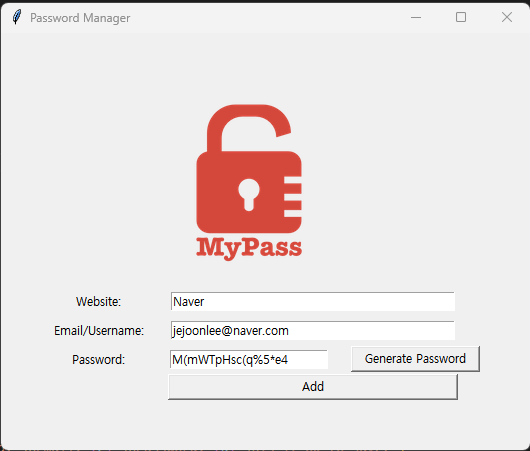
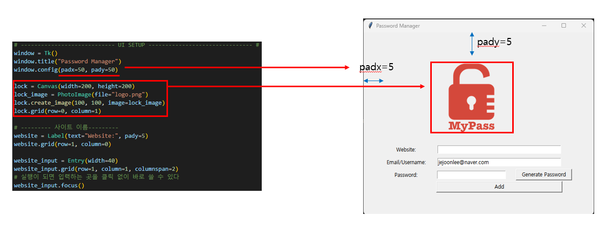
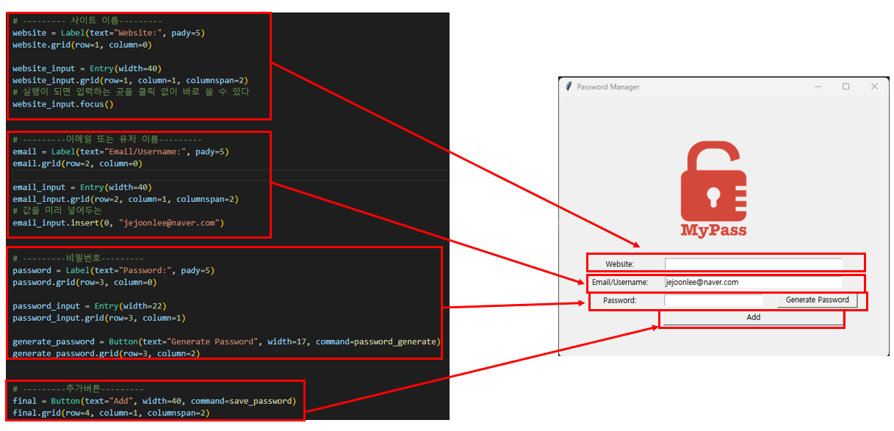
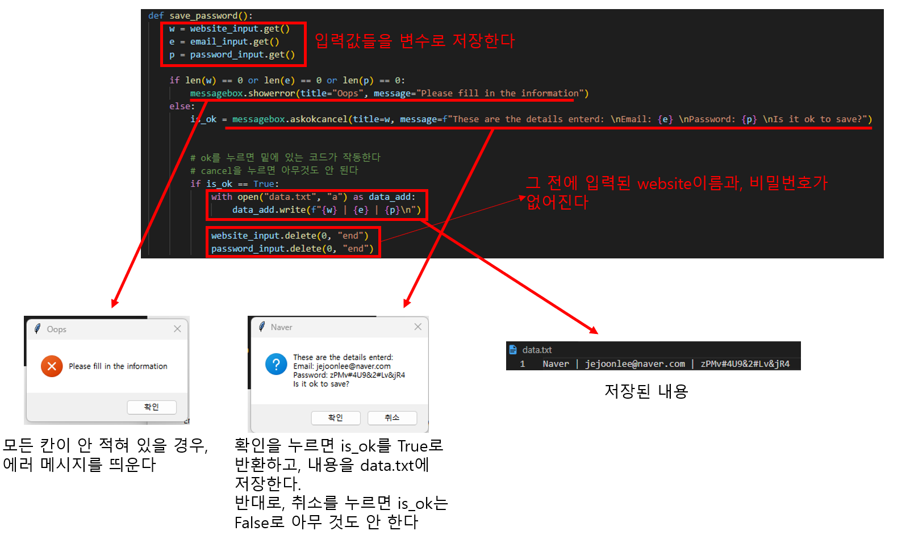

# Udemy : Tkinter로 패스워드 매니저 GUI 만들기



- 패스워드 매니저를 실행하면 자주 사용하는 `Email/Username`이 미리 입력이 되어 있다

- 그리고 클릭 없이 바로 쓸 수 있게, 실행하면 `Website` 입력창이 미리 클릭되어 있다

- `Generate Password`를 누르면 무작위 비밀번호를 만들어 준다

- `Add`를 누르면, `data.txt`에 사이트 이름, Email/Username 그리고 비밀번호가 저장이 된다

  

### `.focus()`

- 입력해야 하는 란을, 실행하자마자 미리 클릭 해두는 곳
- 그렇게 하면, 따로 클릭하지 않아도, 바로 글을 작성할 수 있다


### `.grid(columnspan)`

- `columnspan`은 행을 합병할 때에 사용한다


### `.insert()`

- 미리 값을 적어 두는 것.
- 예시로 밑에 Password Manager의 Email/Username을 보면 jejoonlee@naver.com 이 써져 있다


### `.delete()`

- 적혀 있는 내용들을 삭제하는 것
- 0, "end" 를 넣으면, 처음부터 끝까지 다 없애는 것이다


### `messagebox`

- 팝업 창을 띄우는 것이다
- `.showerror()`  :  에러를 띄우고 싶을 때
- `.askokcancel()`  :  확인 또는 취소를 띄운다. 누를 때 True 또는 False를 반환한










## 비밀번호 생성 코드

```python
def password_generate():
    letters = ['a', 'b', 'c', 'd', 'e', 'f', 'g', 'h', 'i', 'j', 'k', 'l', 'm', 'n', 'o', 'p', 'q', 'r', 's', 't', 'u', 'v', 'w', 'x', 'y', 'z', 'A', 'B', 'C', 'D', 'E', 'F', 'G', 'H', 'I', 'J', 'K', 'L', 'M', 'N', 'O', 'P', 'Q', 'R', 'S', 'T', 'U', 'V', 'W', 'X', 'Y', 'Z']
    numbers = ['0', '1', '2', '3', '4', '5', '6', '7', '8', '9']
    symbols = ['!', '#', '$', '%', '&', '(', ')', '*', '+']

    let = [random.choice(letters) for _ in range(random.randint(8, 10))]
    sym = [random.choice(symbols) for _ in range(random.randint(2, 4))]
    num = [random.choice(numbers) for _ in range(random.randint(2, 4))]

    password_list = let + sym + num

    random.shuffle(password_list)

    password = ''.join(password_list)

    password_input.delete(0, "end")
    password_input.insert(0, password)
    # 자동으로 비밀번호를 복사한다
    pyperclip.copy(password)
```

