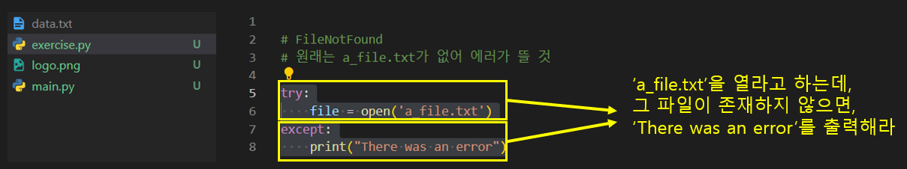
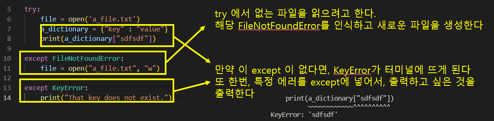
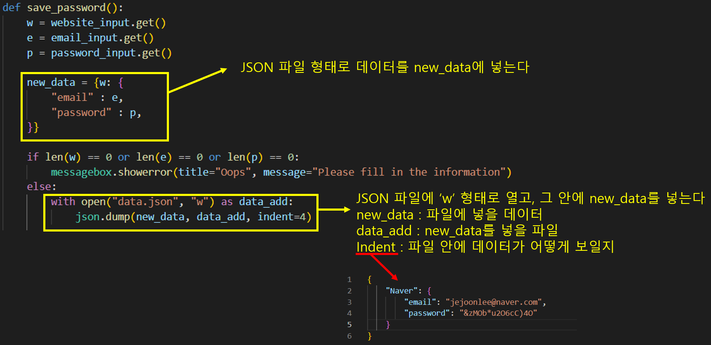
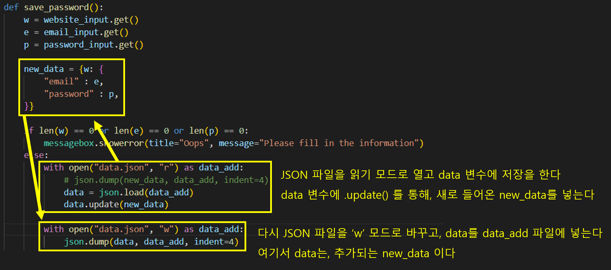
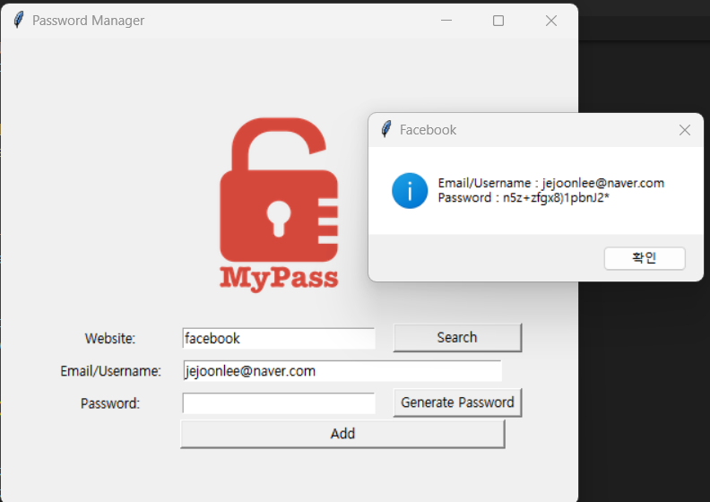

# Udemy : 파이썬 오류, 예외, JSON데이터


## Catching Execptions

> #### 에러가 발생할 때에, 특정한 에러 때문에 멈추지 않고, 코드를 계속 진행하게 만들 수 있는 것
>
> #### 또는 에러가 발생하면, 다른 일이 벌어질 수 있도록 만들기


### `try`

> ##### Somthing that might cause an exception


### `except`

> ##### Do this if there was an exception

- 내가 원했던 대로, 코드가 실행이 안 되면, `except`를 통해 다른 코드를 실행하는 
- `except`만 쓰게 되면, `try`에서 실행했던 코드들이 에러에 의해 실행을 중단한다
- `except`와 에러 내용을 쓰면, 특정 에러에 대한 코드만 `except`에서 잡고, 그 외에는 에러가 없으면 실행을 하게 된다.


### `else`

> ##### Do this if there were no exception

- 코드에 문제가 없을 때 `else`를 통해 진행


### `finally`

> ##### Do this no matter what happens

- 에러가 나타나든, 아니든, 해당 코드를 진행하는 것




- `try` : 파일을 열어보아라
- `except` : 파일을 찾지 못하면 "There was an error"를 출력하라
  - `try`, `except`가 없으면 FileNotFound 에러가 뜰 





### `raise`

> ##### 나만의 예외를 생성하는 것

- 에러를 코드를 만드는 사람이 만드는 


## 실습 1

```python
fruits = ["Apple", "Pear", "Orange"]

def make_pie(index):
    try:
        fruit = fruits[index]
    except IndexError:
        print("Fruit pie")
    else:
        print(fruit + " pie")


make_pie(4)
```

- 인덱스가 리스트를 넘어가면 IndexError를 띄운다
- 그럴 때에 "Fruit pie"를 프린트한다
- 만약 리스트 안에 과일을 가지고 올 수 있으면 과일 이름과 "pie"를 출력한다


## 실습 2

```python
facebook_posts = [
    {'Likes': 21, 'Comments': 2}, 
    {'Likes': 13, 'Comments': 2, 'Shares': 1}, 
    {'Likes': 33, 'Comments': 8, 'Shares': 3}, 
    {'Comments': 4, 'Shares': 2}, 
    {'Comments': 1, 'Shares': 1}, 
    {'Likes': 19, 'Comments': 3}
]

total_likes = 0

for post in facebook_posts:
    try:
        total_likes = total_likes + post['Likes']
    except KeyError:
        pass


print(total_likes)
```

- `facebook_posts`에 있는 좋아요 수들의 합을 구하는 것
- 각 글에는 `Likes`가 다 있지 않다
  - 즉 순회를 하다 `Likes`를 못 찾으면, `KeyError`를 출력할 것
- 그래서 `KeyError`를 발견하면, 그냥 넘어가고, 그게 아니면, 좋아요 수를 계속 더해주면 된


## NATO 음성 알파벳 프로젝트 수정

> 원래는 숫자를 쓰면 그냥 에러만 나왔다
>
> 숫자를 쓰면 유저에게 알파벳만 쓸 것을 알려주면서, 알파벳을 쓸때까지 계속 입력을 할 수 있도록 한다


```python
import pandas

data = pandas.read_csv("nato_phonetic_alphabet.csv")

nato_dict = {items.letter: items.code for index, items in data.iterrows()}


while True:
    user_word = input("Enter a word: ").upper()

    try:
        result = [nato_dict[letter] for letter in user_word if nato_dict[letter]]
    except KeyError:
        print("Sorry, only letters in the alphabet please")
    else:
        print(result)
        break
```

- `while`문을 통해서, 제대로 결과물이 나올때까지, 유저가 입력을 하게 만든다
- 알파벳 외에, 글을 쓴다면 KeyError 대신, "Sorry, only letters in the alphabet please"를 출력한다


## JSON (JavaScript Object Notation)

> #### 데이터 형식으로, 데이터를 주고 받을 때 주로 사용하는 형식이다
>
> #### 파이썬의 딕셔너리랑 비슷하게 생겼다

```python
{
    "Amazon": {
        "email": "jejoonlee@gmail.com",
        "password": "12345",
    },
    "Facebook" : {
        "email": "jejoonlee@gmail.com",
        "password": "12345",
    },
    "Instagram" : {
        "email": "jejoonlee@gmail.com",
        "password": "12345",
    },
}
```


### `json.dump()`

> #### Write




### `json.load()`

> #### Read


### `json.update()`

> #### Update




#### `.dump()`의 경우, 파일 안에 있는 데이터 위에 데이터를 덮어버린다 


## 패스워드 매니저 업데이트

> 이제는 JSON 파일에 사이트, 이메일, 비밀번호 정보를 넣을 것이다
>
> 처음에는 JSON 파일이 없어 FileNotFoundError를 보이게 된다
>
> 이것을 try / except를 사용해서 FileNotFoundError를 보이면, 새로 파일을 만들기를 한다

```python
def save_password():
    w = website_input.get()
    e = email_input.get()
    p = password_input.get()

    new_data = {w: {
        "email" : e,
        "password" : p,
    }}

    if len(w) == 0 or len(e) == 0 or len(p) == 0:
        messagebox.showerror(title="Oops", message="Please fill in the information")
    else:
        # data.json 파일을 열어볼 것
        try:
            with open("data.json", "r") as data_add:
                # json.dump(new_data, data_add, indent=4)
                data = json.load(data_add)
		
        # data.json 파일이 없으면, 파일을 새로 생성하고, 안에 내용을 넣을 것
        except FileNotFoundError:
            with open("data.json", "w") as data_add:
                json.dump(new_data, data_add, indent=4)

        # data.json 파일이 존재하면, 안에 new_data를 업데이트하고,
        # 'w' 모드로 다시 열어서 그 데이터를 파일 안에 추가하기
        else:
            data.update(new_data)
            
            with open("data.json", "w") as data_add:
                json.dump(data, data_add, indent=4)
            
        # 파일이 있든 없든, 위에 코드가 다 실행되면, 입력란에 있는 데이터를 없앨 것
        finally:
            website_input.delete(0, "end")
            password_input.delete(0, "end") 
```


### 웹사이트 검색하기



```python
def search():

    website_name = website_input.get().lower()
    try:
        with open("data.json", "r") as data_file:
            data = json.load(data_file)

    except FileNotFoundError:
        messagebox.showinfo(title="Error", message="No Data File Found")

    else:
        if website_name in data:
            website_e = data[website_name]['email']
            website_p = data[website_name]["password"]
            messagebox.showinfo(title=website_name.title(), message=f"Email/Username : {website_e} \nPassword : {website_p}")
        else:
            messagebox.showinfo(title="Error", message=f"No details for {website_name.title()} exists.")
```

- 저장된 파일이 없다면 FileNotFoundError 대신 에러 메세지를 띄운다
  - 이러면 저장한 데이터가 아예 없다는 것을 알려줄 수 있다
- 웹 사이트의 이름이 파일 안에 없다면 `else`문을 통해 에러 메세지를 띄어준다
  - 여기서는 해당 웹사이트에 대한 정보가 없다는 메세지를 띄어준다
