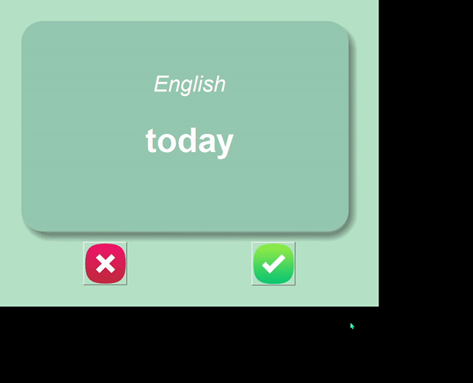
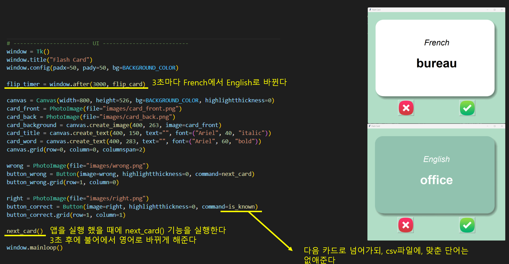
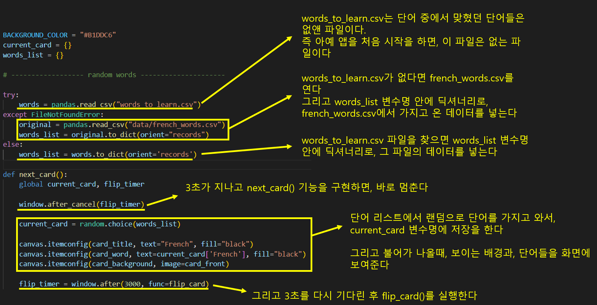
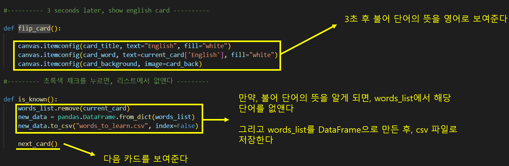

# Udemy : 파이썬 플래시 카드 앱 만들기

> #### 불어 단어가 주어지면, 그 뜻을 맞춰보는 것이다
>
> #### 한 단어 당 3초가 주어진다
>
> #### 3초 후, 영어로 정답이 나온다
>
> #### 그리고 맞췄으면 체크를, 못 맞췄으면 엑스를 누르면 된다
>
> #### 체크를 눌렀을 때에는, 단어 리스트에서, 해당 단어를 빼준다





```python
from tkinter import *
import pandas
import random

BACKGROUND_COLOR = "#B1DDC6"
current_card = {}
words_list = {}

# ------------------ random words ---------------------

try:
    words = pandas.read_csv("words_to_learn.csv")
except FileNotFoundError:
    original = pandas.read_csv("data/french_words.csv")
    words = original.to_dict(orient="records")
else:
    words_list = words.to_dict(orient='records')

def next_card():
    global current_card, flip_timer

    window.after_cancel(flip_timer)

    current_card = random.choice(words_list)

    canvas.itemconfig(card_title, text="French", fill="black")
    canvas.itemconfig(card_word, text=current_card['French'], fill="black")
    canvas.itemconfig(card_background, image=card_front)

    flip_timer = window.after(3000, func=flip_card)
    
#---------- 3 seconds later, show english card ----------

def flip_card():

    canvas.itemconfig(card_title, text="English", fill="white")
    canvas.itemconfig(card_word, text=current_card['English'], fill="white")
    canvas.itemconfig(card_background, image=card_back)

#--------- 초록색 체크를 누르면, 리스트에서 없앤다 ---------

def is_known():
    words_list.remove(current_card)
    new_data = pandas.DataFrame.from_dict(words_list)
    new_data.to_csv("words_to_learn.csv", index=False)

    next_card()
    
# ----------------------- UI --------------------------
window = Tk()
window.title("Flash Card")
window.config(padx=50, pady=50, bg=BACKGROUND_COLOR)

flip_timer = window.after(3000, flip_card)

canvas = Canvas(width=800, height=526, bg=BACKGROUND_COLOR, highlightthickness=0)
card_front = PhotoImage(file="images/card_front.png")
card_back = PhotoImage(file="images/card_back.png")
card_background = canvas.create_image(400, 263, image=card_front)
card_title = canvas.create_text(400, 150, text="", font=("Ariel", 40, "italic"))
card_word = canvas.create_text(400, 283, text="", font=("Ariel", 60, "bold"))
canvas.grid(row=0, column=0, columnspan=2)

wrong = PhotoImage(file="images/wrong.png")
button_wrong = Button(image=wrong, highlightthickness=0, command=next_card)
button_wrong.grid(row=1, column=0)

right = PhotoImage(file="images/right.png")
button_correct = Button(image=right, highlightthickness=0, command=is_known)
button_correct.grid(row=1, column=1)

next_card()

window.mainloop()

```







