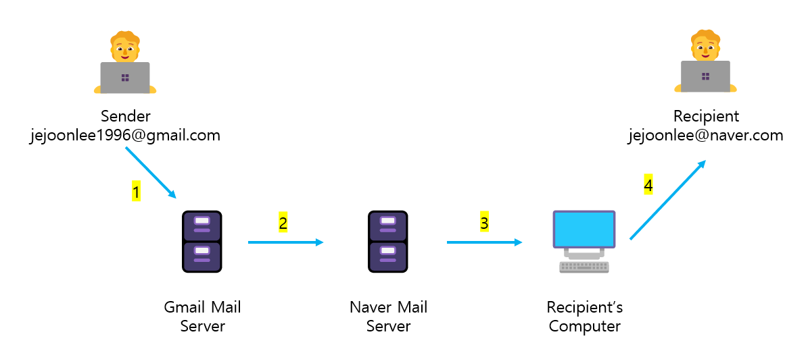

# Udemy : 파이썬 smtplib & datetime

> 이메일을 보내는 라이브러리와 시간 모듈을 사용하는 

#### 

## 이메일?



1. `Sender`가 이메일을 보내게 되면, Gmail Mail 서버에서 `Sender`의 이메일을 받게 된다
2. Gmail Mail 서버에서, 수신자의 이메일의 서버로, 해당 이메일을 보낸다. (여기서는 Naver Mail 서버로)
3. 그리고 Naver Mail 서버에서는, 수신자의 컴퓨터로 이메일을 보낸다
4. 그리고 수신자가 컴퓨터를 키고, 이메일을 볼 수 있다


#### 그리고 이 과정을 SMTP을 통해 진행한다


## SMTP (Simple Mail Transfer Protocol)

> #### 이메일을 보낼 때에, 메일 서버가 이메일을 받고, 다음 메일 서버에게 전달하고, 최종 목적지까지 도달하는 과정의 규칙이다

```python
import smtplib
from email.mime.text import MIMEText

my_email = "이메일 주소"
my_password = "비밀번호"
receive = "받는 사람의 이메일 주소"

connection = smtplib.SMTP_SSL("smtp.naver.com", 포트번호)
# smtp.mail.yahoo.com
# smtp.gmail.com
# smtp.naver.com

connection.login(my_email, my_password)

msg = MIMEText('본문 테스트 메시지')
msg['From'] = my_email
msg['Subject'] = '메일 발송 시험 (2023.01.31)'
msg['To'] = receive

connection.sendmail(my_email, receive, msg.as_string())
connection.close()
```

- 원래는 `MimeText` 없이 진행했지만, 계속 에러가 떴다
  - `smtplib.SMTPDataError: (553, b'5.7.2 The sender address is not a valid RFC-5322 address txRvyaLTSOCYyBZ8XDPh6Q - nsmtp')`
- 그래서 구글링을 통해 얻은 내용이다


### `starttls()`

- **tls : Transport Layer Security**

  - 내 이메일과 이메일 서버를 연결할 때 보안을 만드는 것

  - 이메일을 보냈을 때, 중간에 누군가 이메일을 훔쳤을 때에 starttls() 때문에

  - 이메일의 내용을 절대로 읽을 수 없을 것

- `SMTP_SSL()` 을 사용하면 `starttls()`를 사용이 안 된다


## Datetime

```python
import datetime as dt

now = dt.datetime.now()
year = now.year
month = now.month
day_of_week = now.weekday()
```

- `now = dt.datetime.now()` 지금의 날짜, 시간을 가지고 온다
- 그 외에 년도, 월, 날 등을 다 가지고 올 수 있따
- `now.weekday()`
  - 숫자로 반환한다
  - 0부터 시작하여 0은 월요일이다


## 월요일마다 명언 보내기

```python
import smtplib
from email.mime.text import MIMEText
import datetime as dt
import random

def send_email(content):
	my_email = "이메일 주소"
	my_password = "비밀번호"
	receive = "받는 사람의 이메일 주소"

    connection = smtplib.SMTP_SSL("smtp.naver.com", 포트번호)
    connection.login(my_email, my_password)

    msg = MIMEText(content)
    msg['From'] = my_email
    msg['Subject'] = "월요일 명언"
    msg['To'] = receive

    connection.sendmail(my_email, receive, msg.as_string())
    connection.close()

def get_quotes():
    with open("quotes.txt") as data_file:
        quotes = data_file.read().split('\n')
        quote = random.choice(quotes)
    return quote

now = dt.datetime.now()

if now.weekday() == 0:
    quote = get_quotes()
    send_email(quote)
    print(quote)
```

- 함수로, 명언을 가지고 오는 함수와, 명언을 보내는 함수를 하나씩 만든다
- 그리고 지금 요일이 `now.weekday()`가 월요일이면, 두 개의 함수를 실행한
