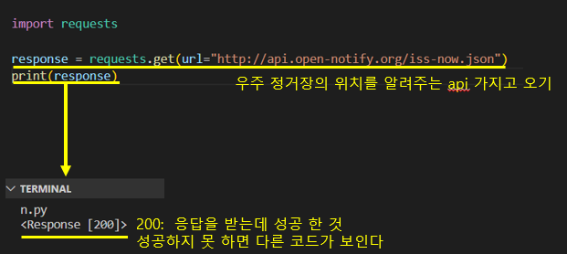
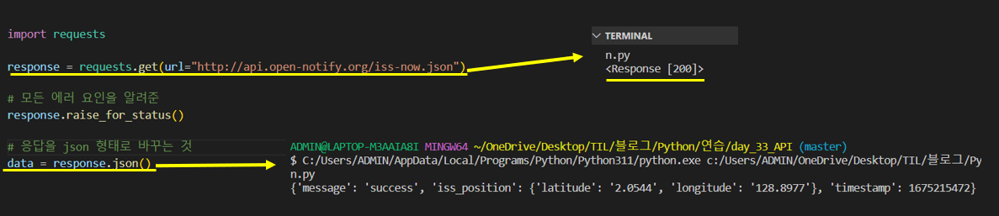
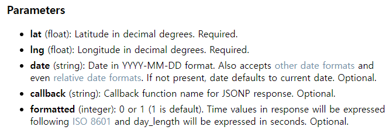
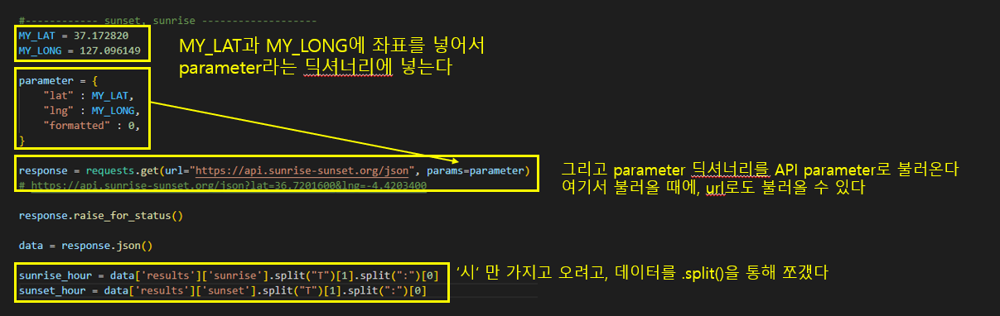

# Udemy : 파이썬 API


## API (Application Programming Interface)

> #### 프로그래머들이 소프트웨어를 만들거나, 외부 시스템과 상호 작용하기 위해 만들어진 명령어, 기능, 프로토콜 그리고 객체들이 이루어진 세트이다

- API를 통해 외부 시스템에게 데이터를 요청하고, 외부 시스템이 데이터를 응답을 해주는 것
  - API에서 지정한 규칙을 통해 외부 시스템에게 데이터를 요청한다
  - 즉 외부 시스템의 데이터를 사용하는 것이다
- 즉 API는 식당 메뉴 같은 것
  - 메뉴 안에 없는 음식을 시킬 수 없는 것처럼, API에서 지정한 규칙대로 요청하지 않으면 안 된다
  - 메뉴 안에 있는 음식을 주문하면, 그 음식이 나오는 것처럼, API에서 지정한 규칙대로 요청을 하면, 받고자 하는 데이터를 받을 수 있을 것이


### API EndPoint

- 데이터가 있는 외부 시스템의 주소라고 할 수 있다
- 주로 외부 시스템의 URL이다
  - 예) 가상 코인 API 주소  :  api.coinbase.com


### API Request

- 데이터를 요청하는 


### Response

> https://httpstatuses.org/  :  응답 코드



- `1XX`  :  기다리라는 것
- `2XX`  :  성공
- `3XX`  :  엑세스가 없는 것
- `4XX`  :  클라이언트 쪽에서 문제가 생긴 
- `5XX`  :  서버의 문제가 생긴 것


#### JSON 형태로 변환




### API Parameter

-  API request, 즉 요청을 할 때 특정 입력값을 넣어주는 것이다.
  - 이렇게 하면 특정 입력값에 따라 다른 데이터를 받을 수 있다
- 예시)
  - 식당이 몇시까지 하나요? 라는 것을 질문 할 수 있지만
  - 특정 parameter을 넣어 **월요일**은 식당이 언제까지 하나요? 라고 물어볼 수 있다
    - 식당에 마감 시간이 다 똑같을 수도 있지만, 요일마다 다르는 식당이 있을 수도 있다
- 꼭 넣어야 하는 것이 있고 (required), 선택할 수 있는 것이 있다 (optional)
  - 아래 parameter에는 lat과 lng는 꼭 넣어야 된다
  - optional 한 것들은 기본 값이 이미 있고, 꼭 안 넣어도 된






## 국제 우주 정거장 보기

> #### 국제 우주 정거장 위치를 API로 가지고 오기
>
> #### 저녁 때만 국제 우주 정거장을 볼 수 있다
>
> #### 즉 국제 우주 정거장 위치가, 내가 있는 위치에서 볼 수 있고, 밖이 어두울 때에, 우주 정거장을 찾아보라고 이메일을 보낸다


#### 60분 마다 국제 우주 정거장과 저녁인지 아닌지를 확인한다

`iss_location = is_above()` : 위치가 내가 볼 수 있는 위치면, True를 반환한다

`night = is_night()` : 어둡다면 True를 반환한다

`send_email()` : 이메일을 보내는 것

```python
while True:
    time.sleep(60)
    
    iss_location = is_above()
    night = is_night()

    if iss_location == True and night == True:
        send_email()
```


#### `send_email()`

```python
def send_email():
    my_email = "송신자 주소"
    my_password = "송신자 주소 비밀번호"
    receiver = "수신자 주소"

    connection = smtplib.SMTP_SSL("smtp.naver.com", port=465)
    connection.login(my_email, my_password)

    msg = MIMEText(f"Look above!")
    msg["From"] = my_email
    msg["Subject"] = "ISS above you"
    msg["To"] = receiver

    connection.sendmail(my_email, receiver, msg.as_string())
    connection.close()
```


#### `is_above()`

```python
MY_LAT = 37.172820
MY_LONG = 127.096149

def is_above():
    response = requests.get(url="http://api.open-notify.org/iss-now.json")
    response.raise_for_status()
    data = response.json()

    iss_latitude = float(data["iss_position"]["latitude"])
    iss_longitude = float(data["iss_position"]["longitude"])

    if MY_LAT -5 <= iss_latitude <= MY_LAT -5 and MY_LONG - 5 <= iss_longitude <= MY_LONG + 5:
        return True
    else:
        return False
```

- 내 위치에서 경도와 위도를 -5, +5 각각 더해서, 그 사이에 들어오면, 내가 우주 정거장을 볼 수 있는 거리 안에 들어오게 된다
- 즉 우주 정거장의 위치가, 내 위치 -5, +5 사이 안에 들어오면, 볼 수 있는 


#### `is_night()`

```python
MY_LAT = 37.172820
MY_LONG = 127.096149

def is_night():

    parameters = {
        "lat": MY_LAT,
        "lng": MY_LONG,
        "formatted": 0,
    }

    response = requests.get("https://api.sunrise-sunset.org/json", params=parameters)
    response.raise_for_status()
    data = response.json()
    sunrise_hour = int(data["results"]["sunrise"].split("T")[1].split(":")[0])
    sunset_hour = int(data["results"]["sunset"].split("T")[1].split(":")[0])

    if int(sunrise_hour) + 9 >= 24:
        sunrise_hour = (int(sunrise_hour) + 9) - 24

    if int(sunset_hour) + 9 >= 24:
        sunset_hour = (int(sunset_hour) + 9) - 24
    else:
        sunset_hour = int(sunset_hour) + 9

    time_now = datetime.now()

    if sunrise_hour <= time_now.hour <= sunset_hour:
        return False
    else:
        return True
```

- 중간에 `sunrise`와 `sunset`에 if문을 넣은 것은, 한국 시간으로 반환하기 위해서다
- 만약 지금 시간이 `sunrise` 전이고, `sunset`이후면, 밖은 어둡다
