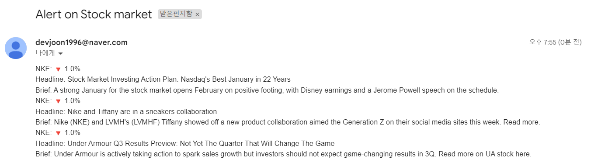

# Udemy : 주식시장 뉴스 알림기능 프로젝트

https://apilist.fun/


## API 사용

주식 API : https://www.alphavantage.co/

뉴스 API : https://newsapi.org/


## 내용

1. 주식
   - 오늘 주식 가치와, 전 날의 주식 가치를 비교한다
     - 얼마가 올랐거나, 내려갔는지 확인 (퍼센트도 추가)
     - **전 날과 비교해서, 가격 변동이 심하면, 그 주식에 관련된 회사에 어떤 일이 일어났는지 확인하고 싶은** 것
2. 뉴스
   - 가격 변동이 크다면 (예시) 10프로 변동), 주식에 관련된 회사의 뉴스를 확인한다
3. SMS 또는 이메일을 보낸


```python
import requests
import os
import dotenv
from datetime import datetime, timedelta
import smtplib
from email.mime.text import MIMEText

dotenv.load_dotenv()

def send_email(news):
    my_email = os.getenv("my_email")
    receive = "devjoon1996@gmail.com"
    my_password = os.getenv("password")

    connection = smtplib.SMTP_SSL("smtp.naver.com", port=465)
    connection.login(my_email, my_password)

    msg = MIMEText('\n'.join(news))
    msg["From"] = my_email
    msg["Subject"] = 'Alert on Stock market'
    msg["To"] = receive

    connection.sendmail(my_email, receive, msg.as_string())


SEARCH = "nike"
STOCK = []

parameter = {
    "function": "SYMBOL_SEARCH",
    "keywords" : SEARCH,
    "apikey": os.getenv("api_key"),
}

symbol_response = requests.get(url="https://www.alphavantage.co/query", params=parameter)
symbol_response.raise_for_status()

symbol_data = symbol_response.json()["bestMatches"]

if symbol_data:
    for data in symbol_data:
        if data["4. region"] == "United States":
            STOCK.append(data["1. symbol"])


#------- 주식 시장이 매일 열리는 것이 아는 것을 인지 ------
# 토요일, 일요일, 월요일에는 목요일 금요일 시장 마감 금액을 파악해야 한다
# 화요일에는 목요일 월요일 시장 마감 금액을 파악해야 다
today = datetime.now().weekday()
yesterday = (datetime.now() - timedelta(1)).date()
yesterday_2 = (datetime.now() - timedelta(2)).date()

if today == 6:
    yesterday = (datetime.now() - timedelta(2)).date()
    yesterday_2 = (datetime.now() - timedelta(3)).date()
elif today == 0:
    yesterday = (datetime.now() - timedelta(3)).date()
    yesterday_2 = (datetime.now() - timedelta(4)).date()

elif today == 1:
    yesterday_2 = (datetime.now() - timedelta(4)).date()

y_year, y_month, y_day = yesterday.year, "{:02d}".format(yesterday.month), "{:02d}".format(yesterday.day)
y2_year, y2_month, y2_day = yesterday_2.year, "{:02d}".format(yesterday_2.month), "{:02d}".format(yesterday_2.day)

yesterday = f"{y_year}-{y_month}-{y_day}"
yesterday_2 = f"{y2_year}-{y2_month}-{y2_day}"

news_to_send = []

#---------------- STOCK 이라는 리스트를 만들었다 ------------------
# 즉 삼성이라도, 삼성전자가 있고, 삼성전기가 있듯이, 삼성이라고 검색하면, STOCK에 삼성에 관련된 이름들이 저장될 수 있다
for stock in STOCK:
    parameter = {
        "function": "TIME_SERIES_DAILY_ADJUSTED",
        "symbol" : stock,
        "apikey": os.getenv("api_key"),
    }

    response = requests.get(url="https://www.alphavantage.co/query", params=parameter)
    response.raise_for_status()
    stock_data = response.json()["Time Series (Daily)"]

    data_list = [value for (key,value) in stock_data.items()]


    close_value_1 = float(data_list[0]["4. close"])
    close_value_2 = float(data_list[1]["4. close"])

    # 얼마나 가치가 떨어지거나, 올라갔는지 알수 있는 공식
    change = (close_value_1 - close_value_2) // close_value_1

    if abs(change) >= 1:
        if change < 0:
            change = f"🔻 {abs(change)}%"
        else:
            change = f"🔺 {abs(change)}%"


    news_parameter = {
        "apiKey": os.getenv("news_api_key"),
        "q": stock,
        "language": "en",
        "sortBy": "popularity",
        "from": yesterday,
        "to": yesterday_2,
    }

    news = requests.get(url="https://newsapi.org/v2/everything", params=news_parameter)
    news.raise_for_status()
    news_data = news.json()["articles"][:3]

    for news in news_data:
        news_to_send.append(f'{stock}: {change} \nHeadline: { news["title"] } \nBrief: { news["description"] }')

send_email(news_to_send)
```


