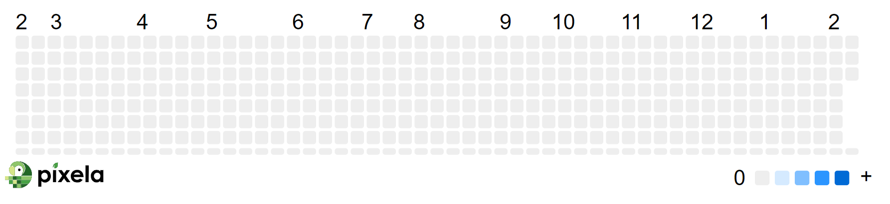

# Udemy : Python API POST / PUT / DELETE request

https://apilist.fun/

[연습 코드](https://github.com/jejoonlee/TIL-and-Coding-Test/tree/master/%EB%B8%94%EB%A1%9C%EA%B7%B8/Python/%EC%97%B0%EC%8A%B5/day_37_habit_tracker)


## HTTP Requests

#### `GET`

- 정보를 가지고 오는 것이다
- API에 경우, `GET` 을 통해 외부 정보를 요청을 하는 것이다
- `requests.get()`


#### `POST`

- 정보를 받는 것이 아닌, 외부에 정보를 보내는 것이다
- 응답 같은 경우, 외부에서 정보를 잘 받았는지에 대한 확인 여부가 중요하다 (`GET`처럼 응답은 중요하지 않다)

- `requests.post()`


#### `PUT`

- 외부 정보를 업데이트 하는 것이다

- `requests.put()`


#### `DELETE`

- 외부 정보를 삭제하는 것

- `requests.delete()`


## POST request

```python
import requests
import os
import dotenv

dotenv.load_dotenv()

pixela_endpoint = "https://pixe.la/v1/users"
parameter = {
    "token": os.getenv("pixela_token"), 
    "username":"jejoonlee", 
    "agreeTermsOfService":"yes", 
    "notMinor":"yes"
}

response = requests.post(url=pixela_endpoint, json=parameter)
print(response.text)
```

- pixela 라는 웹사이트의 API를 가지고 와서, 회원가입을 하는 것
- `parameter`에 API 문서에서 필요한 것들을 집어 넣은다
- `requests.post()`을 사용하여 `url`에는 엔드포인트를 그리고 `json`에는 파라미터를 넣은다
  - `username`이 중복된 것이 없으면, 성공을 한다
  - 만약, 다시 터미널을 실행한다면, 중복된 `username`이라서 실패가 뜬다 (즉, 유저이름을 이미 만들었다는 의미)


## requests headers를 이용하여 인증하기

> 원래 parameter에 넣어서 토큰이나, API를 사용하면, 인터넷 주소창에 뜬다


- 주소창에 API key나 토큰이 뜨게 되면, 다른 사람들이 보고 사용할 수 있다
- `headers`를 이용하면 주소창에 안 뜨게 할 수 있다

```python
pixela_graph_endpoint = f"{pixela_endpoint}/{USERNAME}/graphs"
graph_parameter = {
    "id" : "graph1",
    "name" : "Coding Study",
    "unit" : "commit",
    "type" : "int",
    "color": "sora",
    "timezone": "Asia/Seoul",
}

headers = {
    "X-USER-TOKEN" : os.getenv("pixela_token"),
}

graph_response = requests.post(url=pixela_graph_endpoint, json=graph_parameter, headers=headers)
print(graph_response.text)
```

- 위의 코드는 `X-USER-TOKEN`이 헤더에 저장되어, `requests.post()`할 때에 주소창에 보이지 않는다


> 위의 코드를 실행하면, 만들어지는 




## `strftime`

> 날짜를 원하는 대로 포맷 하는 것

```python
today = datetime.now()
print(today.strftime("%Y%m%d"))

# 20230207
```


