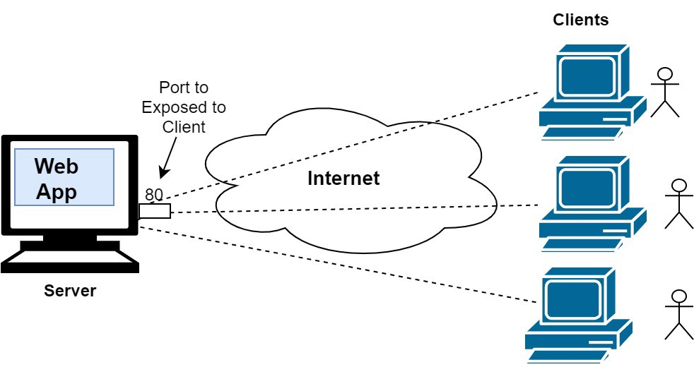
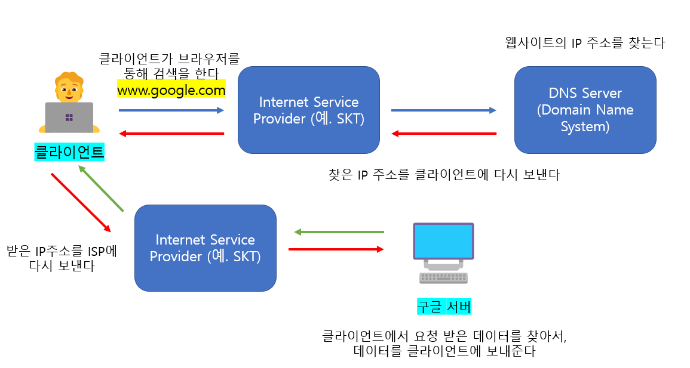

# Udemy : Python, 인터넷

## 인터넷은 어떻게 작동하는가?

#### 인터넷이란?

> 24시간 열려있는 도서관이라고 생각하면 된

- 24시간 동안 모든 컴퓨터들을 연결해주는 것이다
- 웹사이트에 접근할 때에, 필요한 데이터 또는 파일을 제공해주는 것이 **서버**
- 웹사이트를 접근하고, 일반 유저가 사용하는 것이 **클라이언트**

#### 웹사이트 작동

**HTML**

- 웹 사이트의 구조를 만드는 것

**CSS**

- 웹 사이트의 스타일링을 하는 것 (웹 사이트가 어떻게 보이고 싶은지 만들어준다)

**JavaScript**

- 웹 사이트를 동적으로 만들 수 있다

