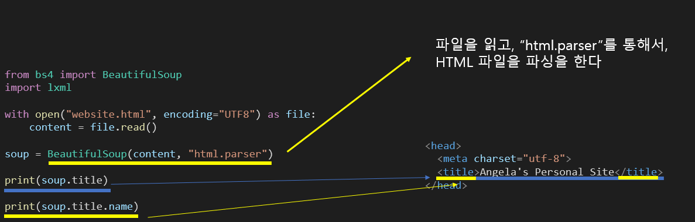
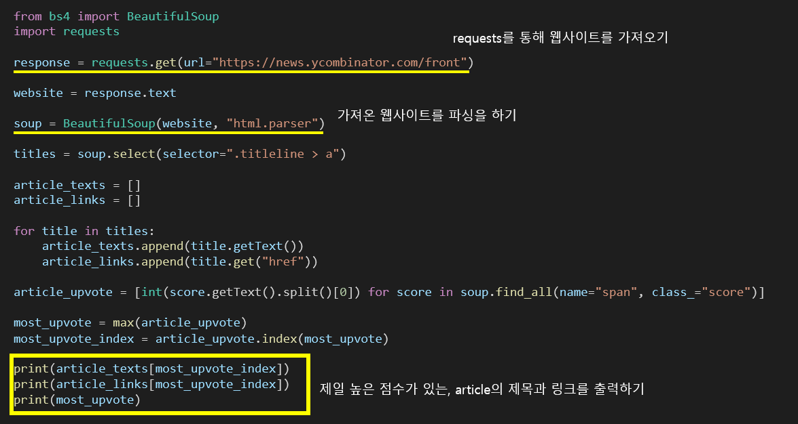

# Udemy : Python Web Scraping (parsing)

## Web Scraping

> #### 웹 사이트의 html을 사용하여, 웹 사이트에 있는 데이터를 가지고 오는 것이다

### 웹 스크래핑은 합법인가?

> 웹 스크래핑은 내 소유가 아닌 다른 사람의 소유의 웹 사이트의 데이터를 사용하는 것이다
>
> 주로 저작권이 없거나, 로그인 없이 접근할 수 있을 때에 데이터를 사용할 수도 있다

- 웹 스크래핑을 한 데이터를 상업화 하면 불법이 될 수 있다
- 저작권이 있는 데이터를 상업화 시키는 것도 불법이다
- 웹 사이트에 로그인을 하여, 웹 스크래핑을 할 경우 불법이다
  - 로그인을 해서 데이터를 활용할 수 있는 웹 사이트들은, 회원가입 때에, 해당 사이트의 데이터를 못 쓰도록 인증하도록 되어 있다

- 웹 스크래핑을 막기 위해 사용되는 도구다

#### 데이터가 필요할 때에는 API가 있으면, API를 사용하는 것이 제일 좋다

#### https 주소 맨 마지막에 /robot.txt 를 넣으면, 어떤 정보를 사용할 수 있을지 볼 수 있다

#### Beautiful Soup

> HTML 또는 XML 파일 안에 있는 데이터를 출력하는 것을 가능하게 해주는 파이썬 라이브러리

#### 파싱이란?

- 데이터를 분해하여 원하는 형태로 조립하고 빼내는 프로그램
- 문서 또는 HTML 에서 내가 원하는 데이터를 특정 패턴이나 순서로 추출해 가공하는 것

- 위는 만약 `title`이 여러 개면, `title` 중에 제일 첫 번째, 즉 제일 위에 있는 태그의 데이터를 출력한다

### 라이브 웹사이트 스트래핑하기

