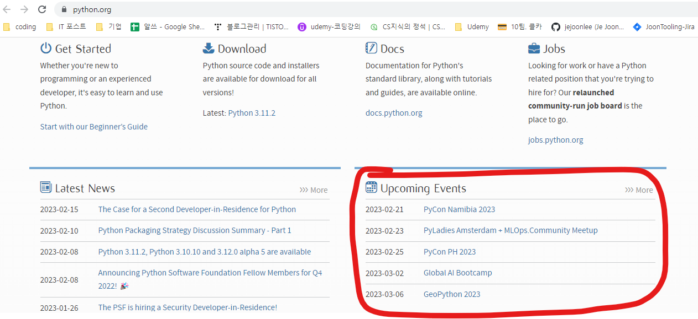

# Udemy : Python Selenium

*Udemy Python*


## Selenium Webdriver

> #### 웹에서 자동적으로 작업을 할 수 있도록 만드는 것
>
> #### 입력, 클릭, 스크롤 등 인간들이 웹에서 할 수 있는 것들을 자동으로 할 수 있다


### Selenium

- **크롬 설치하기**

- **셀레니움/ webdriver 설치하기**
  - `pip install selenium` 그리고 `pip install webdriver_manager` 설치하기
  - `webdriver.Chrome(service=Service(ChromeDriverManager().install()))`
    - 예전에는 크롬드라이버를, 크롬 버전에 따라서, 직접 다운로드를 받아야 했다
    - 하지만 이제는 `service=Service(ChromeDriverManager().install())`를 통해 최신 크롬드라이버를 자동으로 다운 받아준다

```python
from selenium import webdriver
from selenium.webdriver.common.by import By
from selenium.webdriver.chrome.service import Service
from webdriver_manager.chrome import ChromeDriverManager

driver = webdriver.Chrome(service=Service(ChromeDriverManager().install()))
```


#### 요소를 찾고 선택하는 방법

> 최신 셀레니움을 사용하려면 By를 가지고 와야 한다


```python
from selenium import webdriver
from selenium.webdriver.common.by import By
from selenium.webdriver.chrome.service import Service
from webdriver_manager.chrome import ChromeDriverManager

driver = webdriver.Chrome(service=Service(ChromeDriverManager().install()))
driver.get("https://sports.news.naver.com/wfootball/index")

driver.find_element(By.NAME, "q")
# 전 driver.find_element_by_name("q")

driver.find_element(By.CLASS_NAME, "클래스 이름")
# 전 driver.find_element_by_class_name("클래스 이름")

driver.find_element(By.ID, "id 이름")
# 전 driver.find_element_by_id("id 이름")

driver.find_element(By.CSS_SELECTOR, "CSS 설렉터")
# 전 driver.find_element_by_selector(selector="css selector")

driver.find_element(By.XPATH, "XPath")
# 전 driver.find_element_by_xpath("XPath")

driver.quit()
```


#### 셀레니움은, `find_element`를 하고, 출력을 하면, 셀레니움 요소를 출력해준다

`<selenium.webdriver.remote.webelement.WebElement (session="40e0cfd79007116d7d21251d93e0b88f", element="d13a9e68-403f-43bd-8bdb-0038ca5123ad")>`

- `.tag_name`  :  find_element의 태그 이름을 가지고 반환한다

- `.text `  :  find_element 안에 있는 글을 반환한다
- `.get_attribute(속성 이름)`  :  속성의 값을 가지고 와준다
  - 속성 : a 태그의 href


### 셀레니움을 사용해서 웹사이트 데이터 스크래핑하기



```python
{0: {'time': '2023-02-21', 'name': 'PyCon Namibia 2023'}, 1: {'time': '2023-02-23', 'name': 'PyLadies Amsterdam + MLOps.Community Meetup'}, 2:
{'time': '2023-02-25', 'name': 'PyCon PH 2023'}, 3: {'time': '2023-03-02', 'name': 'Global AI Bootcamp'}, 4: {'time': '2023-03-06', 'name': 'Ge
oPython 2023'}}
```

- python.org 의 Upcoming Event를 딕셔너리로 반환하는 것이다


```python
from selenium import webdriver
from selenium.webdriver.common.by import By
from selenium.webdriver.chrome.service import Service
from webdriver_manager.chrome import ChromeDriverManager

driver = webdriver.Chrome(service=Service(ChromeDriverManager().install()))

driver.get("https://www.python.org/")

upcomming_event = {}


time = driver.find_elements(By.XPATH, '//*[@id="content"]/div/section/div[2]/div[2]/div/ul/li/time')
name = driver.find_elements(By.XPATH, '//*[@id="content"]/div/section/div[2]/div[2]/div/ul/li/a')

for i in range(len(time)):
    upcomming_event[i] = {
        'time' : time[i].text,
        'name' : name[i].text,
    }

driver.quit()

print(upcomming_event)
```

- `find_elements`를 통해서, 요소들을 리스트로 가지고 온다
- `time`과 `name`으로 요소들을 저장한다
- 그리고 for문을 통해 `upcomming_event` 요소들을 딕셔너리에 넣는다


### 셀레니움을 이용해서 웹 사이트와 상호 작용하기

```python
from selenium import webdriver
from selenium.webdriver.common.by import By
from selenium.webdriver.chrome.service import Service
from selenium.webdriver.chrome.options import Options
from webdriver_manager.chrome import ChromeDriverManager
from selenium.webdriver.common.keys import Keys


driver = webdriver.Chrome(service=Service(ChromeDriverManager().install()))

driver.get("https://www.naver.com/")


# -------------- 요소를 찾고, 클릭하기 ------------------------
number_of_articles = driver.find_element(By.XPATH, '//*[@id="articlecount"]/a[1]')
number_of_articles.click()

# ------ 요소를 찾고, 박스 안에 입력하고, enter 누르기 -----------------
search = driver.find_element(By.NAME, "query")
search.send_keys("Python")
search.send_keys(Keys.ENTER)


driver.quit()
```

#### send_keys

- 키보드에 있는 값들을 보내주는 것이다
- `from selenium.webdriver.common.keys import Keys`
  - 왠만해서, 알파벳은 그냥 알파벳 값으로 보내면 된다
  - 하지만 ENTER 같은 값은, `Keys`를 따로 가지고 가지고 와서 사용해야 한다


