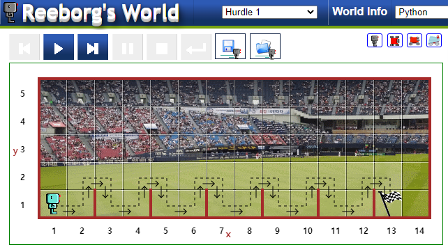
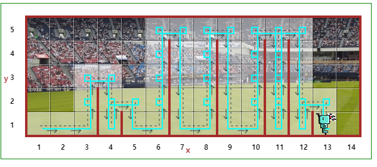
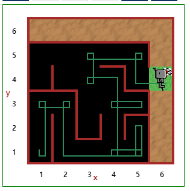

# Udemy : Python 함수와 카렐


## Function

#### function() - 앞에 function의 이름이 있고, 뒤에 괄호가 붙는다

#### 왜 사용는건가?

- 지속적으로 똑같은 코드를 쓰기보단, 함수로 만들어서, 그 함수를 지속적으로 사용하면 된다
- 코드를 줄일 때, 유용하게 쓸 수 있다


#### function 만들기

```python
def my_function() :
    print("My Function")
    print("Wow")
    
my_function() 
# 함수 부르기
```


## While Loop

```python
while something_is_true:
    #Do this
    #Then do this
    #Then do this
```

- while문은, 써 놓은 조건이 거짓일때까지, 지속적으로 코드를 실행하는 것이다
- 확실한 길이의 데이터가 주어지지 않을 때 while문을 사용하면 좋다
  - 목표를 이룰때까지 while문을 사용해라


## 실습 1



- 함수를 이용해서, 로봇을 조작하는 것을 간단히 했다.
- https://reeborg.ca/reeborg.html?lang=en&mode=python&menu=worlds%2Fmenus%2Freeborg_intro_en.json&name=Hurdle%201&url=worlds%2Ftutorial_en%2Fhurdle1.json

### 위의 코드

```python
def turn_right():
    turn_left()
    turn_left()
    turn_left()

def jump():
    turn_left()
    move()
    turn_right()
    move()
    turn_right()
    move()
    turn_left()
    
while not at_goal():
    if front_is_clear():
        move()
    elif wall_in_front():
        jump()
```

- 장애물을 뛰는 것과, 오른쪽을 보는 것이 지속적으로 나온다.
- 계속 move()와 turn_left()를 사용하는 것은 매우 비효율적이다
- 그래서 turn_right() 과 jump() 라는 함수를 따로 만들어서, 해당 코드를 실행한다
- 그리고 while문을 통해, 목적지까지 도착할때까지, 뛰거나 움직이는 것을 반복한다


## 실습 2



```python
def turn_right():
    turn_left()
    turn_left()
    turn_left()

def jump():
    cnt = 0
    while wall_in_front():
        turn_left()
        move()
        turn_right()
        cnt += 1
    move()
    turn_right()
    for _ in range(cnt):
        move()
    turn_left()
        
while not at_goal():
    if front_is_clear():
        move()
    elif wall_in_front():
        jump()
```

- 이번에는 점프를 하는데, 장애물 크기가 다 다르다
  - 이럴 때는 while문을 써서, 앞으로 움직일때마다 장애물이 있는지 확인을 하며 몇번을 움직였는지 `cnt`에 누적한다
    - wall_on_right() 과 front_is_clear()로 대체할 수 있다
  - 그리고 그 `cnt`만큰 내려오면 된다


## 실습 3



```python
def turn_right():
    turn_left()
    turn_left()
    turn_left()
    
while not at_goal():
    if right_is_clear():
        turn_right()
        move
    if front_is_clear():
        move()
    elif wall_in_front():
        if wall_on_right():
            turn_left()
        elif right_is_clear():
            turn_right()
```

- 로봇의 위치와, 바라보는 방향 모두 무작위로 주어진다
- 여기서 중요한 것은 오른쪽에 도착지가 있고, 오른쪽을 신경쓰면서 움직여야 한다
