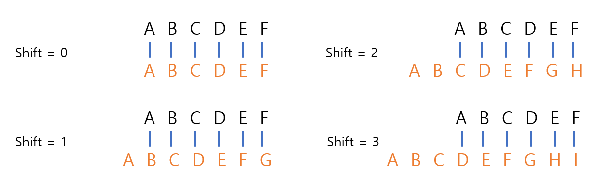

# Udemy : Python 매개변수와 카이사르 암호

> 입력값을 받는 함수를 알게 될 것
>
> Arguments 와 Parameters의 차이


## 입력 값이 있는 함수

```python
# 그 전에 배웠던 함수
def greet():
    print("Hello")
    print("Alex")
    
greet()
# 괄호에 아무것도 안 넣었다

def greet_with_name(name):
    print("Hello")
    print(name)

greet_with_name('Alex')
# greet_with_name() 안에 입력값을 넣어야 함수가 실행이 된다
# 그 입력값은 하나의 변수의 역할을 한다
# 괄호 안에 아무것도 없으면 argument가 없다고 에러 메세지가 뜬다
# TypeError: greet_with_name() missing 1 required positional argument: 'name'
```

`greet_with_name("Alex")`

- **name = "Alex"**
- name 은 parameter
- "Alex" 는 argument 이다

**argument**는 함수에서 호출되는 데이터를 의미한다 / 데이터의 실질적인 값

**parameter**는 그 데이터의 이름이다


```python
def greet_with(name, location):
    print(f"Hello {name}")
    print(f"What is it like in {location}")
```

- parameter는 2개 이상으로도 가능하다
- 하지만 함수를 불러오게 될 때에는 parameter의 개수에 맞게 arguments들을 넣어야 한다


## 실습 1

> 페인트 1 캔 당 5미터제곱의 벽을 칠할 수 있다
>
> 벽의 높이와 길이가 주어질 때, 몇 개의 페인트가 필요한가?

식 ) `(height * width) / cover`

```python
import math

def paint_calc(height, width, cover):
    cans = math.ceil((height * width) / cover)
    print(f"You'll need {cans} cans of paint.")

test_h = int(input("Height of wall: "))
test_w = int(input("Width of wall: "))
coverage = 5
paint_calc(height=test_h, width=test_w, cover=coverage)
```

- `math.ceil()`을 함으로 올림을 해준다


## 실습 2

소수 구하기

```python
def prime_checker(number):
    flag = True
    for i in range(2, number):
        if number % i == 0:
            print("It's not a prime number.")
            flag = False
            break
    if flag == True:
        print("It's a prime number")

n = int(input("Check this number: "))
prime_checker(number=n)
```

- 소수는 1과 자기 자신만 제외하고 나눠 질 수 없는 수이다.
- 위 같은 경우 2부터 시작해서, `number`까지 for문으로 순회를 해서, `number`가 0으로 떨어지는지 확인한다
  - 0으로 나누어 떨어지면 소수가 아닌 것이고
  - for문이 끝날 때까지 0으로 나누어 떨어지지 않으면, 소수이다


## 카이사르 암호



- 메세지를 보낼 때에, 메세지 유출을 막기 위해, 문자를 encode를 한 것이다
- 위를 보면, shift에 따라 원래 문자가 메세지를 쓰는 문자들이 달라진다.
  - 예) Shift를 3번을 하면, A는 D가 되고 B는 E가 된다


```python
alphabet = ['a', 'b', 'c', 'd', 'e', 'f', 'g', 'h', 'i', 'j', 'k', 'l', 'm', 'n', 'o', 'p', 'q', 'r', 's', 't', 'u', 'v', 'w', 'x', 'y', 'z', 'a', 'b', 'c', 'd', 'e', 'f', 'g', 'h', 'i', 'j', 'k', 'l', 'm', 'n', 'o', 'p', 'q', 'r', 's', 't', 'u', 'v', 'w', 'x', 'y', 'z']

continue_ = "yes"

def caesar(text, shift, direction):
  cipher_text = ""
  shift = shift % 26

  for t in text:
    if t.isalpha():
      alphabet_index = alphabet.index(t)
      
      if direction == "encode":
        cipher_text += alphabet[alphabet_index + shift]
      elif direction == "decode":
        cipher_text += alphabet[alphabet_index - shift]

  if direction == "encode":
    print(f"The encoded text is {cipher_text}")
  elif direction == "decode":
    print(f"The decoded text is {cipher_text}")

while continue_ == "yes":
  direction = input("Type 'encode' to encrypt, type 'decode' to decrypt:\n")
  text = input("Type your message:\n").lower()
  shift = int(input("Type the shift number:\n"))
  
  if direction == "encode" or direction == "decode":
    caesar(text, shift, direction)
  else:
    print("You can only input 'encode' or 'decode'")

  continue_ = input("Would you like to continue? Type 'yes' or 'no' \n").lower()
```

- `caesar()`라는 함수를 만들어 엔코딩 또는 디코딩을 할 수 있도록 했다
  - shift 같은 경우, 26 이상으로 인덱스가 나갈 수 있어서, shift으로 입력한 값과 26을 나누어 떨어지는 수를 구한다
- `.index()`로 현재 단어의 문자들의 인덱스 값을 구한다
  - 엔코딩이면 shift를 더하고, 디코딩이면 shift를 빼준다
  - 그리고 다시 그 인덱스 값을 통해 알파벳을 구해서 엔코딩 또는 디코딩한 값을 `cipher_text`로 저장하면 된다
- while문을 통해, 만약 유저가 계속 이 프로그램을 실행하고 싶으면, 실행을 할 수 있도록 만든다


