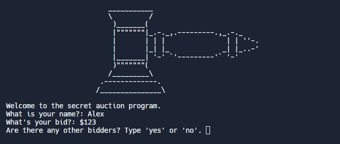

# Udemy : Python 딕셔너리


## 딕셔너리

```python
name = {
    "Alex" : 2;
    "Lisa" : 1;
    "Joon" : 1;
}
```

- "Alex", "Lisa", "Joon" 은 **key**
- 2, 1, 1은 **value**들이다. 즉 **key**의 값들이다
- 딕셔너리는 **key**를 통해서 값을 가지고 올 수 있다
  - `name["Alex"]` 는 2로 출력된다

```python
name = {
    "Alex" : 2,
    "Lisa" : 1,
    "Joon" : 1,
}

print(name["Alex"])
# 2

name["Yang"] = 5
print(name)
# {
#    "Alex" : 2,
#    "Lisa" : 1,
#    "Joon" : 1,
#    "Yang" : 5,
# }
# Yang이 key로, 5가 Yang의 값으로 추가가 되었다

name["Joon"] = 7
# "Joon"의 값이 1에서 7로 바뀔 것이다
```

- 즉 key를 통해서 값을 넣게 되면, 딕셔너리에 존재하는 key가 없으면, 새로운 key와 값이 추가가 된다
- 반대로 key가 존재하게 되면, 해당 key의 값이 바뀐다


#### for loop

```python
for key in name:
    print(key)
    print(name[key])
# key 위주로 순회를 한다
```


#### Value

값은 리스트, 딕셔너리로 저장을 할 수 있다

```python
travel_log = {
    "England" : {"cities_visited": ['London', 'Manchester'], "total_visits": 1},
    "South Korea" : ['Busan', 'Seoul', 'Sokcho'],
}
```

그 외에도, 리스트 안에 딕셔너리 또는 리스트를 넣을 수 있다


## 실습 1

> 학생들의 점수를 grade로 바꿔서 딕셔너리로 넣는 것이다

```python
student_scores = {
  "Harry": 81,
  "Ron": 78,
  "Hermione": 99, 
  "Draco": 74,
  "Neville": 62,
}

student_grades = {}

for key in student_scores:
    score = student_scores[key]

    if 90 < score <= 100:
        student_grades[key] = "Outstanding"
    elif 80 < score <= 90:
        student_grades[key] = "Exceeds Expectations"
    elif 70 < score <= 80:
        student_grades[key] = "Acceptable"
    else:
        student_grades[key] = "Fail"
    
print(student_grades)
```

- `student_grades` 라는 비어있는 딕셔너리를 만든다
- for문을 통해 학생들의 점수를 꺼내서, if문을 통해서 grade로 바꾼다
- 그리고 `student_grades` 딕셔너리에 학생의 이름과 함께 넣는다


## 실습 2

> 여행을 한 새로운 나라, 도시를 함수를 통해 리스트 안에 저장을 하는 것이다

```python
travel_log = [
{
  "country": "France",
  "visits": 12,
  "cities": ["Paris", "Lille", "Dijon"]
},
{
  "country": "Germany",
  "visits": 5,
  "cities": ["Berlin", "Hamburg", "Stuttgart"]
},
]

def add_new_country(country, visits, cities):
    visited = {}
    visited["country"] = country
    visited["visits"] = visits
    visited["cities"] = cities
    travel_log.append(visited)

add_new_country("Russia", 2, ["Moscow", "Saint Petersburg"])
print(travel_log)
```

- `add_new_country()`는 country, visits, cities 라는 파라미터가 존재한다
  - 함수는 `visited`라는 딕셔너리에 정보를 집어넣고, 마지막에 `travel_log`에 `visited` 딕셔너리를 넣어준다


## 비밀 경매 프로그램

> 컴퓨터를 통해 경매를 하는 것이다
>
> 여기서 경매 입찰가는 아무도 모른다
>
> 입찰가는 각 유저들이 프로그램에 넣고, 그 중에서 입찰가가 제일 높은 사람이 경매를 성공하는 것이다

- 이름과 입찰가를 넣고, 입찰을 할 사람이 더 있는지 물어본다 ('yes' or 'no')
  - 'yes'를 입력하면, 다른 유저가 이름과 입찰가를 추가할 수 있는 것이다
  - 'no'를 입력하면, 입력한 사람들 중에서 제일 높은 입찰가를 보여준다




```python
from replit import clear
from art import logo
#HINT: You can call clear() to clear the output in the console.

print(logo)
print("Welcome to the secret auction program.")

auction_list = {}
next = "yes"

while next == "yes":
  name = input("What is your name?: ")
  
  if name in auction_list:
    name = input(f"{ name } has already made a bid. \nPlease type in another name or type in the name again to change your bid : ")
  
  bid = input("What's your bid?: $")

  if bid.isdigit() != True:
    bid = input("Please write a correct format : $")

  auction_list[name] = bid
  
  next = input("Are there any other bidders? Type 'yes' or 'no'. ").lower()

  if next == 'no':
    break
  else:
    clear()

bid_winner = []
highest_bid = max(auction_list.values())

for key in auction_list:
  if auction_list[key] == highest_bid:
    bid_winner.append((key, auction_list[key]))
                      
if len(bid_winner) == 1:
  print(f'The winner is {bid_winner[0][0]} with a bid of ${bid_winner[0][1]}')
else:
  print('Please try the action again')
```

- while문을 통해 입찰가를 더 입력할 사람이 있으면, 입찰가를 계속 넣을 수 있도록 한다
  - 하지만 이름이 겹치면, dictionary 상, 값을 바꾸게 된다
    - 다시 확인 하는 메세지와, 이름을 바꾸거나, 다시 쓰게 한다
  - 혹시나 금액이 아닌 다른 이상한 글을 썼을 때를 방지하기 위해 `.isdigit()`을 썼다
    - 숫자 여부를 확인하는 것이다
- 그리고 마지막에 입찰가가 제일 큰 사람의 내용을 `bid_winner` 라는 리스트에 넣는다
  - 리스트에 한 명 밖에 없으면 그 한명한테 입찰이 되는 것이다
  - 2명 이상일 경우, 경매를 다시 하라고 메세지를 띄운다

