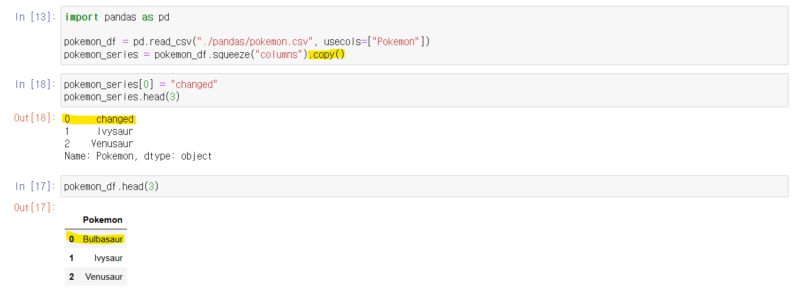
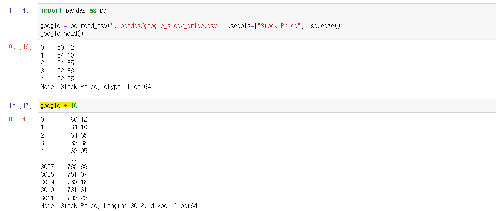
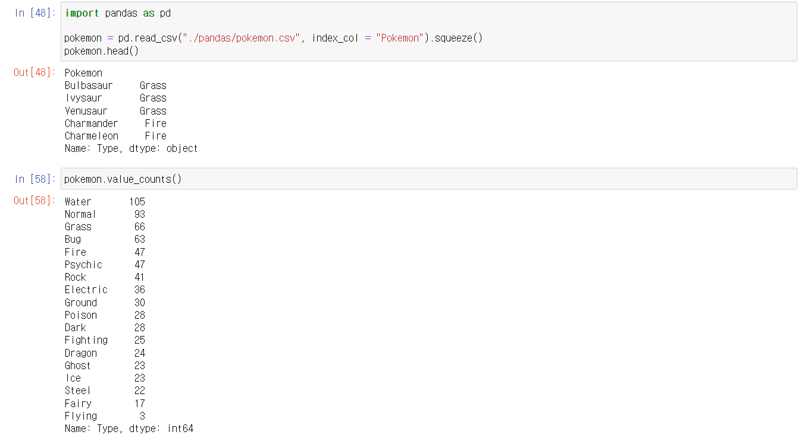

# Pandas - Series


## View

```python
import pandas as pd

pokemon_df = pd.read_csv("./pandas/pokemon.csv", usecols=["Pokemon"])
pokemon_series = pokemon_df.squeeze("columns")
```

- pokemon_df 를 통해서 .squeeze() 를 하여, pokemon_series라는 series를 만들었다
- 하지만 pokemon_df와 pokemon_series는 독립적인 관계가 아니다
  - 즉 pokemon_series에서, 값을 바꾸면, pokemon_df에 있는 값도 바뀌게 된다


```python
pokemon_series[0] = "Changed"
```

- pokemon_series[0]를 "Changed"로 바꿨다
- pokemon_df의 0번째를 보면 "Changed"로 똑같이 바뀌게 된다


## Copy

> #### 독립적인 복제 데이터를 만드는 것이다




- .copy() 를 사용하여 pokemon_df으로부터 독립된 series를 만들었다
- pokemon_series와 pokemon_df의 0번째를 보면, pokemon_series의 값만 바뀐 것을 볼 수 있다


## Inplace Parameter

> #### dataframe을 copy() 해야지 사용할 수 있다


```python
import pandas as pd

google = pd.read_csv("./pandas/google_stock_price.csv", usecols=["Stock Price"]).squeeze().copy()

google.sort_values(inplace=True)
# google = google.sort_values() 와 같다
google
```

- **google** 이라는 변수 안에 값들을 정렬을 하려면 **sort_values()**를 사용한다
- **google = google.sort_values()** 를 해야지, 정렬된 **google** 변수가, **google** 변수에 저장이 된다
- 그와 같이 **google.sort_values(inplace=True)**를 하면 위와 같이 행동을 한다
  - 즉 나중에 **google**만 출력하면, 정렬된 **google**이 출력된다
- 메모리 측면에서는, 둘 다 비슷비슷 하다
  - inplace를 사용해도, 새로운 google 변수를 만들기 때문이다


```python
google.sort_index(inplace=True)
# google = google.sort_index()
```


## Math Methods

```python
import pandas as pd

google = pd.read_csv("./pandas/google_stock_price.csv", usecols=["Stock Price"]).squeeze()


google.count()
# output : 3012

google.sum()
# output : 1006942.0

google.mean()
# output : 334.3100929614874

google.median()
# output : 283.315

google.product()
# output : inf

google.std()
# 기본 편차
# output : 173.18720477113106

google.min()
# output : 49.95

google.max()
# output : 782.22

google.mode()
# 제일 많이 나오는 숫자
# output
# 0    291.21
# Name: Stock Price, dtype: float64

google.describe()
# output
# count    3012.000000
# mean      334.310093
# std       173.187205
# min        49.950000
# 25%       218.045000
# 50%       283.315000
# 75%       443.000000
# max       782.220000
# Name: Stock Price, dtype: float64
```


## Broadcasting

> #### series에 있는 모든 값에, 특정한 수학 연산을 적용하는 것이다
>
> - 예를 들면, 모든 값에 10을 더하는 것




- 위와 같이 google, 즉 series에 연산과 값을 추가하면 된다
  - 47번줄 같은 경우 google, series에 있는 모든 값을 10씩 더해주는 것이다


```python
google + 10		# series 안에 있는 모든 값에 10을 더하기
google - 10		# series 안에 있는 모든 값에 10을 빼기
google * 2		# series 안에 있는 모든 값에 2를 곱하기

google.add(10)	# google + 10 과 같다
```


## value_counts

> #### Unique한 값들의 숫자를 세준다
>
> - 여기서 대문자와 소문자는 구분해줘야 한다. Grass와 grass는 다르다



- **.value_counts()**를 사용하면 기본적으로 내림차순으로 정렬을 해준다


```python
pokemon.value_counts(normalize = True)
# 해당 값이 차지하는 비중을 출력해준다
# 여기서 * 100 을 곱하면 퍼센티지로 볼 수 있다

pokemon.value_counts(sort=False)
# 정렬을 하지 않는다

pokemon.value_counts(ascending=False)
# 오름차순으로 정렬을 해준다
```

