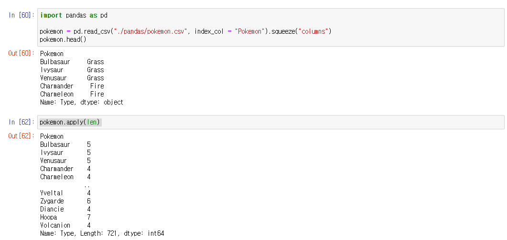
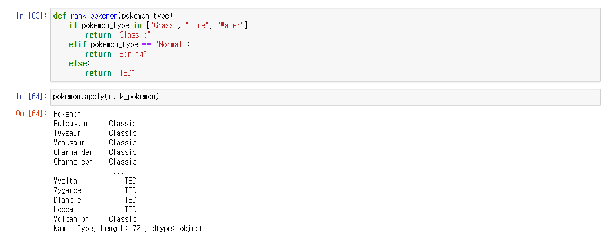
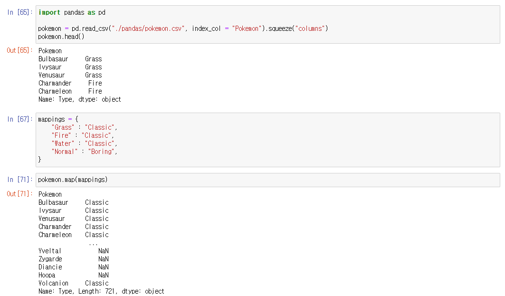

# Pandas - Series

## apply()

> #### series에 있는 모든 값에 함수를 넣어서, 새로운 값을 만드는 것이다

- 여기서 **len**은 문자열의 길이, 또는 리스트의 길이를 알고 싶을 때 사용하는 함수이다
  - 위에 같은 경우, **pokemon** 에 있는 모든 종류의 문자열의 길이를 출력해준다
  - Grass 같은 경우, 문자열의 길이가 5고, Fire 같은 경우 4이다

- 따로 함수를 만들어서 **apply()** 에 argument로 넣어서 사용할 수 있다
  - **rank_pokemon()**에 parameter가 있지만 **apply()**에서는 각각의 값들을 **rank_pokemon()**의 argument로 자동으로 넣어준다

## map()

> #### apply()는 함수를 받아온다면, map()은 객체(예. 딕셔너리)를 받는다

- 그 외에도 series를 **map()**의 argument로 넣어도 된다
  - **A_series.map(B_series)**
    - B_series의 인덱스와 A_series의 값을 매칭시킨다
    - 매칭된 값이 있다면 B_series의 값을 A_series 값으로 지정한다
    - 없다면 NaN로 저장한다
