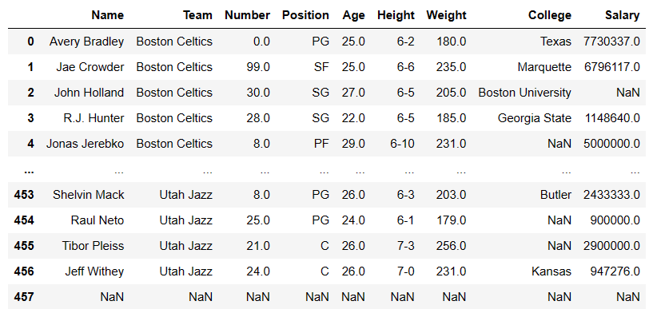
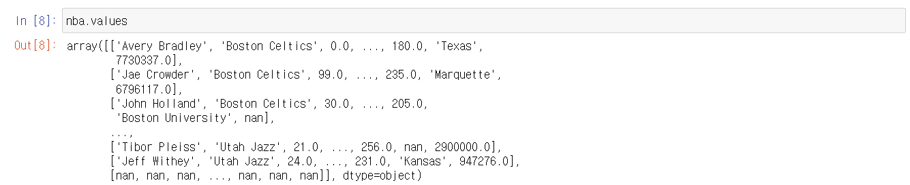
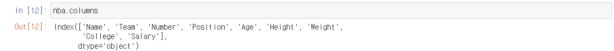
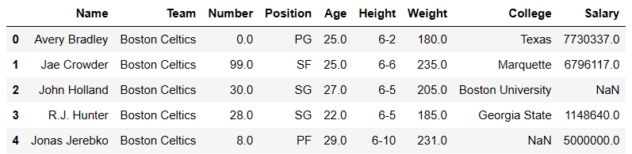
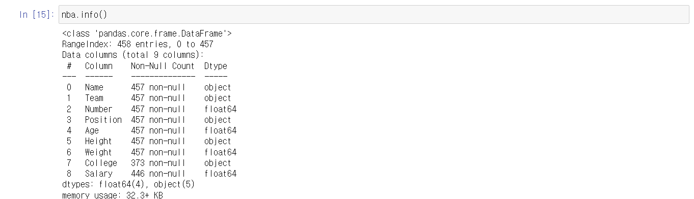
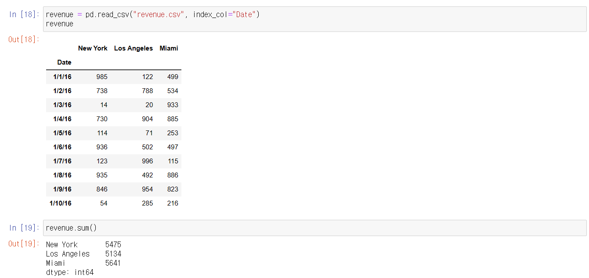
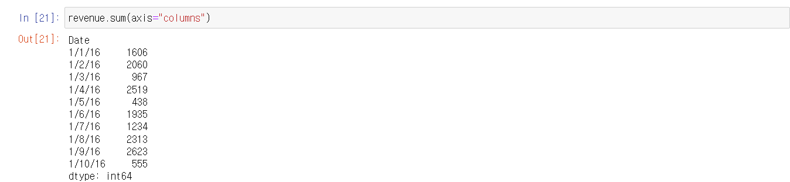
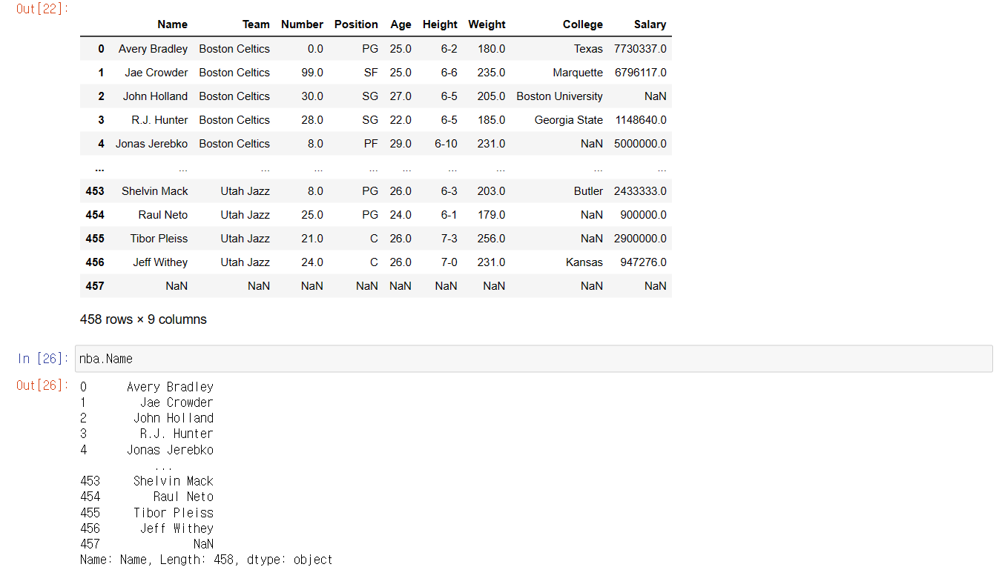
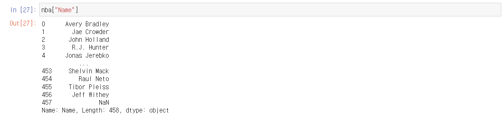

# Pandas - DataFrame


## DataFrame 이란?

> #### 2D 의 자료 구조다 / 테이블이라고 생각하면 된다
>
> - 즉 행과 열로 데이터가 이루어져 있다




## DataFrame Methods and Attributes

```python
import pandas as pd

nba = pd.read_csv("nba.csv")

nba.head()
# 테이블 제일 위의 5개의 열을 출력해준다
# 5개가 기본이고 argument에 위에서 몇 개를 출력할지 지정할 수 있다

nba.tail()
# 테이블 제일 아래의 5개의 열을 출력해준다
# 5개가 기본이고 argument에 위에서 몇 개를 출력할지 지정할 수 있다

nba.index
# output : RangeIndex(start=0, stop=458, step=1)

nba.shape
# output : (458, 9)
# 열과 행의 개수

nba.dtypes
# 각 행의 데이터 타입을 알려준다
# output
# Name         object
# Team         object
# Number      float64
# Position     object
# Age         float64
# Height       object
# Weight      float64
# College      object
# Salary      float64
# dtype: object
```


#### nba.values



- numpy array로 출력해준다
  - 2중 리스트로 묶여있는 것을 볼 수 있다


#### nba.columns




- 행의 정보를 알려준다




- 열의 정보를 찾을 때에는, 맨 왼쪽의 숫자를 보고 정보를 찾으면 된다
- 행의 경우 Name, Team, Number, Position, Age, Height, Weight, College, Salary가 행의 인덱스라고 보면 된다


#### nba.info()



- **nba**가 DataFrame 이라는 정보
- 몇 개의 정보가 있는지와, 인덱스가 0부터 457까지 있는 것
- 행의 개수
- 행에 대한 정보 등을 알 수 있다


#### .sum()



- 기본적으로 **.sum()** 을 하게 되면, 각 행에 있는 모든 데이터를 더해준다




- 각 열에 있는 데이터를 더하고 싶으면 **.sum()** 에 **axis** parameter에 **columns** 를 넣어준다
  - columns 말고 1을 넣어줄 수 있음
  - 반대로 0은 행을 뜻 한다


## DataFrame에서 하나의 행 선택하기

> #### Series로 반환해서 출력해주고, Series에서 사용하는 메서드 또는 속성을 사용할 수 있다





- 위에 **nba**는 DataFrame 이다
- **nba.Name** 즉, 행의 이름을 '.' 다음에 넣으면, 해당 행을 Series로 반환해서 출력해준다
  - 하지만 행의 이름에 공간이 있으면, 작동하지 않는다





- 인덱스를 찾는 것처럼 '[]'를 사용해서, 안에 행 이름을 넣으면 된다
  - 행 이름에 공간이 있어도 100프로 작동한다

