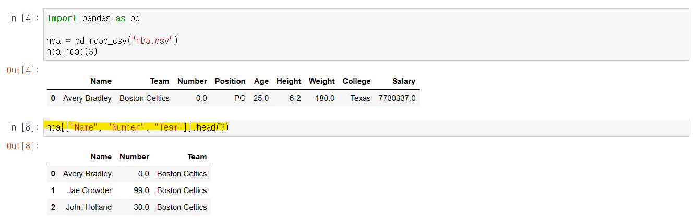
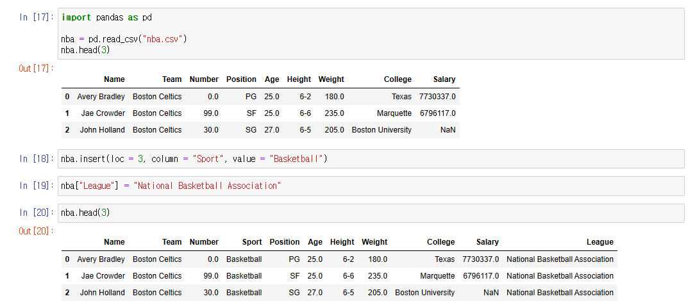

# Pandas - DataFrame


## DataFrame 에서 2개 이상의 행 선택하기



- '[]' 안에 행의 이름/인덱스 를 넣으면, Series를 반환하는 것을 알 수 있다
- '[]' 안에 리스트를 넣으면, 새로운 DataFrame을 만들어 준다
  - **nba[]** 안에 ["Name", "Number", "Team"] 을 넣어주었더니, 해당 행에 대한 값들을 DataFrame으로 출력해주었다
  - 리스트 안의 행의 이름은, 순서대로 안 넣어도 된다
  - 단, 리스트 안에 행의 이름 순으로, 값들이 출력된다


## DataFrame에 추가 행을 넣기




- 19번째 줄 : **nba["League"] = "National Basketball Association"**
  - DataFrame의 행들 중, 제일 마지막에 **League**라는 행 이름으로 **National Basketabll Association**을 값으로 만든다
- 18번째 줄 : **nba.inser(loc = 3, column = "Sport", value = "Basketball")**
  - **loc** : 3번째 행을 뜻한다
    - 인덱스와 같이 0부터 시작한다
    - "Name"은 0 / "Team"은 1 / "Number"는 2 등등
  - **column** : 해당 행에 어떻한 이름을 줄 것인지 argument로 넣어준다
  - **value** : 해당 행에 어떻한 값을 넣을지 argument로 넣어준다


## 기존 행을 이용해서, 새로운 행을 만들기

```python
import pandas as pd

nba = pd.read_csv("nba.csv")
nba.head(3)

nba["Age"] + 10
# nba["Age"].add(10) 도 사용할 수 있다

nba["Age in Decade"] = nba["Age"] + 10

nba["Age"] - 10
# nba["Age"].sub(10)

nba["Age before Decade"] = nba["Age"].sub(10)

nba["Weight"] * 0.4535
# nba["Weight"].mul(0.4535) 도 사용할 수 있음

nba["Weight in kg"] = nba["Weight"] * 0.4535
```

- **nba["Age"] + 10 **또는 **nba["Age"].add(10)**
  - "Age" 행의 각 값에 10을 더하는 것
- **nba["Age in Decade"] = nba["Age"] + 10**
  - "Age in Decade" 라는 새로운 행을 만들고, 그 행에는 "Age" 행에서 10을 더한 값을 넣는다

- **nba["Age"] - 10** 또는 **nba["Age"].sub(10)**
  - "Age" 행의 각 값에 10을 빼준다
- **nba["Age before Decade"] = nba["Age"].sub(10)**
  - "Age before Decade"라는 새로운 행을 만들고, 그 행에 "Age" 행에서 10을 뺀 값을 넣는다
- **nba["Weight"] * 0.4535** 또는 **nba["Weight"].mul(0.4535)**
  - "Weight" 행의 각 값에 0.4535을 곱하는 것
- **nba["Weight in kg"] = nba["Weight"] * 0.4535**
  - "Weight in kg"라는 행을 새로 만들고, "Weight" 행에서 0.4535를 곱한 값을 넣는다


> NaN 이 있을 경우, NaN을 반환할 것이다


## .dropna()

```python
import pandas as pd
nba = pd.read_csv("nba.csv")

nba.dropna()

nba.dropna(how = "all")

nba.dropna(subset = ["College", "Salary"])
```


- **nba.dropna()**
  - 한 열에 NaN, 즉 빈 공간이 하나라도 있으면, 그 열을 제외하고 출력한다
  - 즉 **nba.dropna()** 를 할 경우, NaN가 아예 없어진다
- **nba.dropna(how = "all")**
  - **nba.dropna()** 의 parameter, **how**,는 기본으로 "any"로 설정되어 있다
  - how, parameter에 "all" 이라는 argument를 붙이면, 한 열여 대한 모든 행의 값이 NaN, 또는 빈 공간일 때에, 그 열을 제외하고 출력하는 것이다
    - 예) 위의 사진을 보면 457번 줄이 제외된다
- **nba.dropna(subset = ["College", "Salary"])**
  - **subset** 파라미터에, 리스트를 넣는다
  - 리스트 안에는 해당 행에 NaN, 빈 공간이 있는 열을 제외하고 싶을 때에, 행의 이름을 넣는다
    - 예) 2번, 4번, 454번, 455번, 457번 줄이 제외되어 출력된다


