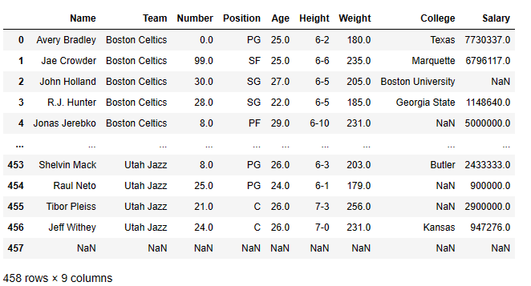
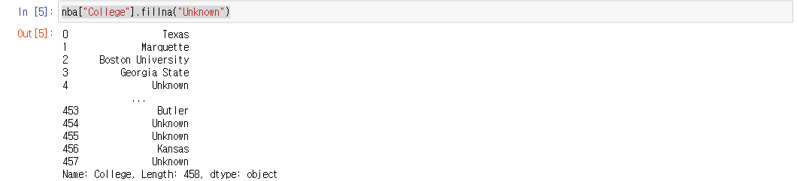
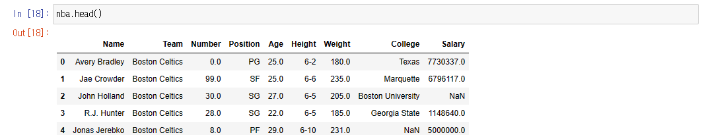
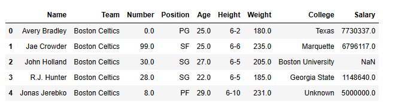
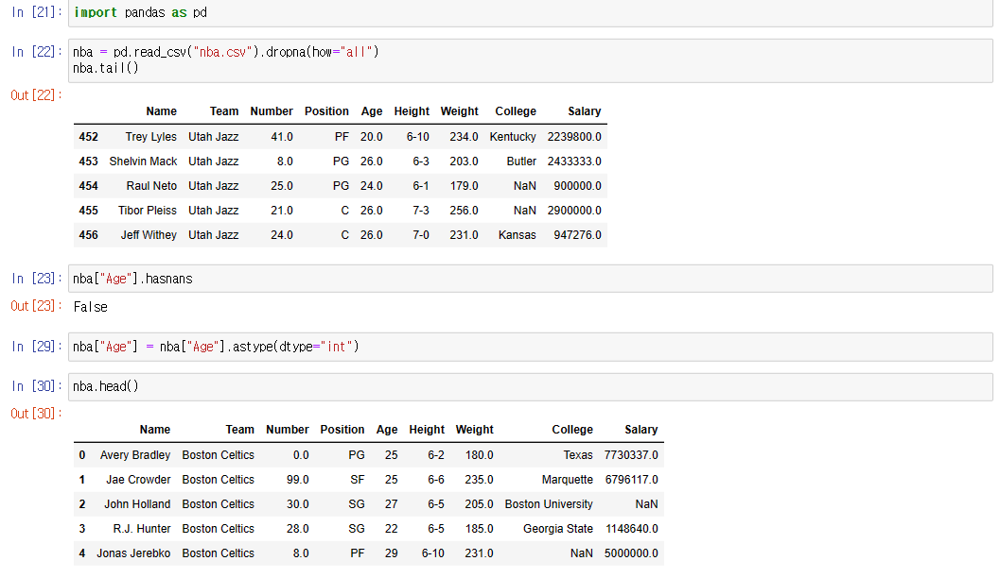
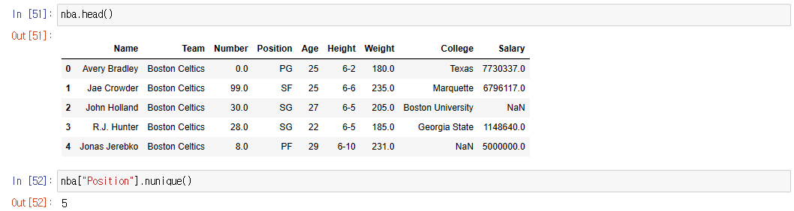
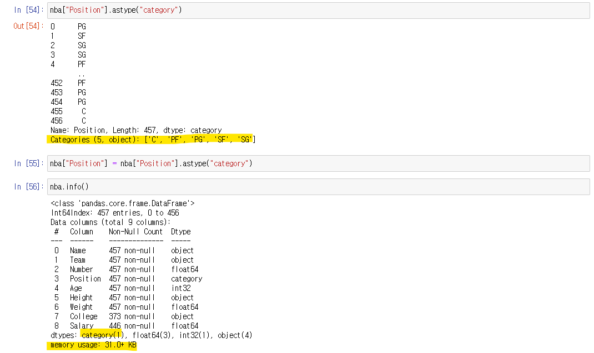

# Pandas - DataFrame


## 빈칸, NaN 안에 값을 직접 넣기




#### .fillna()

- **.fillna()** 를 사용하고, argument를 넣어주면, 위에 DataFrame의 NaN이 argument로 들어간 값을 출력하는 것을 볼 수 있다


#### 특정 행에 NaN 대신 값을 넣고 싶을 때




- 행을 인덱스로 가지고 오고 **.fillna()** 를 사용한다
- 이렇게 하면, series로 반환해서, series 안에 있는 NaN을, 입력한 값으로 바꿔준다





- 하지만 위와 같이 할 경우, DataFrame에는 NaN를 특정 값으로 바꾼 것이 적용이 안 되었다
  - 4번 열의 College 행을 보면 NaN을 볼 수 있다


```python
nba["College"] = nba["College"].fillna("Unknown")
# nba["College"].fillna("Unknown", inplace=True)
```




- DataFrame까지 변경을 시키려면, series를 만들고, 그 series를 해당 행에 덮어주면 된다
- **inplace** 를 사용해도 된다 (하지만, inplace는 없어질 수도 있다)


## astype 메서드

> #### 데이터의 값의 타입을 다른 타입으로 반환해주는 메서드다
>
> - 예) int 에서 string으로 바꾸기
>
> #### 판다의 특성상, 행의 데이터 중에 NaN이 하나라도 있을 수도 있어, 숫자로 된 모든 값은 float로 출력된다




- .astype() 같은 경우 NaN이 있으면 에러가 발생한다
- 23번 줄 : **.hasnans** 
  - NaN이 해당 행에 있는지 확인한다 (Boolean으로 출력)
- 29번 줄 : 해당 행의 데이터 타입을 **int** 로 바꿔주고, **nba["Age"]** 행에 덮어준다
  - 먼저 series를 만들어서, series 안에 있는 **float**들을 **int**로 바꿔준다
  - 그리고 그 series를 **nba["Age"]** 행에 덮어주는 것이다


> 만약에 Salary 행 또는 College 행처럼 NaN이 있으면, **.fillna()** 를 통해, 기본 값을 설정하고, **.astype()**을 사용해야 한다


## astype("category")

> #### DataFrame의 메모리를 줄일 때 유용하다
>
> - 성별, MBTI, 혈액형 같이 DataFrame에 비해 중복적으로 많이 나오는 데이터가 있을 때에 사용할 수 있다





- **Out [52]** : "Position" 행에 대한 유니크한 데이터가 5개 밖에 없는 것을 출력해준다
  - 즉 PG, SF, SG, PF, C 를 카테고리로 묶어서 메모리를 줄인다


- **.astype("category")**를 사용하기 전의 메모리다




- **nba["Position"].astype("category")**
  - series로 반환하고, **category**라는 데이터 타입으로 바꾼 것을 볼 수 있다
- **nba["Position"] = nba["Position"].astype("category")**
  - **category** 데이터 타입으로 바꾼 **series**를 DataFrame의 **nba["Position"]** 행에 덮어 씌운다
- 데이터 타입에는 category 가 1이 추가된 것을 볼 수 있고, 메모리도 전보다 2KB가 줄어든 것을 볼 수 있다
  - 해당 DataFrame은 데이터가 400개 이상이지만, 데이터 개수가 훨씬 더 많아지면, 메모리가 조금이라도 줄어들면 더 빠르게 DataFrame에 접근할 수 있다


