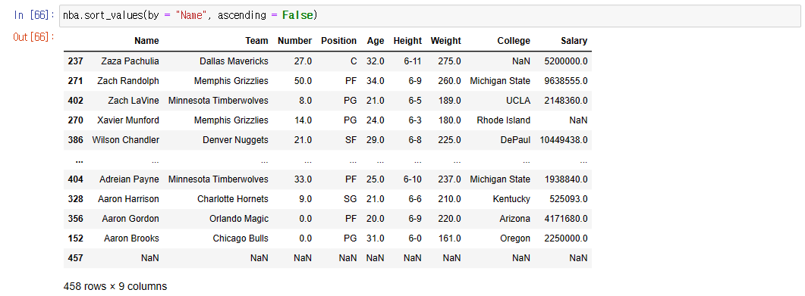
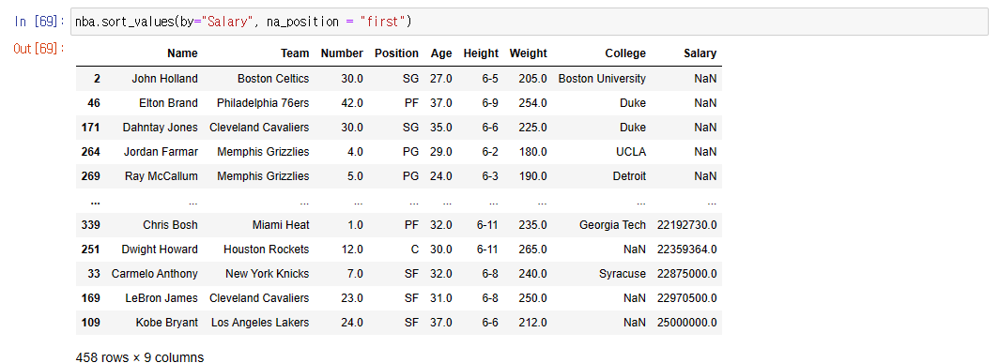
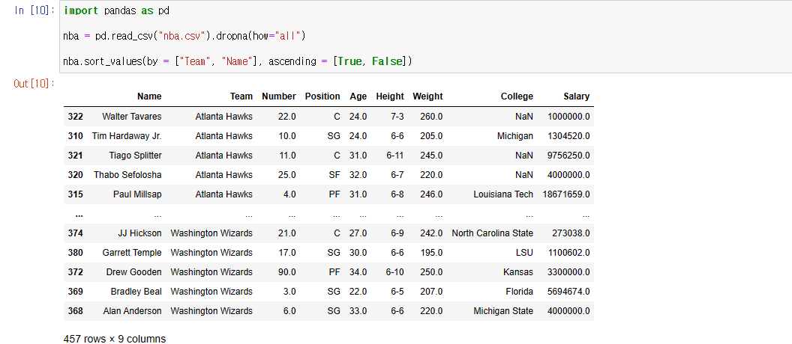
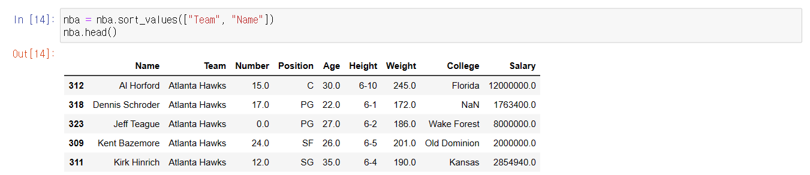
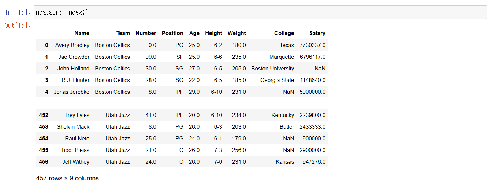
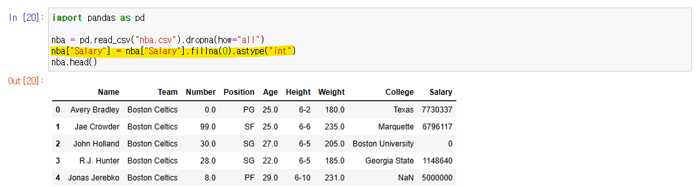
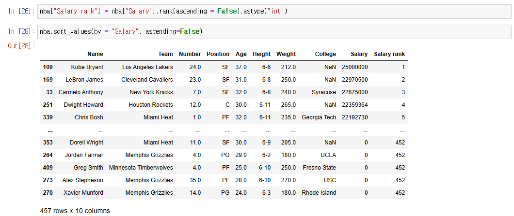

# Pandas - DataFrame

## sort_values 메서드

> #### 선택한 행을 정렬해주는 것이다
>
> - 기본으로는 오름차순으로 정렬된다
> - NaN은 기본으로 제일 밑에 놓인다

- **by = ""** : 정렬을 할 행의 이름을 넣는다
- **ascending** : 오름차순 또는 내림차순을 결정한다

- **na_position** : NaN 이 어느 위치에 출력이 될지 정해준다
  - Salary 행을 보면 NaN이 모두 위쪽에 위치한 것을 볼 수 있다
  - default는 제일 아래에 위치하는 것이다

## 복수의 행 정렬시키기

- **nba.sort_values(by = ["Team", "Name"], ascending = [True, False])**
  - **by** 에 정렬할 행을 순서대로 넣고, **ascending**에 오름차순 또는 내림차순인지 지정한다
    - **ascending**은 꼭 안 해도 된다. 기본이 True 다
  - "Team"을 먼저 오름차순으로 정렬을 하고, "Name"을 내림차순으로 정렬을 한다

## sort_index()

> #### 인덱스를 정렬해주는 것이다
>
> - 숫자 같은 경우 기본으로는 오름차순으로 정렬을 해준다
> - 문자가 있으면 알파벳 별로 오름차순으로 정렬해준다

- 인덱스를 보면 **sort_values()** 때문에, 뒤죽박죽 정렬이 되어 있는 것을 볼 수 있다

- **sort_index()** 를 통해서 인덱스 별로 오름차순으로 정렬을 시켰다
- 여기서 **sort_index(ascending=False)** 를 하면 내림차순으로 정렬이 된다

## rank()

> #### 순위를 맥여주는 메서드다

- **rank()**, 순위를 맥이기 전에는 NaN이 없는 것이 더 확실하다
- 그래서 **"Salary"** 행에, **.fillna(0)**를 통해 빈 칸은 모두 0으로 만든다
- 그리고 **astype("int")**를 통해, **"Salary"** 행에 모든 데이터의 타입을 숫자로 만든다

- **nba["Salary rank"] = nba["Salary"].rank(ascending = False).astype("int")**
  - **.rank(ascending = False)** 를 하면, "Salary" 행에 있는 숫자들의 순위를 맥여준다
    - **ascending = False** 로 해서 내림차순으로 순위를 맥여준다
  - **.astype("int")**를 하는 이유는, 순위를 모두 Float로 출력해준다
    - 보기 쉽게 int 로 변환해서 출력해준다

- **nba.sort_values(by = "Salary", ascending=False)**
  - 순위가 제대로 맥여졌는지, 확인하는 것이다
  - "Salary rank" 행을 보면, 순위가 제대로 맥여진 것을 알 수 있다
