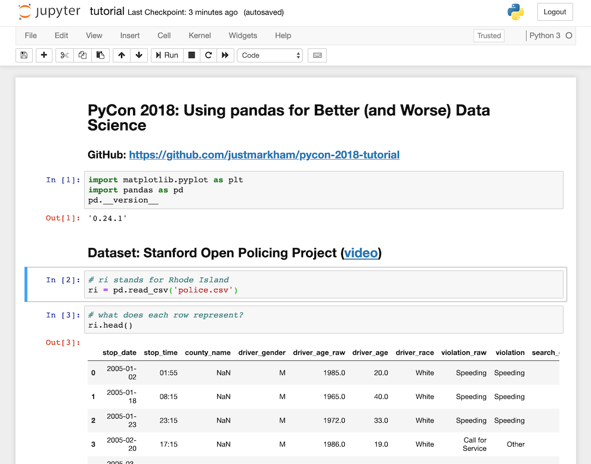

# 데이터 분석 - Pandas

#### 파이썬의 라이브러리다

#### Pandas는 데이터 분석, 필터링, 조작, 집계, 병합, 피벗 등을 할 수 있다

- 데이터를 가공하거나 분석을 할 때에 Pandas를 사용하는게 좋다

#### 엑셀보다 더 강력하다 (즉 더 많은 데이터를 다룰 수 있다)

## 아나콘다란?

> 오늘 인턴으로 첫 출근을 했는데, **아나콘다** 라는 것을 다운로드 받았다
>
> 웹 풀 스택 개발을 했지만, 데이터 분석 파트 인턴으로 입사를 했고, **아나콘다**는 처음 보게 되었다

#### 아나콘다는 머신러닝이나 데이터 분석을 할 때에, 필요한 여러가지 패키지가 기본적으로 포함되어 있는 파이썬 배포판이다

- 사수님이 가상 환경을 구축할 때에도 아나콘다를 사용한다고 했다

#### 기존에는 venv를 사용하며 패키지 하나하나 추가로 설치를 했다

- 하지만 아나콘다를 사용하며 따로 가상환경을 설치하며, 데이터 분석을 위해 필요한 패키지를 자동적으로 가지고 올 수 있다

## Jupyter Notebook

#### 코드와, 결과물 (테이블)을 한꺼번에 볼 수 있다

- IDE와는 다르

