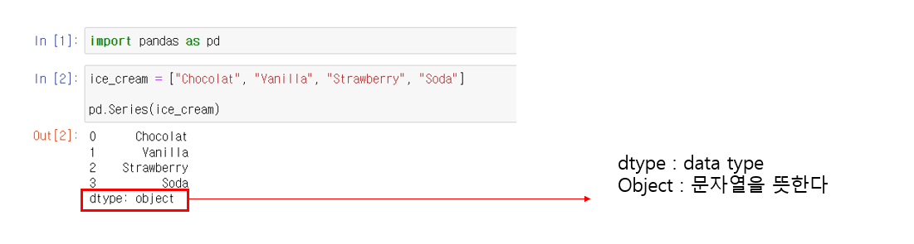
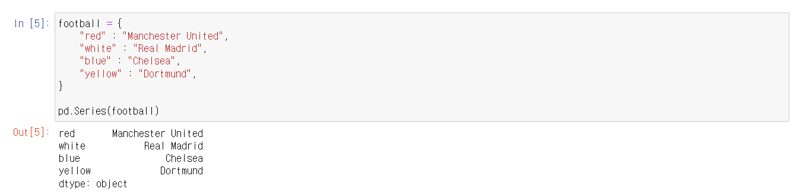

# Pandas - Series

## Series는?

> #### 1차원이면서 라벨이 붙은 배열이다
>
> - 하나의 열이라고 생각하면 된다
> - Series는 여러 가지의 데이터를 순서대로 저장하고, 요소의 위치를 정할 수 있다 (리스트와 같이)
> - 딕셔너리에 key와 value가 있듯이, 값의 식별자 (key)를 할당할 수 있다
>
> #### Series는 클래스다 (블루프린트)

### 리스트로 Series 만들기

- 저장한 **ice_cream** 들은 순서대로 Series로 저장되었다
- Out[2]에서 숫자들은 인덱스다 (기본적으로 0부터 시작해서 1씩 더해준다)
  - 인덱스는 사용자가 지정할 수 있다
  - 지정하지 않을 경우, 값들을, 기본 인덱스로 지정한다

- dtype가 숫자일 경우 **int** 로 나타날 것이다
- dtype가 boolean일 경우 (True or False), **bool** 로 니타날 것이다 

### 딕셔너리로 Series 만들기

- 위에 리스트로 만들었을 때, index에 왔던 곳에 숫자 대신 딕셔너리의 key가 들어왔다
  - 여기서 숫자 인덱스가 안 보이지만, red는 0번째, white는 1번째, blue는 2번째, yellow 3번째 인덱스다
- 값은 똑같이 값에 들어가고, dtype도 모든 값이 문자열이라서, object로 지정되어 있다

