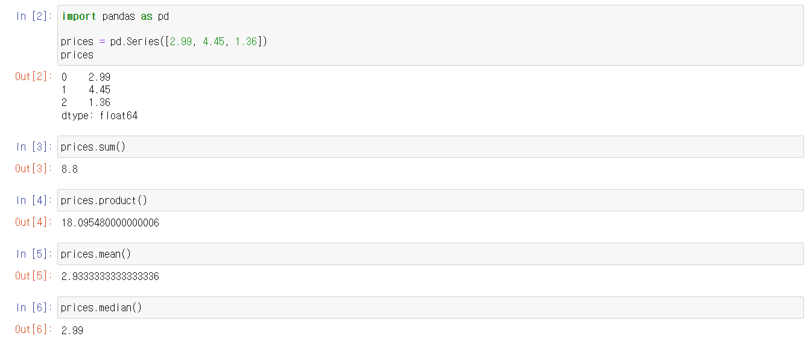
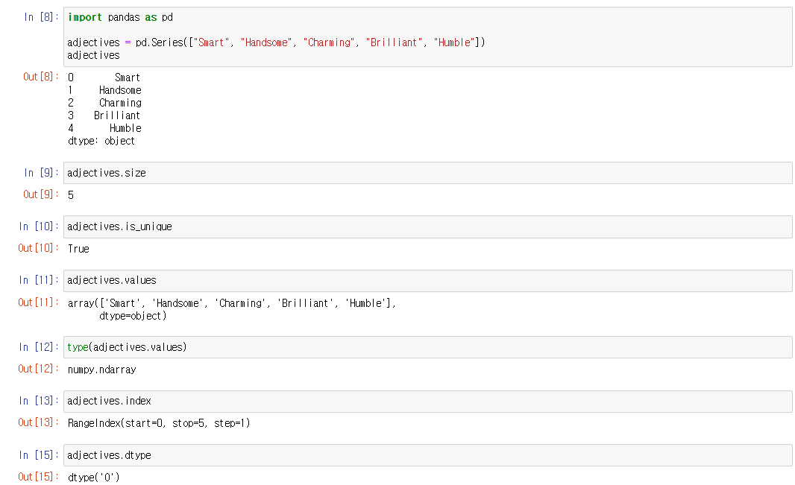

# Pandas - Series

## Methods (메서드)

> #### 객체에게 명령을 하는 것이다

- 메서드를 이용하여, 기존 값을 수정하거나, 기존 값을 토대로 새로운 값을 만들어 낸다

#### 아래의 메서드들은 새로운 값을 출력해준다

- **.sum()** : prices 안에 있는 값들을 모두 더하기
- **.product()** : prices 안에 있는 값들을 모두 곱하기
- **.mean()** : prices 안에 있는 값들의 평균값 구하기
- **.median()** : prices 안에 있는 값들의 중간값 구하기
  - 즉 위의 메서드들은 prices의 값들을 가지고, 새로운 값을 만들어내는 메서드들이다

## Attributes (속성)

> #### 객체의 세부 사항이나 특성 등을 말하는 것이다
>
> - 객체 자체를 설명하는 것이다

#### Series 안에 있는 값들에 대한 '정보'를 알려준다

- **.size** : Series 안에 있는 값들의 갯수를 알려준다
- **.is_unique** : Series 안에 값들이 겹치지 않는지 True 또는 False로 알려준다
- **.values** : Series의 값을 **numpy의 array**로 표현해준다
  - 실제로는 Series는 numpy의 array로 저장이 된다
- **.index** : Series의 인덱스 시작점과 끝을 알려준다
- **.dtype** : Series의 데이터 타입을 알려준다
  - 'O' 는 Object다
