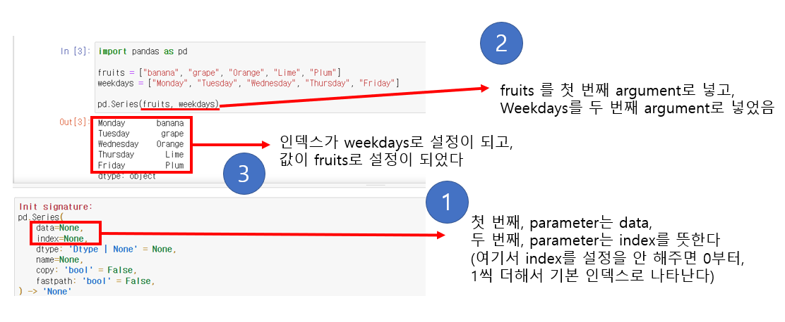

# Pandas - Series


## Parameters and Argument

> #### 파라미터 (매개 변수)는, 기대되는 입력값에 부여하는 이름이다
>
> - 메서드 또는 함수에 입력값을 받아드릴 수 있다
>
> #### Argument는 함수 또는 메서드에 제공하는 실질적인 값을 나타낸다


```python
def add(a, b):
    return a + b

print(add(1, 6))
```

- 여기서 **def add(a, b):** 에서 a와 b는 매개 변수다
- **add(1, 6)**의 **1과 6**은 **add**라는 함수에 실질적으로 입력되는 값으로, argument라고 할 수 있다
  - *즉 parameter를 지정하고, 지정한 parameter에 argument라는 실질적인 값을 넣어서 함수 또는 메서드를 실행한다*




- **pd.Series(data = fruits, index = weekdays)**
  - 이렇게 표현해도 된다
  - 여기서 data와 index는 parameter
  - fruits와 weekdays는 argument


