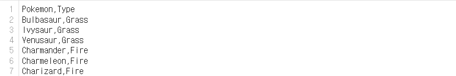
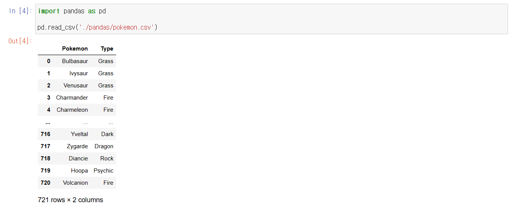
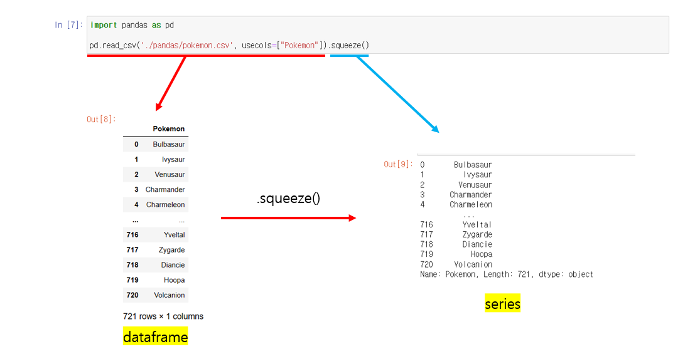

# Pandas - Series

## pd.read_csv

> #### csv 파일을 가져오는 함수이다
>
> - 데이터를 코드로 만드는 것이 아니라, 이미 존재하는 데이터를 가지고 와서 사용하는 것이다
>
> #### Comma Separate Value

- csv 파일은 1번째 행(Row)는 헤더, 즉 어떤 데이터가 있는지 표시해준다
- 그 밑의 행부터는 데이터가 들어간다
- 그리고 각 열은 ',' 쉼표로 구분 짓는다 

#### pd.read_csv

- csv 외에도, 엑셀, html, json 등 많은 파일을 읽을 수 있다

- pd.read_csv() 를 하게 되면, series가 아닌 dataframe을 가지고 온다
  - dataframe은 행과 열로 구성된 테이블을 뜻한다

- **.read_csv()**에서 **usecols**를 통해서 하나의 열을 가지고 왔다
  - 하지만, 주어진 output은 dataframe이다
  - **usecols** 는 dataframe에서 포함하고 싶은 열을 명시하는 것이다 (리스트 안에 넣는다)
- **.squeeze()**를 통해, **dataframe**의 하나의 열을 **series**로 변환해준다

