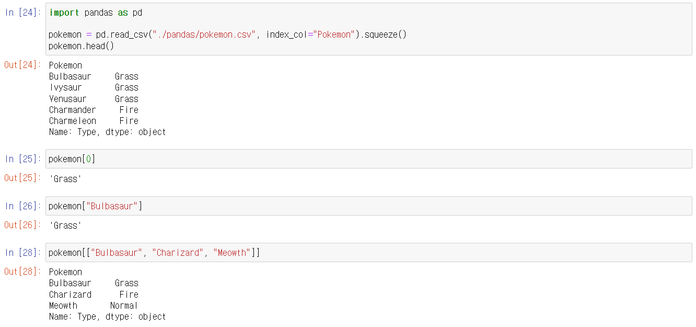

# Pandas - Series


## 인덱스 또는 값 중에, 찾고자 하는 것이 있는지 확인 하는 것

> #### 원래 파이썬을 사용할 때에, 특정 값을 찾을 때 사용하는 'in'을 사용하면 된다
>
> - "car" in "racecar"
>   - output : True

```python
import pandas as pd

pokemon = pd.read_csv("./pandas/pokemon.csv", usecols=['Pokemon']).squeeze()
pokemon.head()
# output
# 0     Bulbasaur
# 1       Ivysaur
# 2      Venusaur
# 3    Charmander
# 4    Charmeleon
# Name: Pokemon, dtype: object


"Bulbasaur" in pokemon
# Output : False

"Bulbasaur" in pokemon.values
# Output : True
```

- 그냥 **pokemon** 안에서 "Bulbasaur"가 있는지 찾으면, **pokemon**의 인덱스를 찾는 것이라서 False가 출력된다
- **pokemon.values** 를 해야, **pokemon** 안의 인덱스가 아닌 값 중에서 "Bulbasaur"를 찾는다


## 인덱스를 활용해서 Series에서 값 찾기

> #### 리스트와 비슷하기 list[숫자] 로 값을 찾을 수 있다


```python
import pandas as pd

pokemon = pd.read_csv("./pandas/pokemon.csv", usecols=["Pokemon"]).squeeze()

pokemon[210]
# Output : 'Qwilfish'

pokemon[[100, 200, 300]]
# Output
# 100    Electrode
# 200        Unown
# 300     Delcatty
# Name: Pokemon, dtype: object

pokemon[10:18]
# Output
# 10       Metapod
# 11    Butterfree
# 12        Weedle
# 13        Kakuna
# 14      Beedrill
# 15        Pidgey
# 16     Pidgeotto
# 17       Pidgeot
# Name: Pokemon, dtype: object

pokemon[-1]
# Output : error

pokemon[-10 : -8]
# Output
# 711    Bergmite
# 712     Avalugg
# Name: Pokemon, dtype: object
```

- **pokemon[[100, 200, 300]]** :  100번째, 200번째, 300번째 값을 출력해준다
- **pokemon[10:18]** : 인덱스가 10번부터 17번까지의 값을 출력해준다
- **pokemon[-10 : -8]** : 인덱스가 제일 뒤에서부터 10번째와 9번째를 출력해준다
- **pokemon[-1]** : pandas는 -1라는 인덱스는, 맨 마지막도 아닌 에러가 뜬다


## 인덱스 레이블로 값을 찾기

> #### 인덱스를 따로 설정할 수 있다
>
> - 그렇게 될 때에는 위와 같이 숫자 인덱스로 값을 찾을 수 있고, 새로 설정한 인덱스로도 값을 찾을 수 있다




- 위와 같이 인덱스는 Pokemon 행으로 그리고 값은 Type 행으로 설정이 된어 있다
- **pokemon[0]** 을 하면 0번째 값을 출력해준다
- **pokemon["Bulbasaur"]** 을 하면 Bulbasaur의 값을 출력해준다
- **pokemon[["Bulbasaur", "Charizard", "Meowth"]]**는 3개의 값들을 모두 출력해준다
