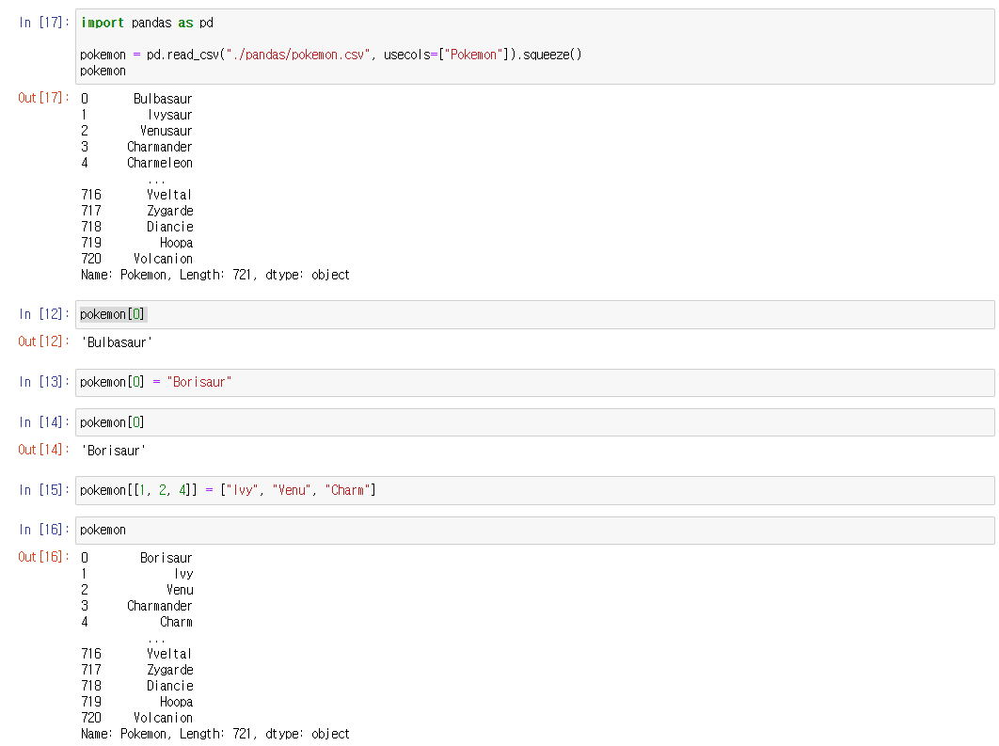

# Pandas - Series


## Get을 사용해서 값을 찾

#### get() 을 사용하면, 인덱스를 가지고 값을 찾을 수 있다

#### get() 을 사용하게 되면, 인덱스가 없으면, output을 아무것도 가지지 않는다

- 즉 None을 출력하는 것이다


```python
import pandas as pd

pokemon = pd.read_csv("./pandas/pokemon.csv", index_col="Pokemon").squeeze()

pokemon.get(0)
# Output : 'Grass'

pokemon.get("Bulbasaur")
# Output : 'Grass'

pokemon.get([4, 10])
# Output
# Pokemon
# Charmeleon    Fire
# Metapod        Bug
# Name: Type, dtype: object

pokemon.get(["Meowth", "Moltres"])
# Output
# Pokemon
# Meowth     Normal
# Moltres      Fire
# Name: Type, dtype: object

print(pokemon.get("Digimon"))
# Output : None

pokemon.get("Digimon", "Not a Pokemon")
# Output : 'Not a Pokemon'

pokemon.get(["Mewth", "Digimon"], "Wrong Pokemon")
# Output : "Wrong Pokemon"
```

- .get() 을 사용했을 때, 인덱스가 없다면 아무것도 출력을 안 한다
  - **.get(p1, p2)**
    - p1 은 문자열, 숫자 또는 리스트를 argument로 넣을 수 있다
    - p2 는 기본이 None으로, 찾는 인덱스가 없을 시, 출력하고 싶은 값을 넣는다
  - **pokemon.get("Digimon", "Not a Pokemon")**
    - 디지몬은 포켓몬에 없어서, "Not a Pokemon"이 출력된다
    - 하지만 두 번째 parameter가 없으면, 아무것도 출력이 안 된다


## 인덱스를 활용해서, 값 수정하기




- Series의 인덱스를 찾고, 해당 값에 어떤 값으로 수정할지 정하면 된다
  - pokemon[0] = "Borisaur"
  - 포켓몬 0번째는 Borisaur로 바껴있을 것이다
- 그 외에, 리스트를 통해서, 하나가 아닌 여러개의 인덱스를 찾아, 값들을 수정할 수 있다
