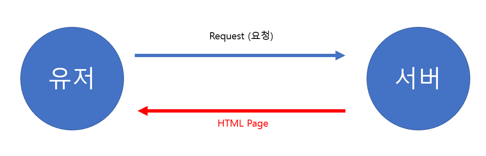

# Udemy - React

*Udemy React*

## React란?

> #### 유저 인터페이스를 만드는 JavaScript 라이브러리다
>
> #### UI를 반응형으로 만들어 준다
>
> #### 선언 방식, 요소 중심 접근을 한다

#### 자바스크립트는 HTML 구조 (DOM)를 조종할 수 있다

- 자바스크립트를 통해 HTML 구조를 조종하면서, 유저가 웹 사이트에서 무엇을 보고 있는지 바꿀 수 있다

#### 원래대로라면 유저가 서버에 데이터를 요청하고, 서버에서는 유저들이 볼 수 있도록 유저가 요청한 데이터를 HTML을 통해 응답을 한다

#### 여기서 자바스크립트를 이용하여, 유저가 데이터를 요청을 해도, 유저가 새로운 HTML을 받지 않더라도, 새로운 데이터에 대한 응답을 받을 수 있다

> #### 하지만 자바스크립트를 사용하면, 모든 자세한 내용들을 다 코드로 작성을 해야 한다
>
> - 기능부터, HTML까지 모두 작성을 해야 한다
> - 유지보수가 매우 어려워 진다

