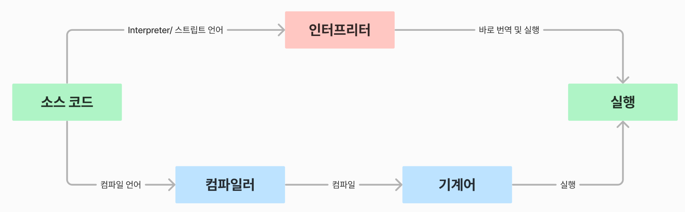

# Java vs Python

## Java와 Python의 차이점

> 두 언어 모두 사용해보고, 취준을 하며 느낀 점
>
> - 파이썬은 가독성이 자바보다 훨씬 뛰어나고, 코드도 작성하기 매우 쉽다
>   - 기본적으로 파이썬은 변수 타입을 따로 지정하지 않아도 된다 (코딩 테스트를 할 때에 변수명만 고민하면 된다)
> - 파이썬은 AI, 데이터 쪽으로 더 많이 활용이 되는 것 같다
>   - 실제로 파이썬에서 AI와 데이터 쪽으로 라이브러리가 잘 형성되어 있다 (TensorFlow, Pytorch, NumPy, Pandas 등) 
>   - 이는 파이썬이 자바보다 학습을 더 빠르게 할 수 있다는 영향도 있다

#### Compile 언어 vs Interpreted 언어

> 기본적으로 컴퓨터는 0과 1만 이해할 수 있다.
> 즉 개발 언어를 사용해도, 그 개발 언어에서는 0과 1로 만들어주는 기능이 있는 것이다.

- **Python은 인터프리터 또는 스트립트 언어다**
  - 코드를 한 줄씩 읽으면서, 기계어로 바꿔주는 것이다
  - 한 줄씩 명령을 내리다보니, 명령 자체의 속도는 컴파일 언어보다 느리다
  - 하지만, 실행될 때 바로 해석이 되어서, 코드를 변경할 때에 결과가 계속 바뀐다
- **Java는 컴파일 언어다**
  - 코드를 한번에 번역하고, 한 번에 실행하는 프로그래밍 언어다 (즉 작성한 코드를 한번에 기계어로 변환 후 실행하는 것이다)
  - 실행 속도는 빠르지만, 대규모 프로젝트를 했을 때에 컴파일 과정에서 시간이 오래 걸린다
  - 모든 코드를 한번에 컴파일 하기 때문에, 코드를 수정한다 해도, 다시 컴파일을 하지 않으면 변경 사항이 적용이 안 된다

#### 정적 타입 vs 동적 타입

> 여기서 타입은 int, str, float, boolean 같은 변수의 종류를 말한다

- **Java는 정적 타입 언어다**
  - 정적 타입은 변수명 앞에 변수의 타입을 직접 지정해주는 것이다
  - 컴파일을 할 때에, 변수 타입과 값의 형태가 맞지 않을 때에 컴파일 에러가 뜬다

- **Python은 동적 타입 언어다**
  - 변수의 타입은 런타임 때에 동적으로 결정이 된다
  - 즉 변수의 타입을 지정해 줄 필요가 없다

#### 운영체제

- **자바는 JVM (Java Virtual Machine)을 통해 각 운영체제에 맡게 작동을 한다**
  - 컴파일을 통해 만들어진 ByteCode를 운영체제에 맞게 설정해주는 소프트웨어다

