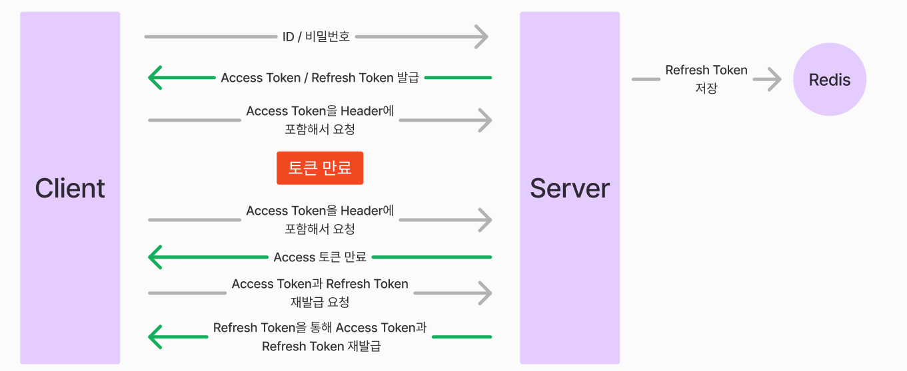

# 스터디 질문 20240214

### Access Token으로 회원 인증, 인가 방식을 설명해주세요. + spring security

Access Token은 JWT Token이다.

즉 JWT 토큰의 Payload에, 해당 유저에 대한 정보를 저장할 수 있다.

- 여기서 비밀번호와 너무 디테일한 정보를 넣는 것은 권장하지 않는다.

여기서 회원 인증은 로그인을 할 때에, 유저가 입력한 ID와 비밀번호 토대로 유저가 유효한 유저인지 확인을 한다.

즉 **회원 인증**은 Spring Security를 통해서 한다.

- AuthenticationFilter에서는 UserPasswordAuthenticationToken을 통해, 입력한 유저ID와 비밀번호에 대한 토큰을 발행한다.
- 인증을 위해 AuthenticationManager에 토큰을 보내고, 해당 토큰이 올바른 유저인지 확인한다.
- 다음은 AuthenticationProvider에 인증 객체를 보내고, 그 객체를 AuthenticationProvider에서는 UserDetailsService에 넘긴다.
- UserDetailsService는 UserDetails를 통해서 해당 유저가 DB에 있는지 확인해준다.
- 모든 확인이 끝나면, 검증된 인증 객체는 SecurityContext에 저장된다.
  - 해당 인터페이스는 getAuthentication 같은 사용자 인증 객체를 반환해준다.

**위에 모든 것이 끝났을 때에, SecurityConfig의 추가 Filter를 통해서 JWT 토큰을 생성해준다.**

- 위에 설명처럼, JWT 토큰에는 유저 정보가 포함되어 있다.
- 이 JWT 토큰을 통해 인가, 즉 권한을 부여해주는 것이다.

### **로그아웃 처리를 어떻게 하는지 설명해주세요.**

1. 로그아웃을 하면 Redis에 있는 Refresh Token을 Redis에서 삭제해 준다.
2. Access Token의 유효하면, Redis에 해당 Access Token을 저장하여 Blacklist로 만든다.
   - 여기서 Access Token의 남은 유효 기간을 TTL로 설정해 둔다.
   - 이렇게 설정해두면, 추후에 해당 Access Token으로 로그인 또는 데이터를 접근할 때에, 접근을 못 하게 해준다.

### **Refresh Token에서 Redis를 왜 사용하셨나요?**

Redis는 인메모리 데이터베이스다. HDD, SSD가 아닌 RAM에 데이터를 올리는 것이다

그래서 입력/읽기 기능이 훨씬 빠르다.

- Refresh Token 경우, 로그인 유지를 위해, 토큰 정보를 찾을 때, 빠르게 찾을 수 있다

지속성 때문에, 서버가 다시 시작해도, DB에 데이터가 저장이 되어 있다.

TTL을 설정할 수 있기 때문에, 특정 데이터의 만료 기간이 지나면, DB에서 없앨 수 있다.

- Refresh Token 같은 경우, 만료 기간이 있다 (만료 기간이 지나면 데이터를 유지 시킬 필요가 없다)

그 외에, 검색 내용, 요청 내용 등을 Redis에 저장하여 Cache 역할을 한다.

- 메인 DB에 직접 들어갈 필요 없이, 이미 한번 검색을 해 놓은 데이터를 Redis에 저장하여, 더 빠르게 정보를 빼올 수 있다
  - 여기서 특정 데이터만 Cache에 저장한다 (Queue 방식으로, 데이터 제한을 두던가, 데이터에 TTL을 설정한다)
- 빠르지만, RAM에 데이터를 저장하는 것을 생각해야 한다. (HDD, SSD 보다 용량이 적다!)

### **resissue 흐름**

기본적으로 한번 로그인을 하면 JWT 토큰을 통해, Access Token과 Refresh Token이 주어진다.

- JWT 토큰에는 만료 기간을 설정해둬야 한다 (없으면, 제3자가 Token을 탈취했을 시에, 해당 유저의 정보가 노출될 수 있다)

여기서 Access Token을 통해, 어플리케이션의 데이터에 접근 권한이 주어진다.

그리고 Access Token의 만료 기간 만큼, 어플리케이션에 따로 로그인을 하지 않고, 로그인을 유지 시킬 수 있다.

- 토큰 값은 HTTP Header의 Authorization에 넣는다. (프론트와 같이 하면, Cookie에 넣어서, 요청을 보낼때마다, 쿠키에서 토큰 값을 꺼내서 HTTP Header에 입력할 수 있다)

그리고 Access Token이 만료되었을 때에, Refresh Token을 통해, Access Token과 Refresh Token을 재발급해준다.

### **JWT 토큰 탈취 시에 어떻게 대응 할 수 있을까요?**

Session 토큰과 비교를 했을 때에, 유저가 많아져서 서버 부하를 줄이기 위해 JWT 토큰을 만이 이용한다.

- JWT 토큰은 클라이언트가 토큰을 가지고 있으면서, 토큰 안에는 유저 정보가 들어가 있다.
- 반면 Session 토큰은 서버 DB에 저장을 해두는 것이다.
- 보안 측면에서 Session 토큰이 더 안정적이다. (서버에서 메모리에 저장되기 때문에)

토큰은 유효 기간이 남아 있으면, 삭제할 수 없다. 그래서 미리 사전에 탈취 당하는 것을 예방하는 것이 제일 좋은 방법이다.

- Access Token 유효 기간을 짧게 두기
  - Access Token의 유효 기간을 짧게 두되, 로그인 유지를 할 수 있도록 Refresh Token을 발급해 주는 것이다.
  - 즉 Refresh Token의 유효 기간을 더 길게 둔다.
- Refresh 토큰이 탈취되었을 때?
  - Access Token이 만료 되었을 때에, Refresh Token을 통해 Access Token을 재발급한다.
  - 이 때에, Refresh Token도 재발급을 시켜준다.
  - 그렇게 되면, 토큰이 탈취 되었을 때에, 정상 사용자가 먼저 재발급을 하면 Refresh Token도 Access Token도 새로 발급이 된다.
  - 이것을 Refresh Token Rotation 이라고 한다.

- Refresh Token Rotation 을 해커가 먼저 재발급 할 때는?
  - 서버 측에서 관여하여, Redis에 저장되어 있는 Refresh Token을 삭제한다.
  - 반면, Access Token은 추적하는 것이 어려워, 유효 기간이 끝날 때까지 기다려야 한다.

- 즉, Access Token의 유효 기간을 정말 짧게 가져가고, 유저들이 이를 인식하면서, 서비스를 사용하는게 제일 좋은 방법이다.

### **게시글 수정 시에 Elasticsearch Document는 어떻게 되나요?**

비효율적으로 보일 수 있지만, 처음 Elasticsearch를 구현한 만큼, MariaDB에 저장되어 있는 모든 정보를 Elasticsearch에 저장을 했다.

즉 추가 입력, 수정, 삭제를 할 때마다 Elasticsearch 또한 입력, 수정, 삭제를 해야 했다.

- 결과적으로는, 두 개의 DB를 사용하는 것이라서, CRUD를 할 때마다, 두 번씩 해야 했다. (Elasticsearch는 검색엔진이긴 하지만...)

