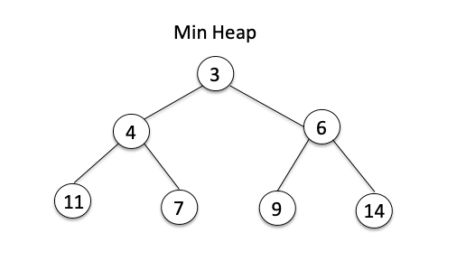

# Udemy : 알고리즘 자료구조

*udemy 알고리즘 코딩 테스트*


## 배열

> #### 파이썬은 리스트를 사용한다

```python
arr = [10, 11, 12, 13]
arr[2] = 5

# output : [10, 11, 5, 13]
```


#### 탐색 : O(1)

#### 삽입/삭제 : O(N)


## 스택/ 큐


#### Stack = LIFO (Last In First Out)

- 리스트 안에 제일 마지막에 추가된 요소를, 제일 먼저 뺀다
- 즉 `append`를 통해서, 리스트 제일 마지막에 값을 넣는다
- `pop`을 통해서 리스트 제일 마지막 요소를 빼낸다
- 맨 마지막에 요소를 추가하거나, 맨 마지막의 요소를 빼는 것이라서 삽입/삭제가 O(1) 이다


#### Queue = FIFO (First In First Out)

- 리스트 안에 제일 처음에 추가된 요소를, 제일 먼저 빼는 것

- `deque`를 사용하는게 제일 좋다
- `append`를 통해 리스트 안에 값을 넣어준다
- 하지만 리스트에 제일 먼저 들어온 값을 제일 먼저 빼내는 것이라서 `pop`이 아닌 `popleft`를 사용한다
  - 여기서 `popleft`는 `deque`를 사용해야 한다
- 원래 삽입하는 것은 O(1)이고, 삭제가 O(N)이 된다
  - 하지만 `deque`의 `popleft`를 사용하면 삭제도 O(1)이 된다


## 우선순위 큐 (Priority Queue)

> #### Heap을 사용한다
>
> - 파이썬에는 `import heapq`을 하면 된다
> - 최소 heap이 기본이다


#### 파이썬은 힙을 사용하게 되면, 최소 힙을 기본적으로 구할 수 있다


#### 그렇기 때문에, 요소를 모두 음수로 바꾸면 최소 힙에서 최대 힙으로 바꿀 수 있다

- 요소를 모두 음수로 바꿔주고, 값을 출력할 때에 다시 음수와 곱해주면 최대 값이 나온다





#### 이진 트리를 사용한다


#### O(log N)이다


```python
import heapq

array = []
heapq.heappush(array, "숫자")
# heappush를 통해 리스트에 값을 넣는다

heapq.heappop(array)
# 숫자를 출력한다
```


## 딕셔너리, SET

> #### 딕셔너리는 key, value를 가지고 있다
>
> - {key : value}
>
> #### 삽입/삭제, key 탐색은 O(1) 이다


### SET 

> #### 중복을 허락하지 않는다
>
> #### 삽입/삭제는 O(1) 이다


```python
s = set()

# 값을 넣기
s.add(10)
s.add(10)
s.add(50)
s.add(70)
# {10, 50, 70}
# 중복을 허락하지 않아서 10이 한개 밖에 안 나온다

s.remove(50)
# {10, 70}
```

값을 넣을 때는 `add(값)`를, 뺄 때에는 `remove(값)`를 사용한다


