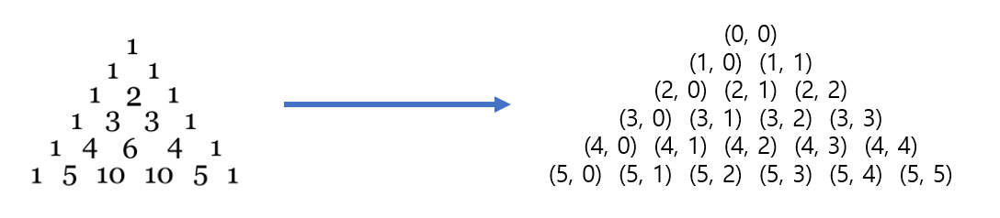

# Udemy : 동적 계획법 (DP)

*udemy 알고리즘 코딩 테스트*


## Dynamic Programming

> #### 문제를 쪼개서 작은 문제의 답을 구하고, 그걸로 더 큰 문제의 답을 구하는 것을 반복
>
> #### 분할정복과 비슷한 느낌


#### 배열 또는 딕셔너리를 만들어서, 작은 문제의 답을 넣는다


#### 메모이제이션 (Memoization)

- **구현 : 재귀    |    저장방식 : 메모이제이션 (Top-down)**

- cache 방식이라고 할 수 있고, 중복연산을 방지한다
- 직관적이라 코드 가독성이 좋다
- 재귀함수 호출이 많이 해서 느릴 수 있다


#### 타뷸레이션 (Tabulation)

- **구현 : 반복    |    저장방식 : 타뷸레이션 (Bottom-up)**

- 테이블을 채워나가는 것
- 필요 없는 부분 문제까지 전부 구하는 것
- 시간과 메모리를 좀 더 아낄 수 있다
- DP 테이블 채워 나가는 순서를 알아야 한다


### 피보나치 수열

> N번째의 숫자를 구하는 것

```python
def fibo(num):
    if num == 0:
        return 0
    elif num == 1:
        return 1
    
    return fibo(num - 1) + fibo(num - 2)


print(fibo(10))
# output : 55
# ----------------------------------------------

cache = [-1] * 91
cache[0], cache[1] = 0, 1

def fibo(num):

    if cache[num] == -1:
        cache[num] = fibo(num - 1) + fibo(num -2)
    
    return cache[num]

print(fibo(90))
# output : 2880067194370816120
```

**cache**를 이용하는 것이 메모이제이션이다

- cache라는 리스트에 피보나치 값들을 넣는다
- 이미 리스트 안에 값이 있으면, 그냥 값을 출력하면 된다


```python
cache = [-1] * 91
cache[0], cache[1] = 0, 1

for i in range(2, N + 1):
    cache[i] = cache[i-1] + cache[i-2]

print(cache(90))
# output : 2880067194370816120
```

**타뷸레이션을 이용한 방법**


### 이항계수



#### (N, K) 라고 하면 K가 0이거나, N과 같을 때 무조건 값이 1이다

#### (N, K)의 값은, (N, K) 위의 왼쪽과 오른쪽에 있는 것을 더한 값이다

- (N - 1, K - 1) : 왼쪽 위    |    (N-1, K) : 오른쪽 위

```python
N, K = map(int, input().split())

def bino(n, k):
    if k == 0 or k == n:
        return 1

    return bino(n - 1, k - 1) + bino(n-1, k)

print(bino(N,K))

# -------------------------------------------------
MOD = 10007
sys.setrecursionlimit(10**7)

N, K = map(int, input().split())

cache = [[0] * 1001 for _ in range(1001)]

def bino(n, k):

    if cache[n][k]:
        return cache[n][k]
    
    if k == 0 or k == n:
        cache[n][k] = 1
    else:
        cache[n][k] = bino(n-1, k-1) + bino(n-1, k)

    return cache[n][k]

print(bino(N,K))
```

- 이항계수도 cache를 통해, 미리 앞에 있는 값들을 cache에 넣는 것이다
- `cache[n][k]` 가 0 일 때는, 재귀를 통해, 앞에 0들을 계산된 값으로 바꾼다


```python
MOD = 10007
sys.setrecursionlimit(10**7)

N, K = map(int, input().split())

cache = [[0] * 1001 for _ in range(1001)]

for i in range(1001):
    cache[i][0], cache[i][i] = 1, 1
    
    for j in range(1, i):
        cache[i][j] = cache[i - 1][j - 1] + cache[i - 1][j]

print(cache[N][K])
```


